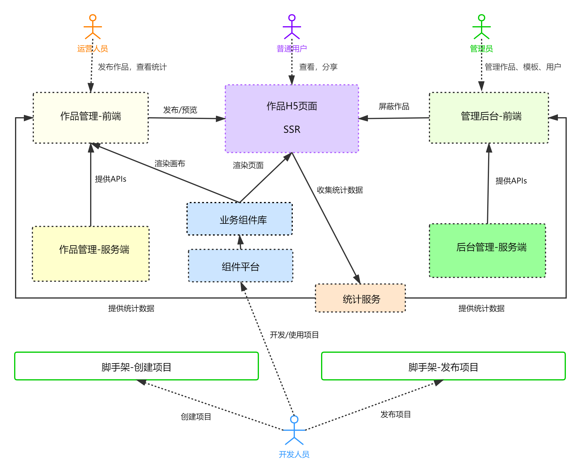
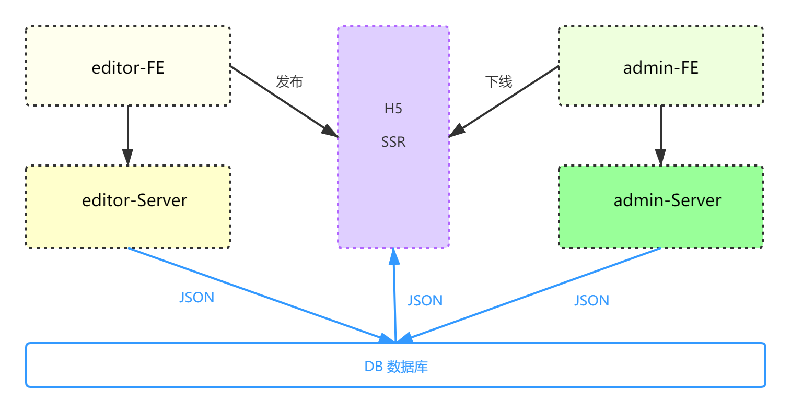

# 架构方案设计 V1.0

## 需求

https://www.yuque.com/imooc-lego/zlz87z

## 范围

### 需要的项目

B 端和编辑器,做前后端分离

- biz-editor-fe
- biz-editor-server
  H5 适合做 SSR，因为要考虑性能
- H5-server
  管理后台，做前端分析
- admin-fe
- admin-server

### 独立的业务组件库

编辑器画布使用的组件和渲染逻辑，和 H5 页面是完全一样的，因此，把业务组件库抽离出来，给画布和 H5 使用。

### 自研统计服务

我们需要实现分渠道统计，实现这个功能，就需要自定义事件统计。

- 支持自定义事件统计
- 支持 Open API
  经调研发现，市面上的第三方统计服务，要么不支持，要么收费太贵。综合对比，选择自研。包括：
- 日志收集
- 日志分析
- Open API

## 模块设计



## 核心数据结构

### 数据结构思路

- 每个组件尽量符合 vnode 规范
- 用数组来组织数据，有序
- 尽量使用引用关系，不要冗余

### 数据结构示例

```javascript
{ 
	work: { 
		title: '作品标题', 
		setting: { }, // 一些可能的配置项，扩展性保证 
		props: { }, // 页面 的一些设置，扩展性保证 
		components: [ 
			{ 
				id: 'xxx', 
				name: '文本1', 
				tag: 'text', 
				attrs: { 
					fontSize: '20px' 
				}, 
				children: [
					'文本1' 
				] 
			}, 
			{ 
				id: 'yyy', 
				name: '图片1', 
				tag: 'image', 
				attrs: { 
					src: 'xxx.png', 
					width: '100px' 
				}, 
				children: null 
			}, 
		] 
	}, 
	// 画布当前选中的组件 
	activeComponentId: 'xxx' 
}
```	

### 数据流转关系图

核心：B 端、C 端、管理后台，共用一个数据库

- 创建作品：初始化一个 JSON 数据
- 保存作品：修改 JSON 数据
- 发布作品：修改一个标记，仅此而已
- C 端浏览作品：获取 JSON 数据，SSR 渲染页面
- 屏蔽作品：修改一个标记，C 端来判断

  

## 扩展性保证

- 扩展组件
- 扩展编辑器的功能，如组件隐藏、锁定
- 扩展页面的配置，如增加多语言
- 扩展其他功能，如大数据计算

## 研发提效

- 脚手架：创建、发布
- 组件平台：代码复用，对业务组件进行抽象，积累业务组件

## 运维保障

- 线上服务和运维服务
- 安全
- 监控和报警
- 服务扩展性：基于云服务，可以随时扩展机器和配置
