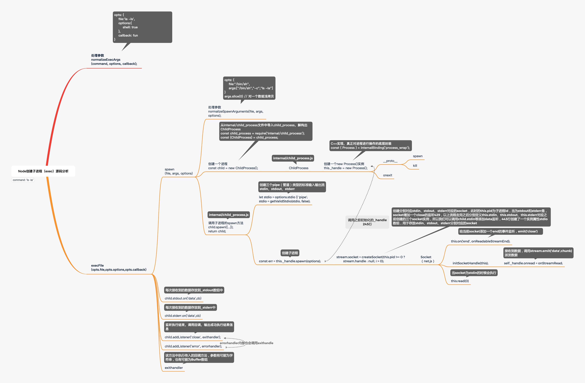

### 第四周作业 - Node多进程源码分析

**一、总结：**

- exec/execFile/spawn/fork的区别

  * exec：原理是调用/bin/sh -c执行我们传入的shell脚本，只做了参数处理就调用了execFile

  * execFile：原始是直接执行我们传入的file和args，底层调用spawn创建和执行子进程，并建立了回调，一次性将所有的stdout和stderr结果返回

  * spawn：原始是调用linternal/child_process，实例化了ChildProcess子进程对象，再调用child.spawn创建子进程并执行命令，底层调用了child._handle_spawn执行process_wrap中的spawn方法，此时才创建了子进程。执行过程是异步的，执行完毕后通过**PIPE**进行单向数据通信，通信结束后子进程发起onexit回调，同时Socket会执行close回调
  * fork：原理是通过spawn创建子进程和执行命令，通过setupchannel创建**IPC**通信，用户父子进程之间双向通信

* data/error/exit/cloes回调的区别

  * data：主进程读取数据过程中通过onread=onStreamRead发起回调

  * error：命令执行失败后发起回调

  * exit：子进程关闭完成后发起回调

  * close：子进程所有Socket实例全部关闭后发起回调（stdin,stdout,stderr）

  * Stdout close /stderr close：特定的PIPE读取完成后调用onReadableStreamEnd关闭socket是发起的回调

  

  

**二、源码分析思维导图**

