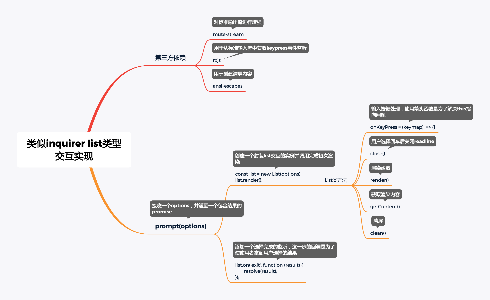

### 类似inquirer列表类型交互实现

**一、源码设计思维导图**

​	

**二、源码**

````javascript
const EventEmitter = require('events');
const readline = require('readline');
const MuteStream = require('mute-stream');
const {fromEvent} = require('rxjs');
const ansiEscapes = require('ansi-escapes');
const options = {
  type: 'list',
  name: 'userName',
  message: '请选择你的名字',
  choices: [{
    name: '张三',
    value: '张三'
  }, {
    name: '李四',
    value: '李四'
  }, {
    name: '王五',
    value: '王五'
  }]
};

class List extends EventEmitter {
  constructor(list) {
    super();
    this.type = options.type;
    this.name = options.name;
    this.message = options.message;
    this.choices = options.choices;

    this.input = process.stdin;
    // 对标准输出流进行一次包装
    const ms = new MuteStream();
    ms.pipe(process.stdout);
    this.output = ms;
    // Interface实例
    this.rl = readline.createInterface({
      input: this.input,
      output: this.output
    });
    // 当前选中位置 用于光标位移
    this.selected = 0;
    // 列表高度
    this.height = 0;
    // 监听按键按下事件
    this.keypress = fromEvent(this.rl.input, 'keypress').forEach(this.onKeyPress);
    // 是否已经选中完毕
    this.haveSelected = false;
  }

  onKeyPress = (keymap) => {
    const key = keymap[1];
    if (key.name === 'down') { // 下箭头
      this.selected++;
      if (this.selected === this.choices.length) {
        this.selected = 0;
      }
      this.render();
    } else if (key.name === 'up') { // 上箭头
      this.selected--;
      if (this.selected === -1) {
        this.selected = this.choices.length - 1;
      }
      this.render();
    } else if (key.name === 'return') {
      this.haveSelected = true;
      this.render();
      this.close();
      // 派发给程序开发者的
      this.emit('exit', this.choices[this.selected]);
    }
  }

  close() {
    // this.input.pause();
    this.output.unmute();
    this.rl.output.end();
    //this.rl.close();内部会调 this.rl.pause(); 会调 this.input.pause();
    // this.rl.pause();
    this.rl.close();
  }

  // 渲染列表
  render() {
    // 让用户可以输入
    this.output.unmute();
    this.clean();
    // 输出列表
    this.output.write(this.getContent());
    // 用户不能继续输入
    this.output.mute();
  }

  // 获取输出内容
  getContent() {
    if (!this.haveSelected) { // 用户还没选择结束
      // 加粗无效
      let content = '\x1B[32m?\x1B[39m \x1B[1m' + this.message + '\x1B[22m\x1B[0m \x1B[0m\x1B[2m(Use arrow keys)\x1B[22m\n';
      this.choices.forEach((choice, index) => {
        // 是否为当前选中项，高亮显示，因为除了最后一个选项外，每一项后面需要加入\n换行
        if (index === this.selected) {
          if (index === this.choices.length - 1) { // 最后一行 不要加\n
            content += '\x1B[36m> ' + choice.name + '\x1B[39m';
          } else { // 不是最后一行，添加\n
            content += '\x1B[36m> ' + choice.name + '\x1B[39m\n';
          }
        } else { // 没有选中 除了最后一个选项外，每一项后面需要加入\n换行
          if (index === this.choices.length - 1) { // 最后一行 不要加\n
            content += '  ' + choice.name;
          } else { // 不是最后一行，添加\n
            content += '  ' + choice.name + '\n';
          }
        }
      });
      // 选项数组长度加1的原因为还有一行提示文本的高度也需要被清空
      this.height = this.choices.length + 1;
      return content;
    } else {
      // 输出给使用者看的
      const name = this.choices[this.selected].name;
      return '\x1B[32m?\x1B[39m \x1B[1m' + this.message + '\x1B[22m\x1B[0m \x1B[36m' + name + '\x1B[39m\x1B[0m \n';
    }
  }

  // 清屏
  clean() {
    const emptyLines = ansiEscapes.eraseLines(this.height);
    this.output.write(emptyLines);
  }
}

function prompt(options) {
  return new Promise((resolve, reject) => {
    try {
      const list = new List(options);
      list.render();
      // 添加退出监听
      list.on('exit', function (result) {
        resolve(result);
      });
    } catch (e) {
      reject(e);
    }
  });
}

prompt(options).then((result) => {
    console.log(result);
  }
);

````

