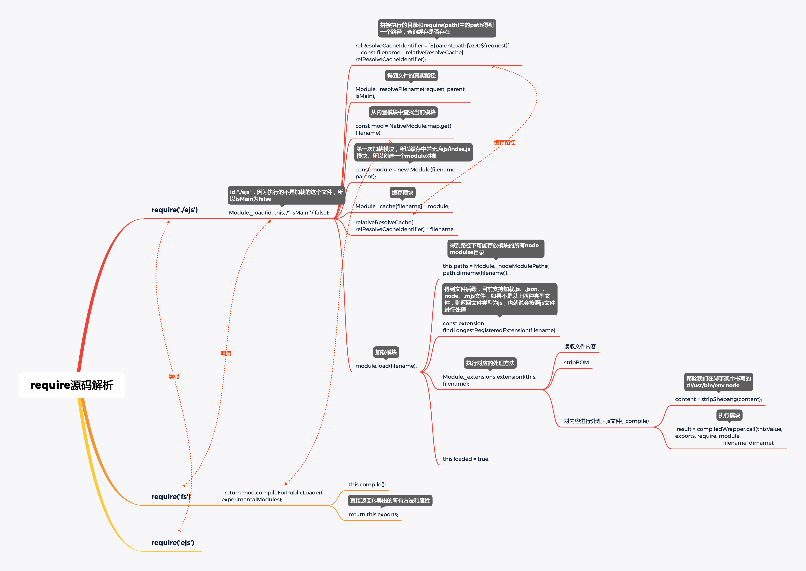

### require源码分析 - v12.5.0
**一、require是如何缓存的？**

* 缓存模块路径：

  通过执行文件的目录和require(path)中的path拼接得到一个路径，在后续查找到模块真实路径的情况下会以之前拼接的路径为key，正式路径为value进行缓存，如：

  ````javascript
  {
    "/Users/snail/Desktop/code/lego/imooc-test1-dev/imooc-test1/bin\u0000./ejs": 
    "/Users/snail/Desktop/code/lego/imooc-test1-dev/imooc-test1/bin/ejs/index.js"
  }
  ````

* 缓存模块：

  以上一步拿到的真实文件路径为key，创建的module实例为value缓存到Module._cache对象中

  ```javascript
  Module._cache = Object.create(null);
  // 缓存
  Module._cache[filename] = module;
  ```

  

**二、require支持加载的文件类型？**

* .js 读取文件内容，移除utf-8 BOM头和移除脚手架中定义的#!/usr/bin/env node，将内容包装在一个函数内进行自执行并传入exports、require、module、filename、dirname；

* .json 读取文件内容 调用JSON.parse(content)转成json对象后返回；

* .node

* .mjs node 14+版本支持，如果低版本需要指定开启 --experimental-modules，否则将报错；

* 如果文件没有指定文件类型，则按js处理；

  注：一个文件中多次加载同一个模块，后面的将使用第一次加载的缓存模块；

  

**三、源码分析思维导图**

​	包含自定义模块，node_modules下的模块和内置模块



