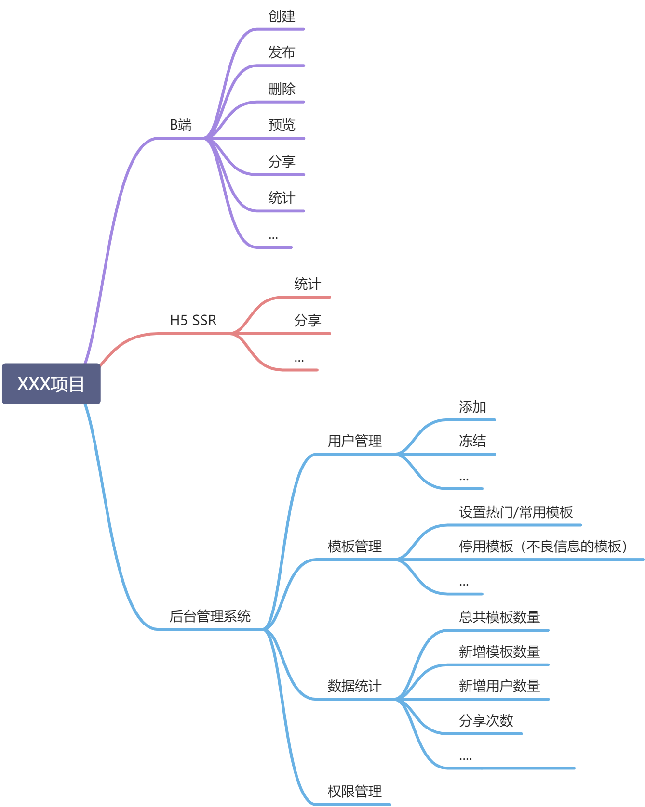

# 慕课乐高架构方案设计文档

## 需求分析

### 需求分析思维导图


## 范围
从需求上我们大致可以分为 `B端（作者端）` `H5 SSR（用户端）` `后台管理系统（管理端）` 三个端
而前端开发部分又可以分解成三个项目

- editor-fe
- h5-ssr
- admin-fe

后端项目分也分解成三个项目
- editor-server
- h5-server
- admin-server

## 模块设计

### 独立业务组件库

编辑器画布使用的组件和渲染逻辑和h5完全一致，为了两边一致，应该抽离出来提供给它们使用，从而保证制作的时候和渲染出来的h5保持一致

### 自研统计服务

考虑自研服务前，先列出我们统计所需的功能

我们需要实现分渠道统计这个需求，要实现这个需求，我们就需要自定义事件统计

- 支持自定义事件统计
- 支持Open API

经过调研后，我们发现，市面上第三方服务要么不支持，要么收费很贵，综合对比，只能选择自研一个

包括：

- 日志收集
- 日志分析
- Open API


## 作品的数据结构

思路

- 每个尽量符合vnode规范
- 用数组来组织数据，有序
- 尽量使用引用关系，不要冗余

### vuex store
```javascript
{
  work: {
    title: '作品标题',
    setting: {/* 一些可能的配置项，用不到就先预留 */},
    props: {/* 页面body的一些设置，如背景色 */},
    components: [
      // components要用数组，有序结构
      // 单个node要符合常见的vnode格式
      {
        id: 'xxx', // 每个组件都有id，不重复
        name: '文本1',
        tag: 'text',
        attrs: { fontSize: '20px' },
        children: [
          '文本1' // 文本内容，有时候放在children，有时候放在attrs或者props，没有标准，看实际情况来确定
        ]
      },
      {
        id: 'yyy',
        name: '图片1',
        tag: 'image',
        attrs: { src: 'xxx.png', width: '100px' },
        children: null
      }
    ]
  }
}
```

### vuex getter
```javascript
// 图层
{
  layers: (state) => {
    state.work.components.map(c => {
      return {
        id: c.id,
        name: c.name
      }
    })
  }
}
```

## 扩展性保证
- 组件扩展
- 编辑器组件的扩展（比如以后增加其它组件，视频组件，音频组件，抽奖组件等等）
- 页面信息的扩展（比如以后增加微信/微博/QQ分享）
- 其他扩展（比如埋点统计大数据分析）


## 开发提效
- 实现平滑发布增加用户体验感
- 脚手架：创建发布
- 组件平台

## 运维保障
- 错误日志收集
- 监控和报警

