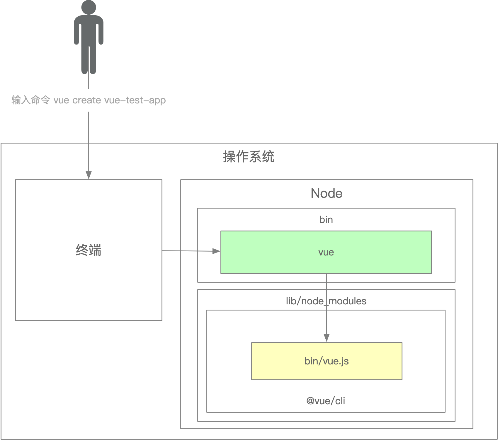

## 1. 脚手架实现原理，基于 Lerna 搭建自己的脚手架并发布到npm

### 1.1脚手架简述
脚手架本质是一个操作系统得客户端，它通过命令行执行
```js
vue create vue-test-app
```
上面这条命令主要由3个部分组成
- 主命令 `vue`
- command `create`
- command的 param `vue-test-app`

### 1.2脚手架的执行原理图


脚手架的执行原理如下：
- 在终端输入 `vue create vue-test-app`
- 终端解析出 `vue` 命令
- 终端在环境变量中找到 `vue` 命令
- 终端根据 `vue` 命令链接倒实际文件 `vue.js`
- 终端利用 `node` 执行 `vue.js`
- `vue.js`解析 command / options
- `vue.js`执行 command
- 执行完毕，退出执行

### 1.3为什么全局安装 `@vue/cli` 后会添加的命令为 `vue`?
全局安装脚手架，会根据脚手架根目录的package.json 中的 bin 来决定脚手架的命令
```js
"bin": {
    "vue": "bin/vue.js"
}
```

### 1.4全局安装 `@vue/cli` 时发生了什么？
全局安装脚手架后，会在node的目录下的node_modules生成 `@vue` 的脚手架包，并且会在 node的安装目录下生成一个vue环境变量，而这个环境变量的名字就取决于 `@vue` 的脚手架包根目录的 package.json 中的bin

### 1.5为什么 `vue` 执行一个 `js` 文件，我们却可以直接通过vue命令去执行它？
因为在脚手架根目录的 package.json 中的bin 所指向的真正执行的 `vue.js` 中有
```
#!/usr/bin/env node
```
相当于我们执行 `node vue.js`


## 2. 理解 Yargs 常用 API 和开发流程
```js
const yargs  = require('yargs/yargs')
// 一个ES6字符串标签，从多行字符串中去除缩进。
const dedent = require("dedent");

const cli = yargs()
const argv = process.argv.slice(2)

// 注入额外参数
const context = {
  diaoVersion: '1.0.0',
};
cli
  // 开启严格模式，输入无效命令会报错无法识别命令
  .strict()
  // 在头部输出一段信息
  .usage('Usage: diao-cli [command] <options>')
  // 设置需要输入命令的最小值，这里设置最少输入一个命令，否则则抛出错误信息
  .demandCommand(1, "A command is required. Pass --help to see all available commands and options.")
  // 如果没有找到匹配的命令，yargs提供关于类似命令的建议
  .recommendCommands()
  // 在有错误的时候执行，可以在这里自定义错误信息
  .fail((err, msg) => {
    console.error('err:', err)
  })
  // 设置 command 的别名
  .alias('h', 'help')
  .alias('v', 'version')
  // 设置命令行输出时候的宽度
  .wrap(cli.terminalWidth())
  // 在命令行末尾打印的消息
  .epilogue(dedent`
    When a command fails, all logs are written to lerna-debug.log in the current working directory.

    For more information, find our manual at https://github.com/lerna/lerna
  `)
  // 配置额外选项
  .options({
    debug: {
      type: 'boolean',
      describe: 'Bootstrap debug mode',
      alias: 'd'
    }
  })
  // 配置额外选项
  .option("registry", {
    type: "string",
    describe: 'Define global registry',
    alias: 'r'
  })
  // 对选项进行分组
  .group(['debug'], 'Dev Options')
  .group(['registry'], 'Extra Options')
  // 注册命令
  .command('init [name]', 'Do init a project', (yargs) => {
    yargs
      .option('name', {
        type: 'string',
        describe: 'Name of a project',
        alias: 'n'
      })
  }, (argv) => {
    console.log(argv)
  })
  // 注册命令
  .command({
    command: 'list',
    aliases: ['ls', 'la', 'll'],
    describe: 'List local packages',
    builder: (yargs) => {},
    handler: (argv) => {
      console.log(argv)
    }
  })
  // 解析命令输入参数
  .parse(argv, context)
```

## 3. 理解 Lerna 实现原理
> Lerna 是基于 git+npm 的多package项目管理工具

### 3.1常用命令
```
npm init -y
npm install -g lerna (// 全局安装)
npm install lerna
lerna -v ( // 输出版本号说明安装成功)
lerna init (// 初始化lerna项目，会创建一个lerna.json)
// 经过上面init这一步，会初始化git仓库，再搞一个.gitignore 配置一些不用上传的目录
git remote xxx (// 添加远程仓库)
lerna create core (// 创建一个package)
lerna create utils(// 又创建了一个package)
lerna add (// 批量给两个package都安装依赖)
lerna publish (// 发布项目)
```
### 3.2Lerna 实现原理
懵逼中，后面回过头再看~


## 4. 理解 ` import-local ` 实现原理，理解 ` require.resolve ` 实现原理
懵逼中，后面回过头再看~

