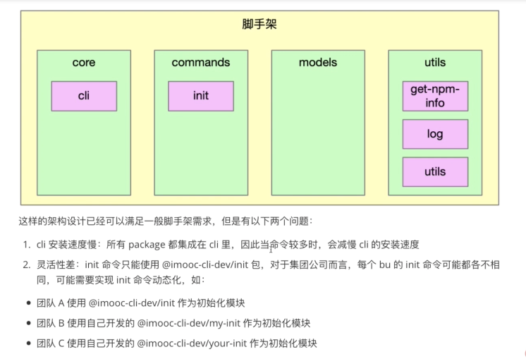
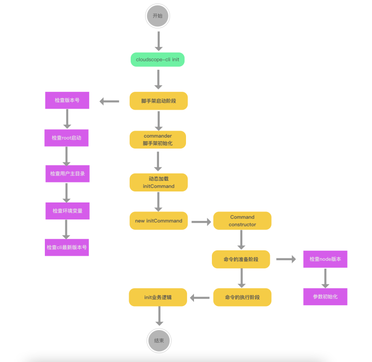
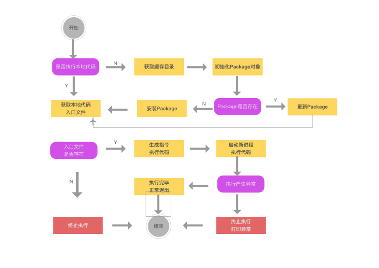
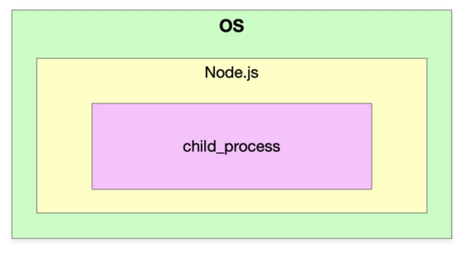
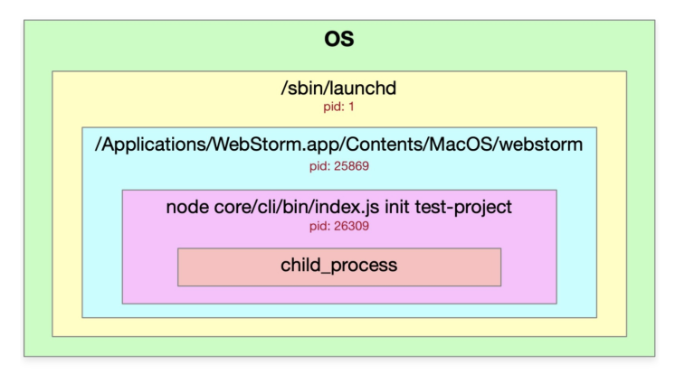
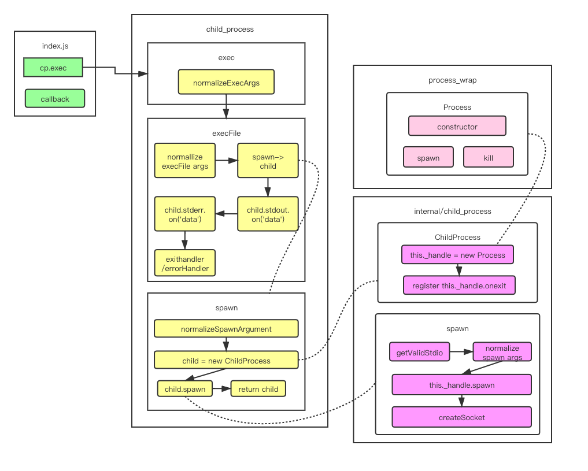

# Week4-脚手架命令注册和执行过程开发


本Week代码提交支：[lesson04](https://github.com/liugezhou/cloudscope-cli/tree/lesson04)
### 第一章：本周导学

---

#### 1-1 本周整体内容介绍和学习方法

<br />标题
> - 基于Commander完成脚手架命令注册和命令执行过程开发


<br />收获
> - 如何设计高性能脚手架
> - Node多线程开发
> - javascript面向对象编程的实战技巧 


<br />内容
> - 图解高性能脚手架架构设计方法
> - 封装通用的Package和Command类
> - 基于缓存 + Node 多进程 实现动态命令加载和执行
> - 将业务逻辑和脚手架逻辑彻底解耦


<br />加餐
> Node多进程开发进阶--child_process源码解析
> - 深入Node源码看清spawn/exec/execFile/fork的本质区别，彻底搞懂Node多进程原理。


### 第二章：imooc-cli脚手架命令注册

---

#### 2-1 imooc-cli脚手架初始化+全局参数注册
<br />(本节有代码编写)<br />
<br />本节的主要内容为使用commander这个库在全局添加注册命令<br />

> - cd core/cli
> - npm i -S commander

```javascript
// core/cli/lib/index  添加全局注册命令方法
//命令注册
function registerCommand(){
    program
        .name(Object.keys(pkg.bin)[0])
        .usage('<command> [options]')
        .version(pkg.version)
        .option('-d, --debug', '是否开启调试模式', false);

     // 开启debug模式
     program.on('option:debug',function(){
        if(program.opts().debug){
            process.env.LOG_LEVEL='verbose'
        }else{
            process.env.LOG_LEVEL='info'
        }
        log.level = process.env.LOG_LEVEL
    })
    
    // 对未知命令监听
    program.on('command:*',function(obj){
        const availableCommands = program.commands.map(cmd => cmd.name())
        console.log(colors.red('未知的命令：'+obj[0]))
        if(availableCommands.length > 0){
            console.log(colors.red('可用命令为：'+availableCommands.join(',')))
        }
    })
 

    program.parse(program.argv)
    if(program.args && program.args.length < 1) {
        program.outputHelp();
        console.log()
    }
}
```

#### 2-2 imooc-cli脚手架命令注册

<br />(本节有代码编写)

本节的主要内容为添加第一个comman操作：'**init**',并在commands文件夹下创建新的init包
```javascript
// core/cli/lib/index
......

const init = require('@cloudscope-cli/init')

......

program
  .command('init [projectName]')
	.option('-f,--force','是否强制更新项目')
	.action(init)

......
```
### <br />
### 第三章：高性能脚手架架构设计和缓存结构设计

---

#### 3-1 当前imooc-cli脚手架架构痛点分析
**<br />(本节无代码编写)

当前的代码架构如图：<br />
#### 3-2 高性能脚手架架构设计

<br />(本节无代码编写)

对以上架构(之前代码编写)的主要优化点有以下三个方面
> - 将init命令做成了一个动态加载的形式
> - 动态加载的脚手架通过缓存形式进行存储：执行哪个命令下载哪个命令
> - 动态加载的时候，通过node多进程进行执行：深挖cpu性能


#### 3-3 脚手架命令动态加载功能架构设计
<br />
(本节无代码编写)<br />



> 上图架构初看有些难度，在代码编写之后再去回顾，会有更深理解。

> 本节简单讲述了两点：
> 1. require加载文件的用法:
> - require('/xxx/yyy/index.js') ---- 加载绝对路径
> - require('./index.js')----加载相对路径
> - require('fs')    ----  加载内置模块
> - require('npmlog') ---- 加载第三方包
> 


> 2. node执行模块两种方式
> - node 执行文件: ** node core/cli/bin/index.js**
> - node -e '字符串'：**node  -e  "require(./core/cli/bin/index.js)"**

### 
### 第4章 通用 npm 模块类 Package 封装

---

#### 4-1 脚手架命令本地调试功能支持

<br />(本节有代码编写)

> 通过前面画图了解，我们要实现的第一步是initCommand的动态命令加载,即**3-3**章节所示图。
> 是否执行本地代码，我们通过一个属性来进行标识：**targetPath**

```javascript
//core/cli/lib/index.js

program.
.option('-tp, --targetPath <targetPath>','是否指定本地调试文件路径','')

 //指定targetPath
program.on('option:targetPath',function(){
  process.env.CLI_TARGET_PATH = program.opts().targetPath 
})
```
```javascript
// commands/init/lib/index.js
'use strict';

function init(projectName,options,command)  {
    console.log('init',projectName,command.opts().force,process.env.CLI_TARGET_PATH)
}

module.exports = init;

```
> 本节需要注意的一点是如果commander版本低于7.0.0，那么 program.action()中传入的参数为两个。
> 7.0.0版本以上的传入的参数为三个(name.options,cmd)
> 

> 另外，访问targetPath这个参数的时候，需要program.opts().targetPath访问。

#### 
#### 4-2 动态执行库exec模块创建

<br />(本节有代码编写)
> core下新建包文件： lerna create @cloudscope-cli/exec  core/
> 然后在core/cli/lib/index.js文件中将exec包引入，将action(init)此处改为action(exec)

#### 
#### 4-3 创建npm模块通用类Package

<br />(本节有代码编写)
> 首先讲解了exec模块逻辑
> 1.  targetPath -> modulePath
> 1.  modulePath -> Package(npm模块)
> 3.  Package.getRootFile(获取入口文件)
> 4.  Package.update / Package.install


<br />代码实现：
> - 在model文件下创建新的模块Package：lerna create @cloudscope-cli/package 
> - 在core/exec/lib/index.js文件中引入：const Package =  require('@cloudscope-cli/package')


#### 4-4 Package类的属性、方法定义及构造函数逻辑开发


(本节有代码编写)

> 本节主要有三处代码讲解
> - core/exec中创建一个Package对象
> - model/package中Package类的构造方法
> - utils/utils中添加isObject方法：判断一个属性是否为对象
> 
代码分别如下：

```javascript
// core/exec/lib/index.js
'use strict';

const Package = require('@cloudscope-cli/package')
const log = require('@cloudscope-cli/log')

const SETTINGS = {
    init: '@cloudscope-cli/init'
 }
function exec() {
    // 1. targetPath -> modulePath
   // 2. modulePath -> Package(npm模块)
   // 3. Package.getRootFile(获取入口文件)
   // 4. Package.update / Package.install'
    let targetPath = process.env.CLI_TARGET_PATH
    const homePath = process.env.CLI_HOME_PATH
    let storeDir ='';
    let pkg;
    log.verbose('targetPath', targetPath);
    log.verbose('homePath', homePath);
    const cmdObj = arguments[arguments.length - 1];
    const cmdName = cmdObj.name(); 
    const packageName = SETTINGS[cmdName];
    const packageVersion = 'latest';
     pkg = new Package({
        targetPath,
        storeDir,
        packageName,
        packageVersion
     })
     console.log(pkg)
}

module.exports = exec;

```
```javascript
//models/package/lib/index.js
'use strict';
const { isObject }  = require('@liugezhou-cli-dev/utils');
class Package {
    constructor(options){
        if( !options){
            throw new Error('Package类的options参数不能为空！')
        }
        if( !isObject(options) ){
            throw new Error('Package类的options参数必须为对象！')
        }
        // package路径
        this.targetPath = options.targetPath
        // package的存储路径
        this.storeDir = options.storeDir
        // package的name
        this.packageName = options.packageName
        // package的version
        this.packageVersion = options.packageVersion;
    }

    // 判断当前Package是否存在
    exists(){}

    // 安装Package
    install(){}
    //更新Package
    update(){}

    //获取入口文件路径
    getRootFilePath(){}
}

module.exports = Package;

```
```javascript
//utils/utils/lib/index.js

'use strict'
function isObject(obj){
	return Object.prototype.toString.call(obj).slice(8,-1) === 'Object'
}
module.exports = {
 	isObject 
}
```


#### 4-5 Package类获取入口文件路径功能开发（pkg-dir应用+解决不同操作系统路径兼容问题）
(本节有代码编写)<br />本节主要实现models/package/lib/index.js中获取入口文件路径的方法实现getRootfile()<br />

> 思路：
> 1. 获取package.json的所在目录--通过安装pkg-dir库
> 1. 读取package.json
> 1. 寻找main/lib
> 1. 路径的兼容macOS/windows --新建包：utils/format-path，且新建路径兼容方法


核心代码为: 

```javascript
//core/exec/lib/index.js
…………
// 1. 获取package.json所在目录
const dir = pkgDir(targetPath);
if (dir) {
  // 2. 读取package.json
  const pkgFile = require(path.resolve(dir, 'package.json'));
  // 3. 寻找main/lib
  if (pkgFile && pkgFile.main) {
    // 4. 路径的兼容(macOS/windows)
    return formatPath(path.resolve(dir, pkgFile.main));
  }
}
return null;
…………

```

```javascript
'use strict';

const path = require('path')

function formatPath(p) {
    const sep = path.sep;
    if(p && typeof p === 'string'){
      if(sep !=='/'){
        return p.replace(/\\/g,'/')
      }
    }
    return p
}

module.exports = formatPath;
```

#### 4-6 利用npminstall库安装npm模块

<br />(本节有代码编写)  

> 本节实现的内容为exec中的install方法,通过npminstall这个库。
> 使用之前现在测试项目下使用之：[测试代码](https://github.com/liugezhou/liugezhou-yargs-demo/blob/main/bin/npminstall.js)。

```javascript
const npminstall = require('npminstall')
const path = require('path')
const userHome = require('user-home')
npminstall({
    root: path.resolve(userHome,'.cli-test'), //模块路径
    storeDir: path.resolve(userHome,'.cli-test','node_modules') ,
    registry:'https://registry.npmjs.org',
    pkgs:[
        {name:'foo',version:'~1.0.0'}
    ]
})
```
> 1. 首先，我们的项目在开发过程中可能会有错误，有的需要去看执行栈，有的不需要，因此我们在core/cli/lib/index中的core方法中，catch语句中加入如下代码(debug模式下显示执行栈错误)

```javascript
if(program.opts().debug){
	console.log(e)
}
```
> 2.在core/exec/lib/index.js文件中，我们修改代码如下(主要加入了如果不存在targetPath的逻辑梳理)：

```javascript
'use strict';

const path = require('path')   //新添加
const Package = require('@cloudscope-cli/package')
const log = require('@cloudscope-cli/log')

const SETTINGS = {      //新添加
    init: '@imooc-cli/init'
 }

const CATCH_DIR = 'dependencies'  //新添加

async function exec() {
    let targetPath = process.env.CLI_TARGET_PATH
    const homePath = process.env.CLI_HOME_PATH
    let storeDir ='';
    let pkg;
    log.verbose('targetPath', targetPath);
    log.verbose('homePath', homePath);
    const cmdObj = arguments[arguments.length - 1];
    const cmdName = cmdObj.name(); 
    const packageName = SETTINGS[cmdName];
    const packageVersion = 'latest';
    if(!targetPath){
       //生成缓存路径
       targetPath = path.resolve(homePath,CATCH_DIR);  //新添加
       storeDir = path.resolve(targetPath,'node_modules')  //新添加
       log.verbose('targetPath:',targetPath)  //新添加
       log.verbose('storeDir:',storeDir)      //新添加
       pkg = new Package({     								//新添加
         targetPath,
         storeDir,
         packageName,
         packageVersion
      });
      if(await pkg.exists()){    //新添加
         // 更新package
         log.verbose('更新package')
         await pkg.update();
      }else{
         // 安装package
         await pkg.install();
      }
    }else{
      pkg = new Package({
         targetPath,
         packageName,
         packageVersion
      })
      const rootFile = pkg.getRootFilePath();
      if(rootFile){    //新添加
         require(rootFile).apply(null,arguments);
      }
    }
}

module.exports = exec;

```
> 3. model/package包中文件主要加入了安装package这个方法,使用了npminstall这个库。

```javascript
//models/package/lib/ibdex.js

 async install(){
   await this.prepare()
   return npminstall({
     root: this.targetPath,
     storeDir: this.storeDir,
     registry:getDefaultRegistry(),
     pkg:{
       name:this.packageName,
       version:this.packageVersion
     }
   })
 }

```


#### 4-7 Package类判断模块是否存在方法开发
> 本节的主要内容是实现package/lib/index.js中的exists方法，代码实现如下：

```javascript

…………

 // package的缓存目录前缀
        this.cacheFilePathPrefix = this.packageName.replace('/', '_')

…………
get cacheFilePath() {
  return 	path.resolve(this.storeDir,`_${this.cacheFilePathPrefix}@${this.packageVersion}@${this.packageName}`)
}

async prepare(){
  if(this.storeDir && !pathExists(this.storeDir)){
    fse.mkdirpSync(this.storeDir)
  }
  if(this.packageVersion === 'latest'){
    this.packageVersion = await getNpmLatestVersion(this.packageName);
  }
}

async exists(){
  if(this.storeDir){
    await this.prepare() 
    return pathExists(this.cacheFilePath);
  }else{
    return pathExists(this.targetPath);
  }
}
```

#### 4-8 Package类更新模块逻辑开发

<br />(本节有代码编写)

本节内容主要为如果Package包有升级，那么需要去更新，主要实现代码为：

```javascript
// models/package/lib/index.js

…………
getSpecificCacheFilePath(packageVersion){
  return path.resolve(this.storeDir,`_${this.cacheFilePathPrefix}@${packageVersion}@${this.packageName}`)
  }

//更新Package
async update(){
  //获取最新的npm模块版本号
  const latestPackageVersion = await getNpmLatestVersion(this.packageName);
  // 查询最新版本号对应的路径是否存在
  const latestFilePath = this.getSpecificCacheFilePath(latestPackageVersion)
  // 如果不存在，则直接安装最新版本
  if(!pathExists(latestFilePath)){
    await npminstall({
      root:this.targetPath,
      storeDir:this.storeDir,
      registry:getDefaultRegistry(),
      pkgs:[{
        name:this.packageName,
        version:latestPackageVersion
      }
           ]
    })
    this.packageVersion = latestPackageVersion
  }else{
    this.packageVersion = latestPackageVersion
  }
  return latestFilePath;
}
```


#### 4-9 Package类获取缓存模块入口文件功能改造


```javascript
//获取入口文件路径
    getRootFilePath(){
        function _getRootFile(targetPath) {
            // 1. 获取package.json所在目录
            const dir = pkgDir(targetPath);
            if (dir) {
              // 2. 读取package.json
              const pkgFile = require(path.resolve(dir, 'package.json'));
              // 3. 寻找main/lib
              if (pkgFile && pkgFile.main) {
                // 4. 路径的兼容(macOS/windows)
                return formatPath(path.resolve(dir, pkgFile.main));
              }
            }
            return null;
          }
          if (this.storeDir) {
            return _getRootFile(this.cacheFilePath);
          } else {
            return _getRootFile(this.targetPath);
          }
    }
```

ps：关于项目的代码以上就结束了，代码提交至：[lesson04](https://github.com/liugezhou/cloudscope-cli/tree/lesson04)<br />

### 第五章：预备知识：Node 多进程开发入门


#### 5-1 进程的基本概念(讲解在操作系统中如何查看进程的嵌套关系)


> 官方文档中文版： [http://nodejs.cn/api/child_process.html](http://nodejs.cn/api/child_process.html)
> 

> 进程：进程(Process)是计算机中的程序关于某数据集合上的一次运行活动，是系统进行资源分配和调度的基本单元，是操作系统结构的基础。
> 概念主要两点：
> - 第一，进程是一个实体。每一个进程都有它自己的地址空间。
> - 第二，进程是一个“执行中的程序”，存在嵌套关系


> Node进程存在的感知：
> 终端中输入：ps -ef | grep node 命令。
> - UID是当前用户获取权限的ID
> - PID是当前进程ID
> - PPID是当前进程ID的父ID


> 使用webstorm调试一个node程序的图示如下：


#### 5-2 child_process异步方法使用教程（exec&execFile）
child_process用法:
> 异步用法
> - exec
> - execFile
> - fork
> - spawn
> 
同步用法
> - execSync
> - execFileSync
> - spawnSync


```javascript
//exec使用方法demo
const cp = require('child_process')

cp.exec('ls -al',function(err,stdout,stderr){
    console.log(err)
    console.log(stdout)
    console.log(stderr)
})
//execFile使用方法demo
cp.execFile('ls',['-al'],function(err,stdout,stderr){
    console.log(err)
    console.log(stdout)
    console.log(stderr)
})
```

<br />小结：exec和execFile在输出上看不出来区别。
> - exec主要用来执行一个shell命令，本质是execFile，只是参数不同，不支持传入arguments参数。
> - execFile只能执行一个文件，且加入一些命令，不能使用管道符。


#### 5-3 child_process spawn用法以及与exec&execFile的区别
> exec、execFile、fork底层都是使用的spawn。
> spawn使用的时候，没有回调，需要监听获取结果。    
> 新建一个test.shell文件的时候，如果要读取这个文件，那么需要添加权限：chmod +x test.shell

```javascript
const cp = require('child_process')
const path = require('path')

const child = cp.spawn(path.resolve(__dirname,'test.shell'),['-al','-bl'],{
    cwd:path.resolve('..')
});

// console.log(child.pid,process.pid)
child.stdout.on('data',function(chunk){
    console.log('stdout',chunk.toString())
})

child.stderr.on('data',function(chunk){
    console.log('stderr',chunk.toString())
})
```


> spawn:耗时任务(比如 npm install)：    不断打印日志
> exec/execFile:耗时、开销比较小的任务:    一次性返回结果。
> fork：多进程、多线程的下载。


#### 5-4 child_process fork用法及父子进程通信机制讲解


> fork主要是使用node来执行我们的命令。
> fork会执行两个进程 主进程与子进程。
> fork的本质也是调用spawn。

```javascript
// index.js
const cp = require('child_process')
const path = require('path')

const child = cp.fork(path.resolve(__dirname,'child.js'))
child.send('hello child process！',()=>{
    // child.disconnect()
})
console.log('main pid:',process.pid)

child.on('message',msg =>{
    console.log(msg)
    child.disconnect()
})

//child.js
console.log('child pid：',process.pid)

process.on('message', (msg)=>{
    console.log(msg)
})

process.send('hello main process!')
```


#### 5-5 child_process同步方法使用教程
> - execSync
> - execFileSync
> - spawnSync

```javascript
const cp = require('child_process')

//execSync
const ret = cp.execSync('ls -al | grep index.js')
console.log(ret.toString())

//execFileSync
const ret2 = cp.execFileSync('ls', ['-al'])
console.log(ret2.toString())

//spawnSync
const ret3 = cp.spawnSync('ls',['-al'])
console.log(ret3.stdout.toString())
```


### 第六章 基于 Node 多进程构建高性能脚手架

---


#### 6-1 通过脚手架命令Command类封装


(本节有代码编写)

> - 在 model文件夹下安装Command包：lerna create @cloudscope-cli/command
> - 在commands/init 的package.json中引入上面新创建的包command，继承它作为它的子类。


> 然后我们来到新建的command包的lib/index文件中,添加如下代码(同时删除core/cli/lib/index.js中关于checNodeVersion方法的代码)：

```javascript
'use strict';
const semver = require('semver')
const colors = require('colors/safe')

const  LOWEST_NODE_VERSION = '12.0.0'

class Command {
    constructor(argv){
        this._argv = argv
        let runner = new Promise((resolve,reject)=>{
            let chain = Promise.resolve()
            chain = chain.then(()=> this.checkNodeVersion())
            chain.catch(e =>{
                console.log(e.message)
            })
        })
    }

     checkNodeVersion(){
        const currentNodeVersion = process.version
        const lowestNodeVersion = LOWEST_NODE_VERSION
        if(semver.ltr(currentNodeVersion, lowestNodeVersion)) {
            throw new Error(colors.red(`cloudscope-cli 需要安装 v${lowestNodeVersion}以上版本的node.js`))
        }
    }

    init(){
         throw Error('init必须实现')
    }
    exec(){
        throw Error('exec必须实现')
    }
}

module.exports = Command;

```
> 接着，我们来到commands/init/lib/index.js文件中，进行代码的改写：

```javascript
'use strict';
const Command = require('@cloudscope-cli/command')

class InitCommand extends Command {

}
// function init(projectName,options,command)  {
    // console.log('init',projectName,command.opts().force,process.env.CLI_TARGET_PATH)
// }
function init(argv)  {
    return new InitCommand(argv)
}
module.exports = init
module.exports.InitCommand = InitCommand;

```

<br />这里的argv参数传递是从 exec/lib/index.js中的require传递过来的，因此参数传递修改
```javascript
require(rootFile).apply(null,arguments);
//修改为
require(rootFile).call(null,Array.from(arguments));
```
#### 
#### 6-2 脚手架参数初始化方法开发

<br />(本节有代码编写)

> - 首先在command包中引入log包，用于chain的catch错误打印(上节代码已更新)
> - 其次，对于class Comman需要对传入的参数argv进行一个判断，
>    - 如果为空需要抛出异常，这里需要注意抛出的异常在core/cli/lib/index.js中并没有捕获，需要在core/exec/lib/index.js中require的这个targetPath文件进行try catch捕获。
>    - 对argv这个参数进行是否对数组的判断。
>    - 对argv是否为空数组进行判断

 ```javascript
 if(!argv){
   throw new Error('argv参数不能为空')
 }
if(!Array.isArray(argv)){
  throw new Error('argv参数必须为数组')
}
if(argv.length < 1){
  throw new Error('参数列表为空')
}
```

> - 在chain里面实现initArgs方法：主要用来进行参数的分解，将argv最后一个参数与之前的参数装到两个参数中去。

```javascript
//chain逻辑
let chain = Promise.resolve()
  chain = chain.then(()=> this.checkNodeVersion())
	chain = chain.then(()=> this.initArgs())
	chain = chain.then(()=> this.init())
	chain = chain.then(()=> this.exec())
	chain.catch(e =>{
  	log.error(e.message)
})

initArgs(){
   const len = this._argv.length - 1
   this._cmd = this._argv[len].opts()   //commander版本号为7.0.0需要加opts()
   this._argv = this._argv.slice(0,len)
}

```

> chain中的init方法与exec均抛出异常，需要由子类去实现：即commands/init/lib/index.js.


#### 6-3 利用Node多进程动态执行命令（stdio的inherit属性讲解）

> 我们回到exec/lib/index.js中，其中之前的那行代码 
> require(rootFile).call(null,Array.from(**arguments**));
> 是在当前进程中调用的，我们需要修改为在node进程中进行调用，这便是本节的重点。


> 我们通过本周第五章的内容，已经知道了如何使用child_process下的同步或者异步方法进行子进程的执行，这里我有两种方法可以使用

```javascript
const cp = require('child_process')
// cp.fork()  //这里因为fork没有回调，需要通过通信的方式来获取结果，所以这里不推荐

 //之所以不用spawnSync是因为，我们在执行这里的时候是需要不断的用户交互的，需要不断的收到数据打印结果，不要一次性
const child = cp.spawn('node',['-e',code],{
	cwd:process.cwd(),
  stdio:'inherit'   // 加入这行代码，下面的就可以注释掉了
}) 
// child.stdout.on('data',(chunk =>{
// }))
// child.stderr.on('data',(chunk =>{
// }))

// 当然存在错误的情况，我们还是需要添加两个监听事件
child.on('error', e =>{
  log.error(e.message);
  process.exit(1);
})
child.on('exit', e=>{
  log.verbose('命令执行成功' + e);
  process.exit(e);
})
```
> spawn方法中的参数stdio默认值为'pipe'管道，pipe使得主进程与子进程会产生通信通道，因此需要通过on这种方式去进行监听。
> stdio还有一个值为'inherit'，它将相应的stdio传给父进程或者从父进程传入。也就是说：直接将process.stdin、process.stdout、process.stderr直接和父进程进行绑定，这样就无须去监听结果，可以直接将结果打印出来。


#### 6-4 生成Node多进程动态执行代码


> 通过上一节的学习，我们通过代码const args = Array.from(**arguments**)  
>  const cmd = args[args.length - 1]可以知道，现在需要做的就是拼成上面spawn在执行时所需的code 
> 我们之前的代码为  _require(rootFile).call(null,Array.from(arguments));  
> 也就是兼容 conse code = `require(rootFile).call(null,Array.from(arguments));`   
> rootfile -> ${rootfile},难点是  Array.from(arguments)的传入。 

```javascript
const args = Array.from(arguments)
const cmd = args[args.length - 1]   // 拿到command，且进行瘦身，对不需要的参数进行过滤
const o = Object.create(null)
Object.keys(cmd).forEach(key=>{
	if(cmd.hasOwnProperty(key) && !key.startsWith('_')&& key!=='parent'){
     o[key]=cmd[key]
  }
})
args[args.length-1] = o
const code = `require('${rootFile}').call(null,${JSON.stringify(args)})`
```
> 注：由于我使用的commander是7.0.0的，低于此版本传入的参数为两个，但7.0.0版本传入参数为3个，因此上面的代码，我这里直接写成(不知道后续是否还会有错误)：

```javascript
let args = Array.from(arguments).splice(0,2)
const code = `require('${rootFile}').call(null,${JSON.stringify(args)})`
```

到这里，使用node多进程执行代码的功能就完成了。<br />

#### 6-5 windows操作系统spawn执行命令兼容

> windows操作系统与macOS关于spawn的执行是不一样的，本节解决的就是windows操作系统下的兼容
> 将本方法封装在utils/utils包中：通过process.platform来判断操作系统

```javascript
function exec(command,args,options){
  const win32 = process.platform === 'win32';
  const cmd = win32 ? 'cmd': command
  const cmdArgs = win32  ?  ['/c'].concat(command,args) : args;
  return require('child_process').spawn(cmd, cmdArgs,options || {})
}
```
到以上为止，我们完成了动态命令的加载和执行。<br />

### 第七章 加餐：Node 进阶： child_process 源码分析

---

#### 7-1 Node多进程child_process库exec方法源码执行流程分析

疑问和收获：
> exec和execFile到底有什么区别？
> 为什么exec/execFile/fork都是通过spawn实现的，spawn的作用到底是什么？
> 为什么spawn调用后没有回调，而exec和execFile能够回调？
> 为什么spawn调用后需要手动调用child.stdout.on('data',callback),这里的child.stdout/child.stderr到底是什么？
> 为什么有data/error/exit/close这么多种回调，他们的执行顺序到底是怎样的？


<br />exec源码粗略分析<br />



> 在未学习exec源码之前，我们先对上面的拓扑图进行一个简单的学习，看到exec内部的执行流程
> 不难看到exec执行的是execlFile这个方法，且不同的地方就是传入的参数不同，而execFile执行的是spawn这个方法，且spawn这个方法调用的是node内部库的一个child_process方法。


我们在webstorm中打开一个[项目](https://github.com/liugezhou/liugezhou-yargs-demo)

```javascript
// /bin/process/index.js
const cp = require('child_process')
const path = require('path')

cp.exec('ls -al|grep node_modules ',function(err,stdout,stderr){
    console.log(err)
    console.log(stdout)
    console.log(stderr)
})

```
第五行代码打断点，配置webstorm调试设置后，执行命令(我这里是liugezhou-test)，进入到exec源码

```javascript
function exec(command, options, callback) {
 const opts = normalizeExecArgs(command, options, callback);
 return module.exports.execFile(opts.file,
                                opts.options,
                                opts.callback);
}
```
> 正如上面拓扑图画的那样，首先执行一个normalLizeExecArgs方法，然后调用execFile这个方法

```javascript
function execFile(file /* , args, options, callback */) {
 	………………

  const child = spawn(file, args, {
    cwd: options.cwd,
    env: options.env,
    gid: options.gid,
    uid: options.uid,
    shell: options.shell,
    windowsHide: !!options.windowsHide,
    windowsVerbatimArguments: !!options.windowsVerbatimArguments
  });
  
 	………………
  
  function exithandler(code, signal) {
    ………………
    
    callback(ex, stdout, stderr);
  }

  function errorhandler(e) {
   ………………
    exithandler();
  }


  if (child.stdout) {
    ………………
  }

  if (child.stderr) {
    ………………
  }

  child.addListener('close', exithandler);
  child.addListener('error', errorhandler);

  return child;
}

```
> 上面代码的4行，我们看到调用了spawn方法。

```javascript
function spawn(file, args, options) {
  const opts = normalizeSpawnArguments(file, args, options);
  const child = new ChildProcess();
……………………

  child.spawn({
    file: opts.file,
    args: opts.args,
    cwd: options.cwd,
    windowsHide: !!options.windowsHide,
    windowsVerbatimArguments: !!options.windowsVerbatimArguments,
    detached: !!options.detached,
    envPairs: opts.envPairs,
    stdio: options.stdio,
    uid: options.uid,
    gid: options.gid,
    serialization: options.serialization,
  });

  return child;
}

```
> spawn方法的第2行如拓扑图所示，对参数执行了normalizeSpawnArguments方法，这里通过调试查看参数，发现，opts这个对象的file为 'bin/sh'，这里涉及到一个重要的知识点:


shell的使用
> 1. 直接执行shell文件： /bin/sh test.shell
> 1. 直接执行shell语句： /bin/sh -c "ls -al|grep node_modules"


> spawn方法的第3行 const child = new ChildProcess
> 通过分析，我们知道这个ChildProcess调用的是内部库 internal/child_process的this._handler,再进一步如拓扑图所示，调用的是c++文件，不做继续跟踪。
> 继续往后该方法第6行，spwan方法调用的child.spwan如拓扑图所示，真正调用的是internal/child_process中的spawn-->this._hanlde.spawn方法，该方法执行完毕后，子进程便开启了.


> 在spwan最后返回child后，我们再返回到execFile中，发现child.stdout与child.stderr方法的输出，以及回调f
> unction exithandler和errorhandler


<br />上面就是对exec源码的略读过程。<br />

#### 7-2 高能：child_process库exec源码精度
> 上一节我们阅读了exec源码的第一遍，对答题流程有了认识，这节开始阅读第二遍，进行细节的解读。

> 首先进入到exec的normalizeExecArgs方法，逻辑简单。

```javascript
function normalizeExecArgs(command, options, callback) {
  if (typeof options === 'function') {  //判断options是否为function，这一步是对参数的兼容以及参数左移动
    callback = options;
    options = undefined;
  }

  // Make a shallow copy so we don't clobber the user's options object.
  options = { ...options };
  options.shell = typeof options.shell === 'string' ? options.shell : true;

  return {
    file: command,
    options: options,
    callback: callback
  };
}

```
> 然后我们进入到execFile中，分析流程写入到下面代码之中：

```javascript
// liugehou:此方法只接受了一个参数file，后面的参数通过arguments获取
function execFile(file /* , args, options, callback */) {
  // liugezhou:参数初始化
  let args = [];
  let callback;
  let options;

  // Parse the optional positional parameters.
  let pos = 1;
  //liugezhou:意图为拿到arguments的第一个参数，即options，且需满足options为数组时(显然exec进来不满足这个条件)
  if (pos < arguments.length && ArrayIsArray(arguments[pos])) {
    args = arguments[pos++];
  //liugezhou:对exec来说arguments[1]传入的为 {shell:true},即也不满足这个条件  
  } else if (pos < arguments.length && arguments[pos] == null) {
    pos++;
  }
// liugezhou:如上一注释，这里是满足的，将{shell:true}赋值给optios
  if (pos < arguments.length && typeof arguments[pos] === 'object') {
    options = arguments[pos++];
  } else if (pos < arguments.length && arguments[pos] == null) {
    pos++;
  }
//liugezhou:满足
  if (pos < arguments.length && typeof arguments[pos] === 'function') {
    callback = arguments[pos++];
  }

  if (!callback && pos < arguments.length && arguments[pos] != null) {
    throw new ERR_INVALID_ARG_VALUE('args', arguments[pos]);
  }

  options = {
    encoding: 'utf8',   	//liugezhou:编码格式
    timeout: 0,						//liugezhou：超时时间
    maxBuffer: MAX_BUFFER,//liugezhou：缓存区输出的字符串最多的容量(stdout的时候会用到)
    killSignal: 'SIGTERM',
    cwd: null,
    env: null,
    shell: false,
    ...options
  };

  // Validate the timeout, if present.
  validateTimeout(options.timeout); //liugezhou：判断是否为int，如果不是抛出异常

  // Validate maxBuffer, if present.
  validateMaxBuffer(options.maxBuffer); //liugezhou:判断是否为number，如果不是抛出异常

  options.killSignal = sanitizeKillSignal(options.killSignal);

  const child = spawn(file, args, {
    cwd: options.cwd,
    env: options.env,
    gid: options.gid,
    uid: options.uid,
    shell: options.shell,
    windowsHide: !!options.windowsHide,
    windowsVerbatimArguments: !!options.windowsVerbatimArguments
  });
………………

```
> 上面代码走到51行后，进入spawn源码

```javascript
function spawn(file, args, options) {
  // liugezhou：继续对进来的参数进行一个解析，主要就是参数的处理解析
  const opts = normalizeSpawnArguments(file, args, options);
  //liugezhou：这里进入到internal/child_process文件下，重点执行this.handle = new Process()
  const child = new ChildProcess();

  options = opts.options;
  debug('spawn', opts.args, options);

  //liugezhou：又一个重点，这里的源码底层实现，分析在下一节
  child.spawn({
    file: opts.file,
    args: opts.args,
    cwd: options.cwd,
    windowsHide: !!options.windowsHide,
    windowsVerbatimArguments: !!options.windowsVerbatimArguments,
    detached: !!options.detached,
    envPairs: opts.envPairs,
    stdio: options.stdio,
    uid: options.uid,
    gid: options.gid,
    serialization: options.serialization,
  });

  return child;
}

```

#### 7-3 深度分析child_process库spawn底层实现
接着上一节代码块中走到了child.spawn：
> - 第一步是通过getValidStdio去生成pipe，创建一个管道实例：第一个是输入，第二个是输出，第三个是error(只是生成了管道，但是还没创建socket的通信)
> - 第二步对spawn的一些参数进行处理：下面代码未贴
> - 第三步通过this._handle.spawn 子进程被创建出来
> - 第四步通过createSocket方法，将之前的pipe和子进程与socket绑定。

```javascript
ChildProcess.prototype.spawn = function(options) {
………………
  //liugezhou:'pipe'管道从这里创建，这里面的代码就不贴了，该代码可以：
  //1. stdio可以传入ignore，静默执行，没有输出
  stdio = getValidStdio(stdio, false);
………………

  //liugezhou:经过这步后，子进程立即被创建出来
  const err = this._handle.spawn(options);

……………
  
// liugezhou:此循环非常重要，建立起来了父进程与子进程的socket通信
  for (i = 0; i < stdio.length; i++) {
………………

    if (stream.handle) {
      // When i === 0 - we're dealing with stdin
      // (which is the only one writable pipe).
      //liugezhou：createSocket
      stream.socket = createSocket(this.pid !== 0 ?
        stream.handle : null, i > 0);

      //liugezhou:到这里就得到了一个socket事例
      if (i > 0 && this.pid !== 0) {
        this._closesNeeded++;
        stream.socket.on('close', () => {
          maybeClose(this);
        });
      }
    }
  }

………………
  return err;
};

```
然后我们再返回到execFile中，接着往下走：

```javascript
function execFile(file /* , args, options, callback */) {
………………
let encoding;
  //liugezhou：等待输入输出流全部执行完毕后，最后生成内容的数组，这个_stdout是一次性push给我们的，所以这也是我们前面学习说为什么进行耗时任务的时候，不要使用execFile
  const _stdout = [];
  const _stderr = [];
  if (options.encoding !== 'buffer' && Buffer.isEncoding(options.encoding)) {
    encoding = options.encoding;
  } else {
    encoding = null;
  }
  
  //定义了一些变量
  ………………

  function exithandler(code, signal) {
    if (exited) return;
    exited = true;

    if (timeoutId) {
      clearTimeout(timeoutId);
      timeoutId = null;
    }

    if (!callback) return;

    // merge chunks
    let stdout;
    let stderr;
    if (encoding ||
      (
        child.stdout &&
        child.stdout.readableEncoding
      )) {
      stdout = _stdout.join('');
    } else {
      stdout = Buffer.concat(_stdout);
    }
    if (encoding ||
      (
        child.stderr &&
        child.stderr.readableEncoding
      )) {
      stderr = _stderr.join('');
    } else {
      stderr = Buffer.concat(_stderr);
    }

    if (!ex && code === 0 && signal === null) {
      callback(null, stdout, stderr);
      return;
    }

    if (args.length !== 0)
      cmd += ` ${args.join(' ')}`;

    if (!ex) {
      // eslint-disable-next-line no-restricted-syntax
      ex = new Error('Command failed: ' + cmd + '\n' + stderr);
      ex.killed = child.killed || killed;
      ex.code = code < 0 ? getSystemErrorName(code) : code;
      ex.signal = signal;
    }

    ex.cmd = cmd;
    callback(ex, stdout, stderr);
  }

  function errorhandler(e) {
    ex = e;

    if (child.stdout)
      child.stdout.destroy();

    if (child.stderr)
      child.stderr.destroy();

    exithandler();
  }
………………

  //liugezhou：timeout耗时的操作
  if (options.timeout > 0) {
    ………………
  }

  if (child.stdout) {
    if (encoding)
      child.stdout.setEncoding(encoding);

    child.stdout.on('data', function onChildStdout(chunk) {
      const encoding = child.stdout.readableEncoding;
      const length = encoding ?
        Buffer.byteLength(chunk, encoding) :
        chunk.length;
      stdoutLen += length;

      if (stdoutLen > options.maxBuffer) {
        const truncatedLen = options.maxBuffer - (stdoutLen - length);
        _stdout.push(chunk.slice(0, truncatedLen));

        ex = new ERR_CHILD_PROCESS_STDIO_MAXBUFFER('stdout');
        kill();
      } else {
        _stdout.push(chunk);
      }
    });
  }

  if (child.stderr) {
    if (encoding)
      child.stderr.setEncoding(encoding);

    child.stderr.on('data', function onChildStderr(chunk) {
      const encoding = child.stderr.readableEncoding;
      const length = encoding ?
        Buffer.byteLength(chunk, encoding) :
        chunk.length;
      stderrLen += length;

      if (stderrLen > options.maxBuffer) {
        const truncatedLen = options.maxBuffer - (stderrLen - length);
        _stderr.push(chunk.slice(0, truncatedLen));

        ex = new ERR_CHILD_PROCESS_STDIO_MAXBUFFER('stderr');
        kill();
      } else {
        _stderr.push(chunk);
      }
    });
  } 

  child.addListener('close', exithandler);
  child.addListener('error', errorhandler);

  return child;
}
```


#### 7-4 child_process事件应用方法详解
**
> 本节我们进入到child_process源码的第三轮，彻底搞懂process的回调流程，也是child_process中最复杂的部分。同样，我们通过processOn图对流程进行梳理一遍：


> 在分析了上面流程后，我们先写一些测试代码以理解上面的流程。

```javascript
const cp = require('child_process')
const path = require('path')

const child = cp.exec('ls -al|grep node_modules',function(err,stdout,stderr){
    console.log('callback--------start')
    console.log(stdout)
    console.log('callback--------end')
})

child.stdout.on('data',(chunk)=>{
    console.log('stdout data:',chunk)
})

child.stderr.on('data',(chunk)=>{
    console.log('stderr data:',chunk)
})

child.stderr.on('close',()=>{
    console.log('stderr close')
})
child.on('exit',(exitCode)=>{
    console.log('exit:',exitCode)
})
child.on('close',()=>{
    console.log('close!')
})
```
#### 
#### 7-5 高难度：深度解析child_process库spawn方法回调原理


> 这一章完全听的懵逼了。略过。。。。。。。

<br />

#### 7-6 child_process库fork执行流程分析
> 略。。。。。。。


#### 7-7 精化：Node多进程源码总结
> - exec/execFile/spawn/fork的区别  
>    - exec: 原理是调用/bin/sh -c 执行我们传入的shell脚本，底层调用略execFile 
>    - execFile：原理是直接执行我们传入的file和args，底层调用spawn创建和执行子进程，并建立略回调，一次性将所有的stdout和stderr结果返回  
>    - spawn:原理是调用略internal/child_process,实例化略ChildProcess子进程对象，再调用child.spawn创建 子进程并执行命令，底层是调用了child.)handle.spawn执行process_wrap中的spwan方法，执行过程是异步的，执行完毕后再通过PIPE进行单向数据通信，通信结束后子进程发起onexit回调，同时Socket会执行close回调。 
>    - fork:原理是通过spawn创建子进程和执行命令，采用node执行命令，通过setupchannel创建IPC用于子进程和父进程之间的双向通信。
> 

> - data/error/exit/close回调的区别
>    - data：用于主进程读取数据过程中通过onStreamRead发起的回调
>    - error: 命令执行失败后发起的回调
>    - exit: 子进程关闭完成后发起的回调
>    - close：子进程所有Socket通信端口全部关闭后发起的回调
>    - stdout close/stderr close:特定的PIPE读取完成后调用onReadableStreamEnd关闭Socket时发起的回调。

