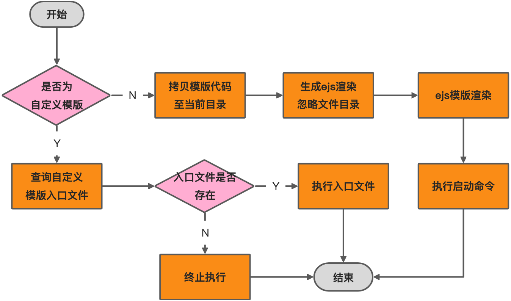
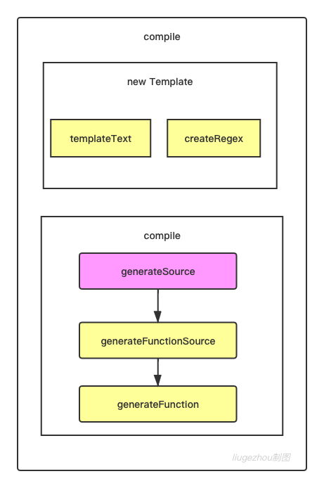
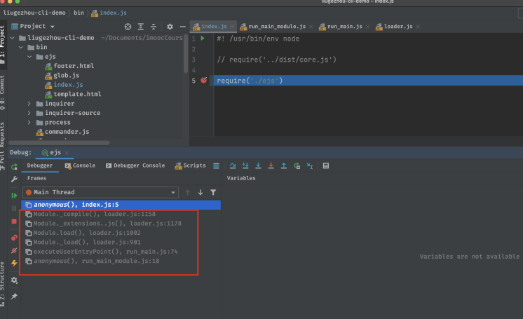
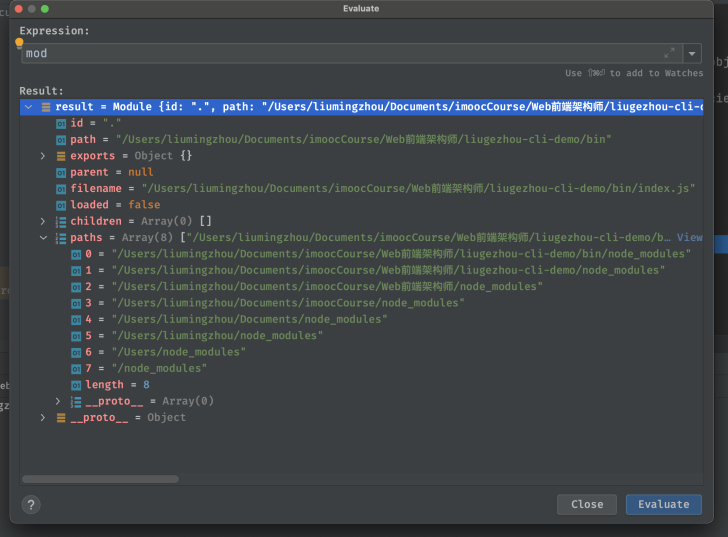

# Week6-脚手架项目和组件初始化开发

### 第一章：本周导学

---

#### 1-1 本周整体内容介绍和学习方法
> - 重点：脚手架安装 项目/组件  功能开发。
> - 技术栈：ejs模版渲染(项目模板安装)和glob文件筛选。
> - 加餐：ejs源码解析、require源码解析。 


### 第二章：脚手架安装模版功能架构设计

---


#### 2-1 脚手架安装项目模板架构设计
installTemplate


#### 2-2 脚手架组件初始化架构设计


> 与项目大体过程没有改变。
> tiny change：
> - 文本提示名称
> - 项目名称format
> - 组件需要填写描述信息


### 第三章 脚手架模板安装核心实现：ejs 库功能详解

---

#### 3-1 ejs模板引擎的三种基本用法


> ejs主要用于模版渲染的。jsp、php是之前模版渲染的代表。ejs的实现与jsp非常类似。
> - ejs.compile(html,options)(data)


```javascript
const ejs = require('ejs')
const path = require('path')
//第一种方法
const html ='<div><%= user.name%></div>'
const options = {}
const data ={
    user:{
        name:'liugezhou'
    }
}

const template = ejs.compile(html,options) //// 返回一个用于解析html中模板的 function

const compileTemplate = template(data)

console.log(compileTemplate)   //<div>liugezhou</div>

//第二种用法
const renderTemplate = ejs.render(html,data,options)
console.log(renderTemplate)

//第三种用法
const renderFile = ejs.renderFile(path.resolve(__dirname,'template.html'),data,options)
renderFile.then(file => console.log(file))

```


#### 3-2 ejs模板不同标签用法详解

> - <%   : ‘脚本’标签，用于流程控制，无输出。
> - <%= : 输出数据到模版(输出是转义Html标签)
> - <%- : 输出非转义的数据到模版 :如果数据是<div>liugehou</div>,那么输出的就是这样的格式。
> - <%# : 注释标签，不执行、不输出内容，但是会占空间。
> - <%_ : 删除前面空格空符
> - -%>: 删除紧随其后的换行符
> - _%>: 删除后面空格字符


#### 3-3 ejs模板几种特殊用法


> 本节主要介绍ejs另外比较常用的三个辅助功能
> - 包含: include
> - 自定义分隔符: 我们上面默认使用的是%，我们只需要在options参数中定义 delimiter这个参数即可
> - 自定义文件加载器: 在使用ejs.renderFile读取文件之前，可以使用ejs.fileLoader做一些操作

```javascript
ejs.fileLoader = function(filePath){
	const content = fs.readFileSync(filePath)
  return '<div><%= user.copyright %></div>' + content
}
```


#### 3-4 glob用法小结


> glob最早是出现在类Unix系统的命令中的，用来匹配文件路径。 

```javascript
const glob = require('glob')

glob('**/*.js',{ignore:['node_modules/**','webpack.config.js']},function(err,file){
    console.log(file)
})
```


### 第四章：脚手架项目模板安装功能开发

---

#### 4-1 引入项目模板类型和标准安装逻辑开发

> 本节代码较少，主要是梳理流程，上一大周写到了下载模版到本地缓存，本节接着上周进度：
> 接着便需要安装模版，新建了安装模版 installTemplate()方法，并对拿到模版的type进行判断，
> 若为normal，则执行安装标准模版方法：installNormalTemplate()
> 若为custom，则执行安装自定义模版方法：installCustomTemplate()


#### 4-2 拷贝项目模板功能开发
```javascript
async installNormalTemplate(){
  //拷贝模板代码至当前目录
  const spinner = spinnerStart('正在安装模板...')
  await sleep()
  try {
    // 去缓存目录中拿template下的文件路径
    const templatePath = path.resolve(this.templateNpm.cacheFilePath,'template')
    //当前执行脚手架目录
    const targetPath = process.cwd()
    fse.ensureDirSync(templatePath)//确保使用前缓存生成目录存在，若不存在则创建
    fse.ensureDirSync(targetPath)   //确保当前脚手架安装目录存在，若不存在则创建
    fse.copySync(templatePath,targetPath) //将缓存目录下文件copy至当前目录
  } catch (error) {
    throw error
  } finally{ 
    spinner.stop(true)
    log.success('模板安装成功')
  }
}
```
#### 
#### 4-3 项目模板安装依赖和启动命令 | **4-4 白名单命令检测功能开发**

<br />在上一节，模板copy成功之后，紧接着：

```javascript
//依赖安装
const { installCommand,startCommand } = this.templateInfo
//依赖安装
await this.execCommand(installCommand,'依赖过程安装失败！')
//启动命令执行
await this.execCommand(startCommand,'启动命令执行失败失败！')
```

```javascript
const WHITE_COMMAND =['npm', 'cnpm'] 

async execCommand(command,errMsg){
        let ret 
        if(command){
            const cmdArray=command.split(' ')
            const cmd = this.checkCommand(cmdArray[0])
            if(!cmd){
                throw new Error(errMsg)
            }
            const args = cmdArray.slice(1)
            ret = await execAsync(cmd,args,{
                stdio:'inherit',
                cwd:process.cwd()
            })
            if(ret !== 0){//执行成功
                throw new Error('依赖安装过程失败')
            }
            return ret
        }
    }
    checkCommand(cmd){
        if(WHITE_COMMAND.includes(cmd)){
            return cmd
        }
        return null;
    }
```

#### 4-5 项目名称自动格式化功能开发


> 本节使用了kebab-case这个库，将手动填入的项目名称保存在projectInfo中，以供后续package.json中的ejs渲染使用。

```javascript
//生成className
if(projectInfo.projectName){
  projectInfo.name = projectInfo.projectName
  projectInfo.className = require('kebab-case')(projectInfo.projectName).replace(/^-/,'');
}
if(projectInfo.projectVersion){
  projectInfo.version = projectInfo.projectVersion
}
```

#### 4-6 本章核心：ejs动态渲染项目模板


> - 首先将vue2模版中package.json文件中的name以及version使用<%= className%>和<%= version%>替代，并发布新的版本至npm。
> - commands/init模块安装 ejs和glob库。
> - 核心代码如下(在4-4节中依赖安装前，ejs动态渲染)

```javascript
 async ejsRender(options){
   const dir = process.cwd()
   const projectInfo = this.projectInfo
   return new Promise((resolve,reject)=>{
     glob('**',{
       cwd:dir,
       ignore:options.ignore || '',
       nodir:true   //不输出文件夹，只输出文件
     },(err,files) =>{
       if(err){
         reject(err)
       }
       Promise.all(files.map(file=>{
         const filePath = path.join(dir,file)
         return new Promise( (resolve1,reject1) => {
           ejs.renderFile( filePath,projectInfo,{},(err,result) => {
             if(err){
               reject1(err)
             }
             fse.writeFileSync(filePath,result)
             resolve1(result)
           })
         })
       })).then(()=>{
         resolve()
       }).catch(err=>{
         reject(err)
       })
     })
   })
 }
```

#### 4-7 init命令直接传入项目名称功能支持
> 本节完成的是  对命令行中传入项目名称的一个支持
> 通过判断脚手架命令是否传入项目名称，对inquirer中的prompt进行动态push。


### 第五章 组件模板开发及脚手架组件初始化功能支持

---


#### 5-1 慕课乐高组件库模板开发

> 维护组件库发布至npm，然后在mongodb数据库中进行配置。

#### 5-2 项目和组件模板数据隔离+动态配置ejs ignore


  这部分完整代码如下
```javascript
 //1.选取创建项目或组件
const { type } = await inquirer.prompt({
  type:'list',
  name:'type',
  message:'请选择初始化类型', 
  default:TYPE_PROJECT,
  choices: [{
    name: '项目',
    value: TYPE_PROJECT,
  }, {
    name: '组件',
    value: TYPE_COMPONENT,
  }]
})

// 数据隔离核心代码
this.template = this.template.filter(template =>template.tag && template.tag.includes(type))

const title =  type === TYPE_PROJECT ? '项目':'组件'
const projectNamePrompt = {
  type:'input',
  name:'projectName',
  message:`请输入${title}的名称`,
  default:'',
  validate:function(v){
    const done = this.async()
    setTimeout(function(){
      if(!isValidName(v)){
        done(`请输入合法的${title}名称`)
        return;
      }
      done(null,true)
    }, 0);
  },
  filter:function(v){
    return v
  }
}
const projectPrompt = []
if (!isProjectNameValid) {
  projectPrompt.push(projectNamePrompt);
}
projectPrompt.push({
  type:'input',
  name:'projectVersion',
  default:'1.0.0',
  message:`请输入${title}版本号`,
  validate:function(v){
    const done = this.async();
    // Do async stuff
    setTimeout(function() {
      if (!(!!semver.valid(v))) {
        done(`请输入合法的${title}版本号`);
        return;
      }
      done(null, true);
    }, 0);
  },
  filter:function(v){
    if(semver.valid(v)){
      return semver.valid(v)
    } else {
      return v
    }
  },
},{
  type:'list',
  name:'projectTemplate',
  message:`请选择${title}模板`,
  choices: this.createTemplateChoice()
})
```

#### 5-3 获取组件信息功能开发

完整核心代码如下,添加了 descriptionPrompt


```javascript
else if (type === TYPE_COMPONENT){
  // 获取组件的基本信息
  const descriptionPrompt = {
    type:'input',
    name:'componentDescription',
    message:'请输入组件描述信息',
    default:'',
    validate:function(v){
      const done = this.async()
      setTimeout(() => {
        if(!v){
          done('请输入组件描述信息')
          return 
        }
        done(null,true)
      }, 0);
    }
  }
  projectPrompt.push(descriptionPrompt)
  const component = await inquirer.prompt(projectPrompt)
  projectInfo = {
    ...projectInfo,
    type,
    ...component
  }
}

……
if(projectInfo.componentDescription){
  projectInfo.description = projectInfo.componentDescription
}

```


#### 5-4 解决组件库初始化过程中各种工程问题
**
> 慕课乐高组件库，在发布到npm包时，安装出现问题，问题原因是 package.json中，需要将
> "files":['dist']  这行代码去除，这是因为files这里限定了上传发布到npm后只有dist这个目录。


### 第六章 脚手架自定义初始化项目模板功能开发

---


#### 6-1 自定义项目模板开发


> - 发布自定义模版 [liugezhou-cli-dev-template-custom-vue2](https://www.npmjs.com/package/liugezhou-cli-dev-template-custom-vue2)
> - mongodb中配置自定义模版数据。


#### 6-2 自定义模板执行逻辑开发
#### 6-3 自定义模板上线
```javascript
async installCustomTemplate(){
        //查询自定义模版的入口文件
  if(await this.templateNpm.exists()){
    const rootFile = this.templateNpm.getRootFilePath()
    if(fs.existsSync(rootFile)){
      log.verbose('开始执行自定义模板')
      const templatePath = path.resolve(this.templateNpm.cacheFilePath, 'template');
      const options = {
        templateInfo: this.templateInfo,
        projectInfo: this.projectInfo,
        sourcePath: templatePath,
        targetPath: process.cwd(),
      };
      const code = `require('${rootFile}')(${JSON.stringify(options)})`
      await execAsync('node',  ['-e', code], {stdio:'inherit',cwd: process.cwd()})
      log.success('自定义模版安装成功')
    }else{
      throw new Error('自定义模板入口文件不存在')
    }
  }
}
```
### 
### 第七章 本周加餐：ejs 库源码解析 —— 彻底搞懂模板动态渲染原理

---

#### 7-1 ejs.compile执行流程分析
> ejs模版渲染的思路值得我们学习，于是我们就开始了了ejs的源码的学习。 



> 本节内容较简单，我们打开webstore，从下面的代码开始调试（11行 打断点）

```javascript
const ejs = require('ejs')

const html = '<div><%= user.name %></div>'
const options = {}
const data = {
	user:{
    name:'liugezhou'
  }
}

const template = ejs.compile(html,options)
const compiletemplate = template(data)
```
```javascript
//ejs.js
exports.compile = function compile(template, opts) {
  var templ;
  if (opts && opts.scope) {   //我们的opts传进来的参数为空，暂不看此判断逻辑
    ……
  }
  templ = new Template(template, opts);
  return templ.compile();
};
```

> templ = new Template(template,opts)   我们继续进去源码，重要的有两点
> - this.templateText = text
> - this.regex = this.createRegex()
> 


> 下节开始 templ.compile()

```javascript
function Template(text, opts) {
  opts = opts || {};
  var options = {};
  this.templateText = text;    //⭐️⭐️⭐️
  this.mode = null;
  this.truncate = false;
  this.currentLine = 1;
  this.source = '';
  options.client = opts.client || false;
  options.escapeFunction = opts.escape || opts.escapeFunction || utils.escapeXML;
  options.compileDebug = opts.compileDebug !== false;
  options.debug = !!opts.debug;
  options.filename = opts.filename;
  options.openDelimiter = opts.openDelimiter || exports.openDelimiter || _DEFAULT_OPEN_DELIMITER;
  options.closeDelimiter = opts.closeDelimiter || exports.closeDelimiter || _DEFAULT_CLOSE_DELIMITER;
  options.delimiter = opts.delimiter || exports.delimiter || _DEFAULT_DELIMITER;
  options.strict = opts.strict || false;
  options.context = opts.context;
  options.cache = opts.cache || false;
  options.rmWhitespace = opts.rmWhitespace;
  options.root = opts.root;
  options.includer = opts.includer;
  options.outputFunctionName = opts.outputFunctionName;
  options.localsName = opts.localsName || exports.localsName || _DEFAULT_LOCALS_NAME;
  options.views = opts.views;
  options.async = opts.async;
  options.destructuredLocals = opts.destructuredLocals;
  options.legacyInclude = typeof opts.legacyInclude != 'undefined' ? !!opts.legacyInclude : true;

  if (options.strict) {
    options._with = false;
  }
  else {
    options._with = typeof opts._with != 'undefined' ? opts._with : true;
  }

  this.opts = options;

  this.regex = this.createRegex();  // ⭐️⭐️⭐️：该方法是对ejs标识符号%与开始结尾符号<>，进行定制化操作
}

```
#### 
#### 7-2 深入讲解ejs编译原理
> 上一节我们看到了 return templet.compile()处，源代码如下

```javascript
  compile: function () {
 
    var src;
    var fn;
    var opts = this.opts;
    var prepended = '';
    var appended = '';
    var escapeFn = opts.escapeFunction;
    var ctor;
    var sanitizedFilename = opts.filename ? JSON.stringify(opts.filename) : 'undefined';

    if (!this.source) {
      this.generateSource();   //⭐️⭐️⭐️⭐️⭐️
      prepended +=
        '  var __output = "";\n' +
        '  function __append(s) { if (s !== undefined && s !== null) __output += s }\n';
      if (opts.outputFunctionName) {
        prepended += '  var ' + opts.outputFunctionName + ' = __append;' + '\n';
      }
      if (opts.destructuredLocals && opts.destructuredLocals.length) {
        var destructuring = '  var __locals = (' + opts.localsName + ' || {}),\n';
        for (var i = 0; i < opts.destructuredLocals.length; i++) {
          var name = opts.destructuredLocals[i];
          if (i > 0) {
            destructuring += ',\n  ';
          }
          destructuring += name + ' = __locals.' + name;
        }
        prepended += destructuring + ';\n';
      }
      if (opts._with !== false) {
        prepended +=  '  with (' + opts.localsName + ' || {}) {' + '\n';
        appended += '  }' + '\n';
      }
      appended += '  return __output;' + '\n';
      this.source = prepended + this.source + appended;
    }

    if (opts.compileDebug) {
      src = 'var __line = 1' + '\n'
        + '  , __lines = ' + JSON.stringify(this.templateText) + '\n'
        + '  , __filename = ' + sanitizedFilename + ';' + '\n'
        + 'try {' + '\n'
        + this.source
        + '} catch (e) {' + '\n'
        + '  rethrow(e, __lines, __filename, __line, escapeFn);' + '\n'
        + '}' + '\n';
    }
    else {
      src = this.source;
    }

    if (opts.client) {
      src = 'escapeFn = escapeFn || ' + escapeFn.toString() + ';' + '\n' + src;
      if (opts.compileDebug) {
        src = 'rethrow = rethrow || ' + rethrow.toString() + ';' + '\n' + src;
      }
    }

    if (opts.strict) {
      src = '"use strict";\n' + src;
    }
    if (opts.debug) {
      console.log(src);
    }
    if (opts.compileDebug && opts.filename) {
      src = src + '\n'
        + '//# sourceURL=' + sanitizedFilename + '\n';
    }

    try {
      if (opts.async) {
        try {
          ctor = (new Function('return (async function(){}).constructor;'))();
        }
        catch(e) {
          if (e instanceof SyntaxError) {
            throw new Error('This environment does not support async/await');
          }
          else {
            throw e;
          }
        }
      }
      else {
        ctor = Function;
      }
      fn = new ctor(opts.localsName + ', escapeFn, include, rethrow', src);
    }
    catch(e) {
      // istanbul ignore else
      if (e instanceof SyntaxError) {
        if (opts.filename) {
          e.message += ' in ' + opts.filename;
        }
        e.message += ' while compiling ejs\n\n';
        e.message += 'If the above error is not helpful, you may want to try EJS-Lint:\n';
        e.message += 'https://github.com/RyanZim/EJS-Lint';
        if (!opts.async) {
          e.message += '\n';
          e.message += 'Or, if you meant to create an async function, pass `async: true` as an option.';
        }
      }
      throw e;
    }

    var returnedFn = opts.client ? fn : function anonymous(data) {
      var include = function (path, includeData) {
        var d = utils.shallowCopy({}, data);
        if (includeData) {
          d = utils.shallowCopy(d, includeData);
        }
        return includeFile(path, opts)(d);
      };
      return fn.apply(opts.context, [data || {}, escapeFn, include, rethrow]);
    };
    if (opts.filename && typeof Object.defineProperty === 'function') {
      var filename = opts.filename;
      var basename = path.basename(filename, path.extname(filename));
      try {
        Object.defineProperty(returnedFn, 'name', {
          value: basename,
          writable: false,
          enumerable: false,
          configurable: true
        });
      } catch (e) {/* ignore */}
    }
    return returnedFn;
  },

```

**generateSource：（最终拿到结果this.source）**
```javascript
 generateSource: function () {
    var opts = this.opts;


    // Slurp spaces and tabs before <%_ and after _%>
    this.templateText =
      this.templateText.replace(/[ \t]*<%_/gm, '<%_').replace(/_%>[ \t]*/gm, '_%>');

    var self = this;
    var matches = this.parseTemplateText();    //⭐️⭐️⭐️⭐️⭐️
    var d = this.opts.delimiter;
    var o = this.opts.openDelimiter;
    var c = this.opts.closeDelimiter;

    if (matches && matches.length) {
      matches.forEach(function (line, index) {   //⭐️⭐️⭐️⭐️⭐️
        var closing;
        if ( line.indexOf(o + d) === 0        // If it is a tag
          && line.indexOf(o + d + d) !== 0) { // and is not escaped
          closing = matches[index + 2];
          if (!(closing == d + c || closing == '-' + d + c || closing == '_' + d + c)) {
            throw new Error('Could not find matching close tag for "' + line + '".');
          }
        }
        self.scanLine(line); ////⭐️⭐️⭐️⭐️⭐️
      });
    }

  },

```

#### 7-3 动态生成Function+with用法讲解
> 上一节代码没有继续追踪，根据自己的源码一步一步调试，生一节调试到的代码为：

```javascript
// ejs.js  line662
fn = new ctor(opts.localsName + ', escapeFn, include, rethrow', src);
```


> 代码讲解：
> const ctor = Function;
> const fn = new ctor('a,b','console.log(a,b)')
> fn(1,2)

> 我们回到7-1节中基础代码，在optons加入参数debug为true，控制台输出内容为：

```javascript
var __line = 1
  , __lines = "<div><%= user.name%></div>"
  , __filename = undefined;
try {
  var __output = "";
  function __append(s) { if (s !== undefined && s !== null) __output += s }
  with (locals || {}) {
    ; __append("<div>")
    ; __append(escapeFn( user.name))
    ; __append("</div>")
  }
  return __output;
} catch (e) {
  rethrow(e, __lines, __filename, __line, escapeFn);
}

```

> 通过代码，我们看到了‘with’，现在前端with的使用已经很不常见且不推荐使用了，这里简单了解下：

```javascript
const ctx = {
	user:{
  	name:'liugezhou'
  }
} 

with(ctx){
  console.log(user.name)   
}
```


#### 7-4 ejs compile函数执行流程分析

> apply简要解释

```javascript
function test(a,b,c){
	console.log(a,b,c)
  console.log(this.a)
}
test(1,2,3) //通常调用   // 1 2 3

test.apply({a:'applt'},[2,3,4]) // 2 3 4 
test.call({a:'call',2,3,4)    // 2 3 4
```


#### 7-5 ejs.render和renderFile原理讲解

ejs.render的代码执行流程为：
> - const renderTemplate = ejs.render(html,data,options)
> - exports.render ==> handleCache(opts, template)
> - handleCache ==>  return  exports.compile(template, options);
> - handleCache(opts, template)(data)


renderFile的原理讲解
> 1. const renderFile = ejs.renderFile(**path**.resolve(__dirname,'template.html'),data,options)
> 1. exports.renderFile
> 1. tryHandleCache(opts, data, cb)
> 1. handleCache(options)(data)


### 第八章 加餐：require源码解析，彻底搞懂 npm 模块加载原理

---

#### 8-1 require源码执行流程分析

- **require使用场景**

> - 加载模块类型
>    - 加载内置模块： require('fs')
>    - 加载node_modules模块：require('ejs')
>    - 加载本地模块：require('./utils')
> - 支持加载文件
>    - js
>    - json
>    - node
>    - mjs
>    - 加载其它类型


- **require执行流程**



> 我们在调试这行代码的时候，在执行栈中可以看到，之前也执行了很多代码，这里的流程以及上面分析的使用场景，我们可以先引出一些思考：
> - CommonJS模块的加载流程
> - require如何加载内置模块？   loadNativeModule
> - require如何加载node_modules模块？
> - require为什么会将非js/json/node文件视为js进行加载

- require源码
> 1. 我们从  require('./ejs')  这行代码在webStorm中开始调试。（点击step into ）
> 1. 打开 Scripts --> no domain --> internal --> modules --> cjs -->  helpers.js
> 1. return mod.require(path);   ----> line of 77 [helpers.js]
> 

>    1. 这里的mod就是指Module对象，调试后每个字段含义为：
>       1. id：源码文件路径
>       1. path:源码文件对应的文件夹,通过path.dirname(id)生成
>       1. exports：模块输出的内容，默认为{}
>       1. parent：父模块信息
>       1. filename:源码文件路径
>       1. loaded：是否已经加载完毕
>       1. children：子模块对象集合
>       1. paths：模块查询范围
>    2. 继续step into到下一步，进去Module对象的require方法
> 


> 4. 代码如下:   (校验参数为 string类型且不为空)

```javascript
Module.prototype.require = function(id) {
  validateString(id, 'id');
  if (id === '') {
    throw new ERR_INVALID_ARG_VALUE('id', id,
                                    'must be a non-empty string');
  }
  requireDepth++;
  try {
    return Module._load(id, this, /* isMain */ false);
  } finally {
    requireDepth--;
  }
};

```

> 5. Module._load(id,this,false) :
> - id：传入的字符串
> - this：Module对象
> - isMain:flase表示加载的不是一个主模块

```javascript
Module._load = function(request, parent, isMain) {
  let relResolveCacheIdentifier;
  if (parent) {
    debug('Module._load REQUEST %s parent: %s', request, parent.id);
    relResolveCacheIdentifier = `${parent.path}\x00${request}`;
    const filename = relativeResolveCache[relResolveCacheIdentifier];
    if (filename !== undefined) {
      const cachedModule = Module._cache[filename];
      if (cachedModule !== undefined) {
        updateChildren(parent, cachedModule, true);
        return cachedModule.exports;
      }
      delete relativeResolveCache[relResolveCacheIdentifier];
    }
  }
  // ✨✨✨ 
  // Module._resolveFilename是require.resolve()的核心实现，在lerna源码讲解时学过--> Module._resolveLookupPaths()
  const filename = Module._resolveFilename(request, parent, isMain);

  const cachedModule = Module._cache[filename];
  if (cachedModule !== undefined) {
    updateChildren(parent, cachedModule, true);
    return cachedModule.exports;
  }
  //✨✨✨
  // loadNativeModule 中 加载内置模块，进入该源码:通过NativeModule.map我们可以看到所有的内置模块
  const mod = loadNativeModule(filename, request, experimentalModules);
  if (mod && mod.canBeRequiredByUsers) return mod.exports;

  // 不是内置模块，new Module，其中children在new的时候完成
  const module = new Module(filename, parent);

  if (isMain) {
    process.mainModule = module;
    module.id = '.';
  }

  Module._cache[filename] = module;
  if (parent !== undefined) {
    relativeResolveCache[relResolveCacheIdentifier] = filename;
  }

  let threw = true;
  try {
    if (enableSourceMaps) {
      try {
        module.load(filename);
      } catch (err) {
        rekeySourceMap(Module._cache[filename], err);
        throw err; /* node-do-not-add-exception-line */
      }
    } else {
      // 🌟🌟🌟：模块加载
      module.load(filename);
    }
    threw = false;
  } finally {
    if (threw) {
      delete Module._cache[filename];
      if (parent !== undefined) {
        delete relativeResolveCache[relResolveCacheIdentifier];
      }
    }
  }

  return module.exports;
};

```


#### 8-2 require加载模块原理详解


> 上一节我们走到了Module._load(filename)


```javascript
Module.prototype.load = function(filename) {
  debug('load %j for module %j', filename, this.id);

  assert(!this.loaded);
  
  // this.filename为上一节new的时候定义的filename
  this.filename = filename;
  
  // 从这个文件的文件目录开始查到，拿到所有的可能有node_modules的路径
  this.paths = Module._nodeModulePaths(path.dirname(filename));

  // 拿到该文件名的后缀：进入该方法可以看到定义的加载的后缀名有四种：js json node mjs
  const extension = findLongestRegisteredExtension(filename);
  // allow .mjs to be overridden
  if (filename.endsWith('.mjs') && !Module._extensions['.mjs']) {
    throw new ERR_REQUIRE_ESM(filename);
  }
  // 这里就是require模块加载的真正逻辑，包含 js node json,源码内容见下
  Module._extensions[extension](this, filename);
  this.loaded = true;

  if (experimentalModules) {
    const ESMLoader = asyncESM.ESMLoader;
    const url = `${pathToFileURL(filename)}`;
    const module = ESMLoader.moduleMap.get(url);
    // Create module entry at load time to snapshot exports correctly
    const exports = this.exports;
    // Called from cjs translator
    if (module !== undefined && module.module !== undefined) {
      if (module.module.getStatus() >= kInstantiated)
        module.module.setExport('default', exports);
    } else {
      // Preemptively cache
      // We use a function to defer promise creation for async hooks.
      ESMLoader.moduleMap.set(
        url,
        // Module job creation will start promises.
        // We make it a function to lazily trigger those promises
        // for async hooks compatibility.
        () => new ModuleJob(ESMLoader, url, () =>
          new ModuleWrap(url, undefined, ['default'], function() {
            this.setExport('default', exports);
          })
        , false /* isMain */, false /* inspectBrk */)
      );
    }
  }
};

```

Module._extensions[extension](this,filename)
```javascript
Module._extensions['.js'] = function(module, filename) {
  if (filename.endsWith('.js')) {
    const pkg = readPackageScope(filename);
    // Function require shouldn't be used in ES modules.
    if (pkg && pkg.data && pkg.data.type === 'module') {
      const parentPath = module.parent && module.parent.filename;
      const packageJsonPath = path.resolve(pkg.path, 'package.json');
      throw new ERR_REQUIRE_ESM(filename, parentPath, packageJsonPath);
    }
  }
  
  //content内容就是我们加载的ejs/index.js问的内容，这里返回一个字符串
  const content = fs.readFileSync(filename, 'utf8');
  
  // 拿到ejs.index.js中的内容，Module原型链上执行_compile,代码如下：
  module._compile(content, filename);
};
```

```javascript
Module.prototype._compile = function(content, filename) {
  let  moduleURL;
  let redirects;
  if (manifest) {
    moduleURL = pathToFileURL(filename);
    redirects = manifest.getRedirector(moduleURL);
    manifest.assertIntegrity(moduleURL, content);
  }

  maybeCacheSourceMap(filename, content, this);
  const compiledWrapper = wrapSafe(filename, content, this);

  var inspectorWrapper = null;
  if (getOptionValue('--inspect-brk') && process._eval == null) {
    if (!resolvedArgv) {
      // We enter the repl if we're not given a filename argument.
      if (process.argv[1]) {
        try {
          resolvedArgv = Module._resolveFilename(process.argv[1], null, false);
        } catch {
          // We only expect this codepath to be reached in the case of a
          // preloaded module (it will fail earlier with the main entry)
          assert(ArrayIsArray(getOptionValue('--require')));
        }
      } else {
        resolvedArgv = 'repl';
      }
    }

    // Set breakpoint on module start
    if (resolvedArgv && !hasPausedEntry && filename === resolvedArgv) {
      hasPausedEntry = true;
      inspectorWrapper = internalBinding('inspector').callAndPauseOnStart;
    }
  }
  const dirname = path.dirname(filename);
  const require = makeRequireFunction(this, redirects);
  let result;
  const exports = this.exports;
  const thisValue = exports;
  const module = this;
  if (requireDepth === 0) statCache = new Map();
  if (inspectorWrapper) {
    result = inspectorWrapper(compiledWrapper, thisValue, exports,
                              require, module, filename, dirname);
  } else {
    result = compiledWrapper.call(thisValue, exports, require, module,
                                  filename, dirname);
  }
  hasLoadedAnyUserCJSModule = true;
  if (requireDepth === 0) statCache = null;
  return result;
};

```

#### 8-3 require加载内置模块和四种文件类型原理

1. 加载内置模块：流程到 loadNativeModule结束。
1. 加载node_modules模块：通过 Module._resolveFilename(request, parent, isMain)找到路径。
1. 加载不存在模块：Module._resolveFilename中抛出异常。
1. 加载.js/.json/.node/mjs文件：Module._extensions['XXX' ]
1. 加载其它文件后缀名：默认按js执行


#### 8-4 require缓存机制解析和CommonJS加载主模块原理


> 连续加载两次同一个文件，require是如何处理的？
> A: require的缓存机制，使得在第二次加载相同的文件时，不会再次执行源文件，直接从缓存中去拿。 

CommonJS加载主模块流程：  
> - require('internal/modules/cjs/loader').Module.runMain(process.argv[1]);
> - Module._load(main, null, true);
> - module.load(filename);
> - Module._extensions[extension](this, filename);
> - module._compile(content, filename);
> 
与require的区别为：isMain为true，parent为null

#### 8-5 require原理总结和回顾

> - `relativeResolveCache[relResolveCacheIdentifier] `查询缓存路径
> - `Module._cache[filename] `查询缓存模块
> - `Module._resolveFilename `查询模块的真实路径
> - `Module._resolveFilename `查询模块的真实路径
> - `new Module `实例化 Module 对象
> - `module.load(filename) `加载模块
> - `findLongestRegisteredExtension `获取文件后缀
> - `Module._extensions[extension](this, filename) `解析模块并执行模块
> - `module._compile `编译模块代码
> - `compileFunction `将模块代码生成可执行函数
> - `exports, require, module, filename, dirname `生成入参
> - `compiledWrapper.call `执行模块函数
> - `return module.exports` 输出模块返回结果
