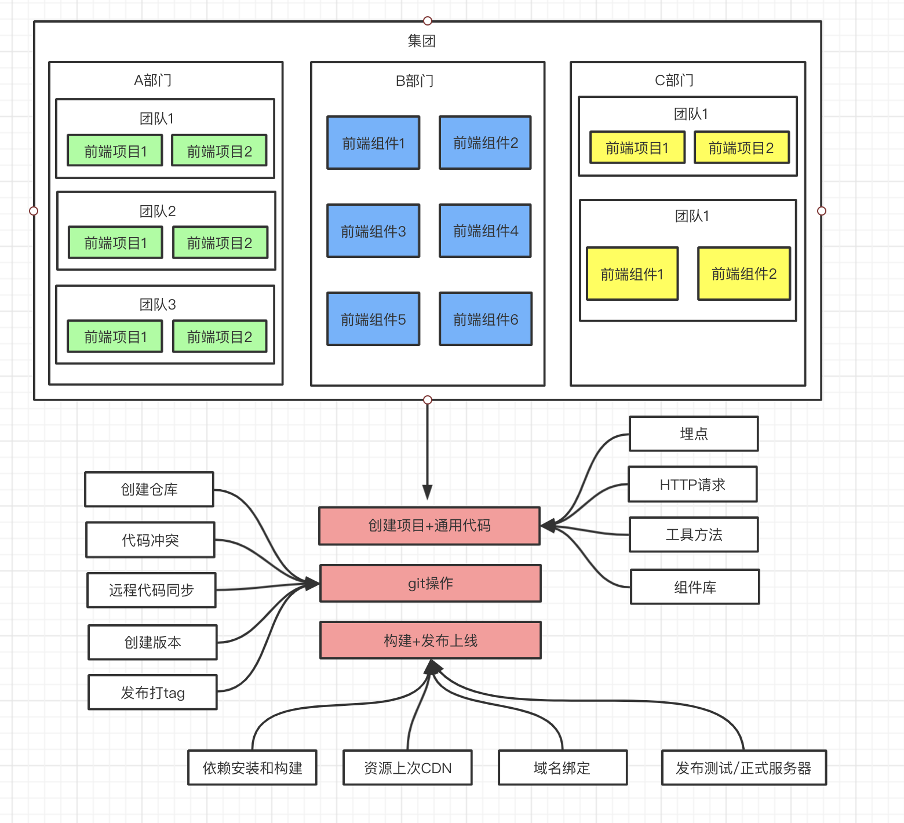
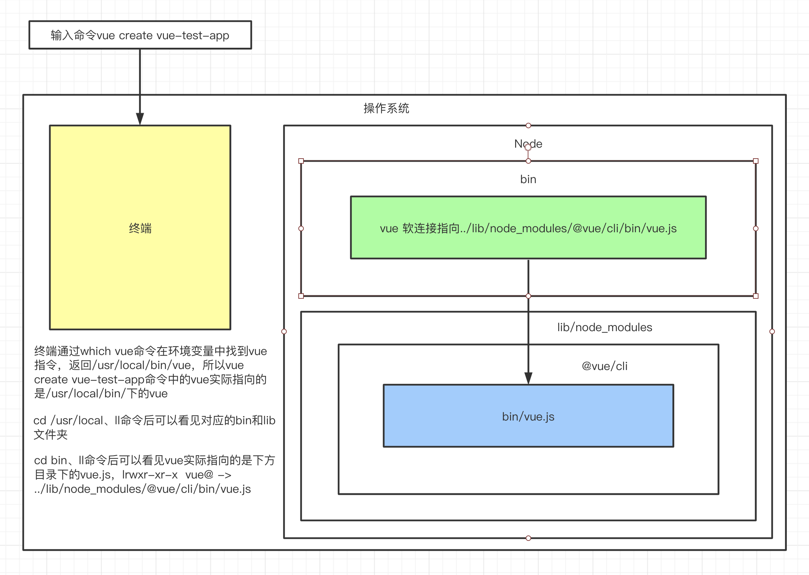
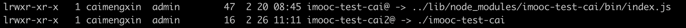
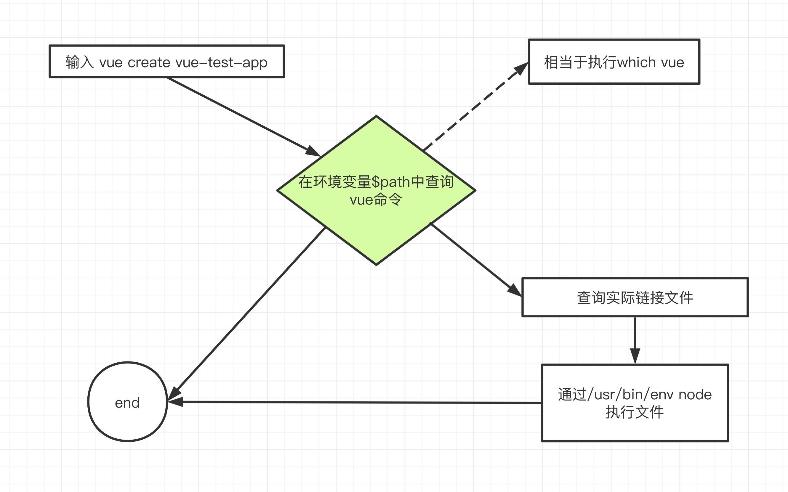
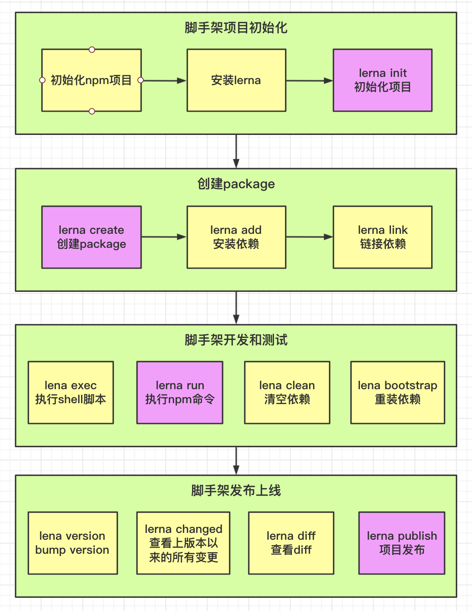

# 站在前端研发的视角，分析开发脚手架的必要性

## 研发效能

脚手架的核心目标是：**提升前端研发效能**

大厂研发架构图：



## 脚手架核心价值

将研发过程：

- 自动化：项目重复代码拷贝/git操作/发布上线操作
- 标准化：项目创建/git flow/发布流程/回滚流程
- 数据化：研发过程系统化、数据化，使得研发过程可量化

## 和自动化构建工具的区别

问题：Jenkins、Travis等自动化构建工具已经比较成熟了，为什么还需要自研脚手架？

- 不满足需求：Jenkins、Travis通常在git hooks中触发，需要在服务端执行（仅仅只能覆盖云构建端的操作），无法覆盖研发人员本地的功能，如：创建项目自动化，本地git操作自动化等
- 定制复杂：Jenkins、Travis定制过程需要开发插件，其过程较为复杂，需要使用java语言，对前端同学不够友好

## 从使用角度理解什么是脚手架

### 脚手架简介

脚手架本质是一个操作系统的客户端，它通过命令执行，比如：

```bash
vue create vue-test-app
```

上面命令由3个部分组成：

- 主命令：`vue`
- command：`create`
- command的params：`vue-test-app`

他表示创建一个vue的项目，项目的名称为`vue-test-app`，以上是一个较为简单的脚手架命令，但实际场景往往更加复杂，比如：

当前目录已经有文件了，我们需要覆盖当前目录下的文件，强制进行安装`vue`项目，此时我们就可以输入

```bash
vue create vue-test-app --force
```

这里的`--force`叫做option，用来辅助脚手架确定在特定场景下用户的选择（可以理解为配置）。还有一种场景：

 通过`vue create`创建项目时，会自动执行`npm install`帮用户安装依赖，如果我们希望使用淘宝源来安装，可以使用命令：

```bash
vue create vue-test-app --force -r https://registry.npm.taobao.org
```

这里的`-r`也叫做option，它与`--force`不同的是它使用`-`，并且使用了简写，这里的`-r`也可以替换成`--registry`，如果不知道`vue create`支持的所有options，可以使用：

```bash
vue create --help
```

`-r https://registry.npm.taobao.org`后面的`https://registry.npm.taobao.org`成为option的param，其实`--force`可以理解为：`--force true`，简写为：`--force`或`-f`

### 脚手架执行原理



脚手架的执行原理如下：

- 在终端输入`vue create vue-test-app`
- 终端解析出`vue`命令
- 终端在环境变量中找到`vue`命令
- 终端根据`vue`命令链接到实际文件`vue.js`
- 终端利用`node`执行`vue.js`
- `vue.js`解析command/options
- `vue.js`执行command/options
- 执行完毕，退出执行

## 从应用角度看如何开发一个脚手架

这里以`vue-cli`为例：

- 开发`npm`项目，该项目中应包含一个`bin/vue.js`文件，并将这个项目发布到`npm`
- 将`npm`项目安装到`node`的`lib/node_modules`
- 在`node`的`bin`目录下配置`vue`软连接指向`lib/node_modules/@vue/cli/bin/vue.js`

这样我们在执行`vue`命令的时候就可以找到`vue.js`进行执行

### 疑问解答

#### 为什么全局安装`@vue/cli`后会添加的命令为`vue`？

```bash
npm install -g @vue/cli
```

答：在`/usr/local/lib/node_modules/@vue/cli`文件夹下的`package.json`的

```javascript
"bin":{
  "vue": "bin/vue.js"
}
```

这个软连接的名称就是`vue`，所以添加后的命令为`vue`

#### 全局安装`@vue/cli`时发生了什么？

答：先把`@vue/cli`下载到`/usr/local/lib/node_modules`中，然后根据`@vue/cli`下的`package.json`，根据`bin`中的定义去`/usr/local/bin/`下去定义`@vue/cli`的软连接`vue`

#### 执行`vue`命令时发生了什么？为什么`vue`指向一个`js`文件，我们却可以直接通过`vue`命令去执行它？

答：1.终端在环境变量中找`vue`指令（相当于`which vue`命令），看有没有被注册，未注册则返回`command not found`,注册了则去找vue指令软连接指向的地址`/usr/local/lib/node_modules/@vue/cli/bin/vue.js`，去执行`vue.js`文件中的代码

​		2.因为这个`js`文件的顶部写了`#!/usr/bin/env node`,标识在环境变量中查找`node`，告诉系统使用`node`去执行这个`js`文件

### 脚手架原理进阶

#### 为什么说脚手架本质是操作系统的客户端？它和我们在PC上安装的应用/软件有什么区别？

1.node在window中是一个node.exe，在Mac中是一个可执行文件（node*）,因为node是操作系统的一个客户端，脚手架的本质是通过node去执行js文件，所以也可以说脚手架的本质是操作系统的客户端。

2.本质来说没有区别，PC安装的应用只是提供了一个GUI，脚手架是通过命令的形式

#### 如何为node脚手架命令创建别名？

进入`/usr/local/bin`目录

```bash
ln -s ./imooc-test-cai imooc-test-cai2
```



#### 描述脚手架命令执行的全过程。



## 脚手架开发流程

### 开发流程

- 创建`npm`项目

- 创建脚手架入口文件，最上方添加：

  ```javascript
  #!/usr/bin/env node
  ```

- 配置package.json，添加bin属性

- 编写脚手架代码

- 将脚手架发布到npm

### 使用流程

- 安装脚手架

  ```bash
  npm install -g your-own-cli
  ```

- 使用脚手架

  ```bash
  your-own-cli
  ```

### 脚手架开发难点解析

- 分包：将复杂的系统拆分成若干个模块

- 命令注册：例

  ```bash
  vue create
  vue add
  vue invoke
  ```

- 参数解析：

  ```bash
  vue command [options] <params>
  ```

  - options全称：`--version`、`--help`

  - options简写：`-V`、`-h`

  - 带params的options：`--path /Users/caimengxin/Desktop/vue-test`

  - 帮助文档：

    - global help
      - Usage
      - Options 
      - Commands 

    示例：`vue`的帮助信息：

    ```bash
    Usage: vue <command> [options]
    
    Options:
      -V, --version                              output the version number
      -h, --help                                 output usage information
    
    Commands:
      create [options] <app-name>                create a new project powered by vue-cli-service
      add [options] <plugin> [pluginOptions]     install a plugin and invoke its generator in an already created project
      invoke [options] <plugin> [pluginOptions]  invoke the generator of a plugin in an already created project
      inspect [options] [paths...]               inspect the webpack config in a project with vue-cli-service
      serve [options] [entry]                    serve a .js or .vue file in development mode with zero config
      build [options] [entry]                    build a .js or .vue file in production mode with zero config
      ui [options]                               start and open the vue-cli ui
      init [options] <template> <app-name>       generate a project from a remote template (legacy API, requires @vue/cli-init)
      config [options] [value]                   inspect and modify the config
      outdated [options]                         (experimental) check for outdated vue cli service / plugins
      upgrade [options] [plugin-name]            (experimental) upgrade vue cli service / plugins
      migrate [options] [plugin-name]            (experimental) run migrator for an already-installed cli plugin
      info                                       print debugging information about your environment
    
      Run vue <command> --help for detailed usage of given command.
    
    ```

还有很多，比如：

- 命令行交互
- 日志打印
- 命令行文字变色
- 网络通信：HTTP、WebSocket
- 文件处理

等等......

## 脚手架本地link标准流程

链接本地脚手架：

```bash
cd your-cli-dir
npm link
```

链接本地库文件：

```bash
cd your-lib-dir
npm link
cd your-cli-dir
npm link your-lib
```

取消链接本地库文件：

```bash
cd your-lib-dir
npm unlink
cd your-cli-dir
# link存在
npm unlink your-lib
# link不存在
rm -rf node_modules
npm install -S your-lib
```

理解`npm unlink`：

- `npm link your-lib`：将当前项目中的`node_modules`下指定的库文件链接到`node`全局`node_modules`下的库文件
- `npm link`：将当前项目链接到`node`全局`node_modules`中作为一个库文件，并解析`bin`配置创建可执行文件

理解`npm unlink`：

- `npm unlink`：将当前项目从`node`全局`node_modules`中移除
- `npm unlink your-lib`：将当前项目中的库文件依赖移除

## 原生脚手架开发痛点分析

- 痛点一：重复操作
  - 多Package本地link
  - 多Package依赖安装
  - 多Package单元测试
  - 多Package代码提交
  - 多Package代码发布
- 痛点二：版本一致性
  - 发布时版本一致性
  - 发布后相互依赖版本升级

**package越多，管理复杂度越高**

## Lerna简介

> Lerna is a tool that optimizes the workflow around managing multi-package repositories with git and npm.

Lerna是一个优化基于git+npm的多package项目的管理工具

### 优势

- 大幅减少重复操作
- 提升操作的标准化

> Lerna是架构优化的产物，它揭示了一个架构真理：项目复杂度提升后，就需要对项目进行架构优化。架构优化的主要目标往往都是以效能为核心。

### 官网

官网：https://lerna.js.org/

### 案例

使用Lerna管理的大型项目：

- babel：https://github.com/babel/babel
- vue-cli：https://github.com/vuejs/vue-cli
- create-react-app：https://github.com/facebook/create-react-app

### lerna开发脚手架流程（重点）



### Lern使用细节（重点）

- `lerna init`:

  会自动完成`git`初始化，但不会创建`.gitignore`文件，这个必须要手动添加，否则会将`node_modules`目录都上传到`git`，如果`node_modules`已经加入到`git stage`，可使用：

  ```bash
  git reset HEAD <file>
  ```

  执行`unstage`操作，如果文件已经被`git`监听到变更，可使用：

  ```bash
  git checkout -- <filename>
  ```

  将变更作废，记得在执行操作之前将文件加入：`.gitignore`

- `lerna add`：

  - 第一个参数：添加npm包名
  - 第二个参数：本地package的路径
  - 选项：
    - `--dev`：将依赖安装到`devDependencies`，不加时安装到`dependencies`

  ```bash
  lerna add <package> [loc] --dev
  ```

- `lerna link`：

  如果未发布上线，需要手动将依赖添加到`package.json`，再执行`npm link`

- `lerna clean`：

  只会删除`node_modules`，不会删除`package.json`中的依赖

- `lerna exec`和`lerna run`：

  `--scope`属性后添加的是包名，而不是`package`的路径，这点和`lerna add`用法不同

- `lerna publish`

  - 发布时会自动执行：`git add package-lock.json`，所以package-lock.json不要加入`.gitignore`文件
  - 先创建远程仓库，并且同步一次master分支
  - 执行`lerna publish`前先完成`npm login`
  - 如果发布的npm包名为：`@xxx/yyy`的格式，需要先在npm注册名为：xxx的organization，否则可能会提交不成功
  - 发布到`npm group`时默认为private，所以我们需要手动在`package.json`中添加如下设置

```javascript
"publishConfig":{
  "access":"public"
}
```

## yargs使用

```javascript
#! /usr/bin/env node

const yargs = require('yargs')
const dedent = require('dedent')
const pkg = require('../package.json')

const cli = yargs()
const argv = process.argv.slice(2)
const context = {
  imoocVersion: pkg.version
}
cli
	// 配置 第一行的使用提示
  .usage('Usage: imooc-cli-cai [command] <options>')
	// 配置 提示用户脚手架最少要接收一个命令
  .demandCommand(1,'A command is required. Pass --help to see all available commands and options.')
	// 配置 命令输入错误或者没有此命令的时候可以根据输入推荐合适的命令
  .recommendCommands()
	// 配置 命令错误时执行的方法
  .fail((err,msg)=>{
    console.log(err)
  })
	 // 配置 help和version的别名
  .alias('v','version')
  .alias('h','help')
	// 配置 终端宽度
  .wrap(cli.terminalWidth())
	// 配置 尾部的提示文字
  .epilogue(dedent`
      when a command fails,all logs are written to lerna-debug.log in the current working directory.

      For more information,find our manual at https://github.com/lerna/lerna
    `)
	// 配置 debug命令
    .options({
      debug:{
        type: "boolean",
        describe: "Bootstrap debug mode",
        alias: "d"
      }
    })
	// 配置 registry命令
    .option('registry',{
      type: "string",
      describe: "Define global registry",
      alias: 'r'
    })
	// 配置 分组
    .group(['debug'],'Dev Options')
    .group(['registry'],'Extra Options')
	// 配置 命令，当执行 init [name] 命令的时候一系列的行为
    .command('init [name]', 'Do init a project',(yargs)=>{
      yargs
        .option('name',{
          type: 'string',
          describe: 'Name of a project',
          alias: 'n'
        })
    },(argv)=>{
      console.log(argv)
    })
	// 配置 命令的第二种方法
    .command({
      command: 'list',
      aliases: ['ls','ll','la'],
      describe: 'List local packages',
      builder:(yargs)=>{},
      handler: (argv)=>{
        console.log(argv)
      }
    })
	// 配置 严格模式，最后一行提示命令错误，如：无法识别的选项：lis
  .strict()
 	// 解析参数
  .parse(argv,context)

```

## lerna原理（还未深入理解）

- 通过import-local来优先调用本地lerna命令
- 通过Yargs初始化脚手架，然后注册全局属性，再注册命令，最后通过parse方法解析参数
- lerna命令注册时需要传入build和handler两个函数，build用来注册命令专属的options，handler用来处理命令的业务逻辑
- lerna通过配置npm本地依赖的方式进行本地开发，具体写法是在package.json中写入：file:your-locale-module-path,在lerna publish的时候会自动替换路径

## 这一周的从4-8到最后有很多不理解的地方，需要学习了node之后再深入学习

