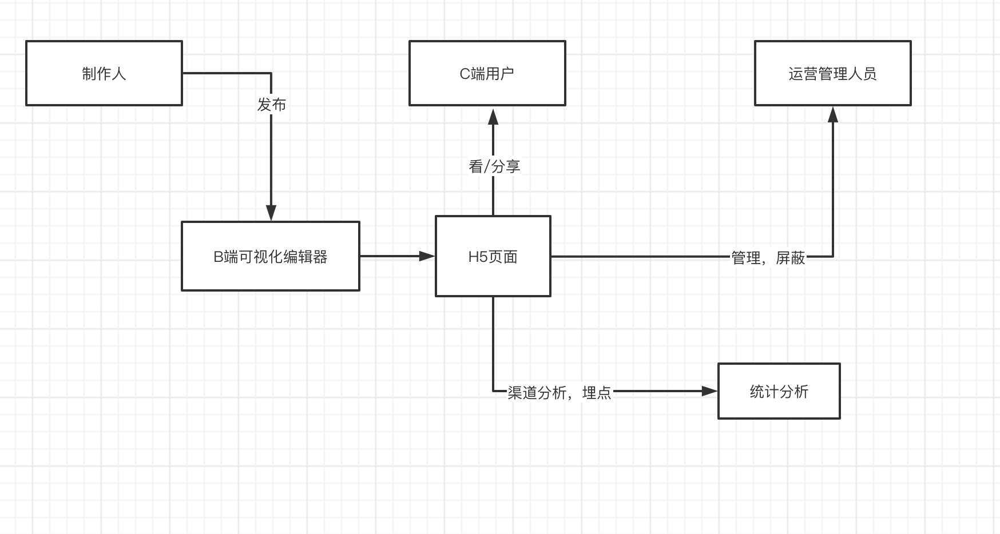
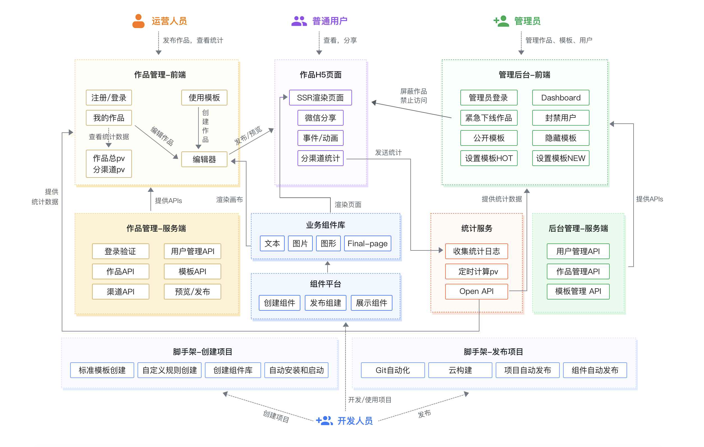
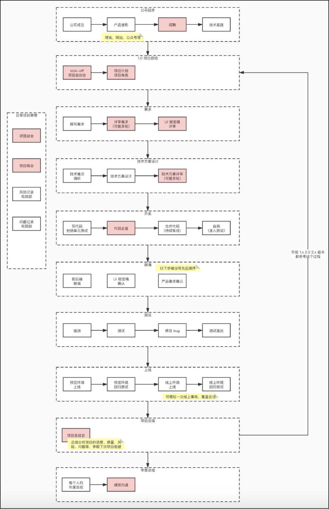

# 整体架构设计 V1.0

## 需求
- [需求稳定](https://www.yuque.com/books/share/af79538c-09eb-4ddd-bfb7-599816c233bf)
- [体验地址](https://www.imooc-lego.com/)

## 范围
从需求来看，可以简单拆分成以下几个大的模块

**B端和编辑器**

采用前后端分离，因此可以划分为两个代码仓库
- biz-editor-FE
- biz-editor-server

通过可视化平台拖拽等方式，可以生成作品，然后发布。

**C 端**

面向用户群体，因此可以高性能(使用SSR)，可以对作品进行分享，提升业务增长。

**管理后台**

- admin-FE
- admin-server

平台管理，负责作品的审核，发布，以及对用户的管理等待。

**独立的组件库**

提升开发效率和复用，独立的 npm 包，供编辑器端和H5端使用

**统计服务**

单独拆分，以报表等形式展示，可以清晰的看到 PV/UV，用户人数活跃度，增长等。

## 需求关系



## 模快设计



## 核心数据结构

单个组件应该使用vnode规范，使用业界统一规范有助于我们少踩一些坑，并能得到扩展性较强的组件结构。vuex store 的大概结构如下：


```js
{
    // 作品
    work: {
        title: '作品标题',
        setting: { /* 拓展配置： 如配置渠道 */ },
        props: { /* 页面 body 的一些设置，如背景色 */ },
        components: [
            {
                id: 'xxx', // 每个组件都有 id ，不重复
                name: '文本1',
                tag: 'text',
                attrs: { fontSize: '20px' },
                children: [
                    '文本1' // 文本内容，有时候放在 children ，有时候放在 attrs 或者 props ，没有标准，看实际情况来确定
                ]
            },
            {
                id: 'yyy',
                name: '图片1',
                tag: 'image',
                attrs: { src: 'xxx.png', width: '100px' },
                children: null
            },
        ]
    },
    // 画布当前选中的组件
    activeComponentId: 'xxx'
}
```

**数据流转核心**

根据组件的位置生成相应的数据结构 **JSON**，进行入库，然后在 C 端在根据对应的 JSON 对组件进行渲染

## 扩展性保证

- 预留一些字段，
- 后期可能多人协作开发
- 自定义事件的加入

## 研发提效

- 脚手架的搭建，创建发布
- 组件平台，方便复用

## 前端开发流程



## 运维保障

- 线上服务和运维服务
- 安全
- 监控与报警
- 服务拓展性: 基于云服务,可以随时拓展机器和配置

## 愿景

保证业务增长，服务于当前的业务。