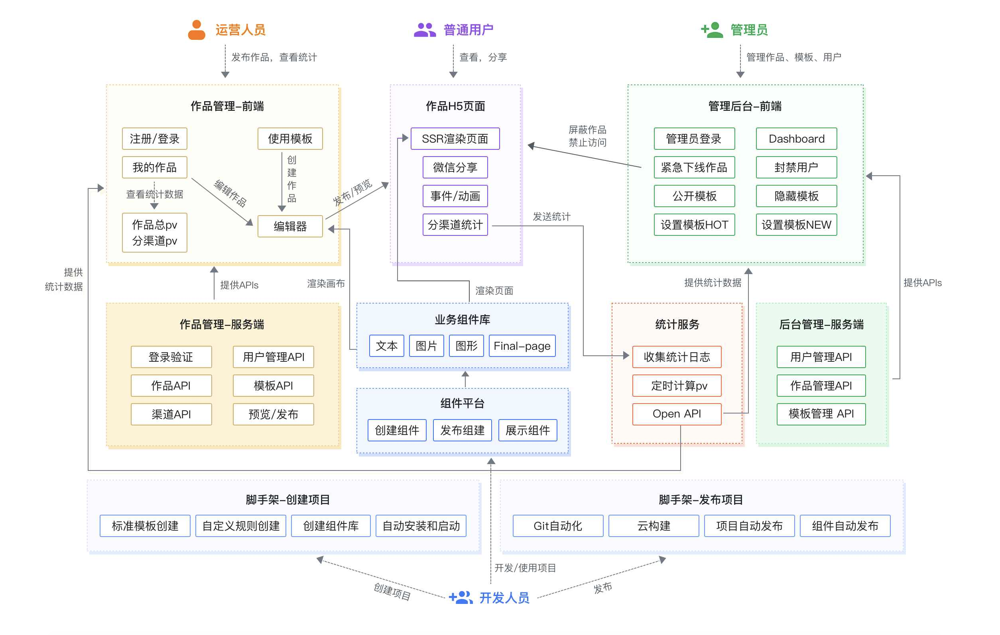

# 脚手架核心开发流程

## 脚手架架构图



## gitFlow


## 脚手架拆分策略

### 拆分原则
根据模块的功能来拆分：
- **core: 核心模块**
- **命令模块：commands**
- **模型模块：models**
- **工具模块：utils**

### 拆分结果为以下


- **核心流程：core**

- **命令：commands**
    - 初始化
    - 发布
    - 清除缓存

- **模型层：models**
    - Command 命令
    - Project 项目
    - Component 项目
    - Npm 模块
    - Git 仓库

- **支撑模块:utils**
    - Git 操作
    - 云构建
    - 工具方法
    - API请求
    - Git Api 


## 命令执行流程


### 检测版本号

直接输出当前 **package.json** 信息

```js
function checkPkgVersion() {
    log.info('cli', pkg.version)
}
```

### 检查 Node 版本

获取系统的 **Node**版本，然后和我们预定的版本进行对比

```js
function checkNodeVersion() {
    // 获取当前Node版本
    const currentVersion = process.version;
    const lowestVersion = constant.LOWEST_NODE_VERSION;
    // 比对最低版本号
    if (!semver.gte(currentVersion, lowestVersion)) {
        throw new Error(colors.red(`aotu-cli 需要安装 v${lowestVersion} 以上版本的 Node.js`))
    }
}
```

### 检查是否 root 启动

利用 **root-check** 来帮忙我们快速实现，如果是 **root** 启动，会帮我们进行降级

```js
function checkRoot() {
    // root 启动的目录无法操作，需要进行降级
    // sudo 启动 打印就是 0  正常就是 501
    const rootCheck = require('root-check')
    rootCheck()
}
```

### 检测用户主目录

```js
const userHome = require('user-home')
const pathExists = require('path-exists').sync
function checkUserHome() {
    if (!userHome || !pathExists(userHome)) {
        throw new Error(colors.red('当前用户主目录不存在，请检查!'))
    }
}
```

### 检测入参

根据输入参数是否开启 **debug** 模式

```js
function checkInputArgs() {
    args = require('minimist')(process.argv.slice(2))
    checkArgs()
}

function checkArgs() {
    if (args.debug) {
        process.env.LOG_LEVEL = 'verbose'
    } else {
        process.env.LOG_LEVEL = 'info'
    }
    log.level = process.env.LOG_LEVEL;
}
```

### 检查环境变量

```js
function checkEnv() {
    const dotenv = require('dotenv');
    const dotenvPath = path.resolve(userHome, '.env')
    if (pathExists(dotenvPath)) {
        dotenv.config({
            path: dotenvPath
        })
    }
    createDefaultConfig()
    log.verbose('环境变量', process.env.CLI_HOME_PATH)
}

function createDefaultConfig() {
    const cliConfig = {
        home: userHome
    };
    if (process.env.CLI_HOME) {
        cliConfig['cliHome'] = path.join(userHome, process.env.CLI_HOME)
    } else {
        cliConfig['cliHome'] = path.join(userHome, constant.DEFAULT_CLI_HOME);
    }
    process.env.CLI_HOME_PATH = cliConfig.cliHome;
}
```

### 检测是否最新版本

```js
async function checkGlobalUpdate() {
    // 获取最新版本号和模块名
    const currentVersion = pkg.version;
    const npmName = pkg.name;
    // 调用 API 拿到所有版本号
    const { getNpmSemverVersion } = require('get-npm-info');
    // 提取所有版本号，对比那些版本号大于当前版本号
    const lastVersion = await getNpmSemverVersion(currentVersion, npmName);
    // 获取最新版本号，提示用户更新到该版本
    if (lastVersion && semver.gt(lastVersion, currentVersion)) {
        log.warn(colors.yellow(`请手动更新 ${npmName}，当前版本：${lastVersion}，最新版本 ${lastVersion}
                  更新命令：npm install -g ${npmName}`))
    }
}
```

## Node 支持 Es Module

可以采用 **Gulp** 进行编译，可以参考 [使用 Gulp 对 Node 进行编译](https://lilixikun.github.io/blog/node/MPA%E6%9E%B6%E6%9E%84%E5%88%9D%E6%8E%A2.html#%E4%BD%BF%E7%94%A8-gulp-%E5%AF%B9-node-%E8%BF%9B%E8%A1%8C%E7%BC%96%E8%AF%91)