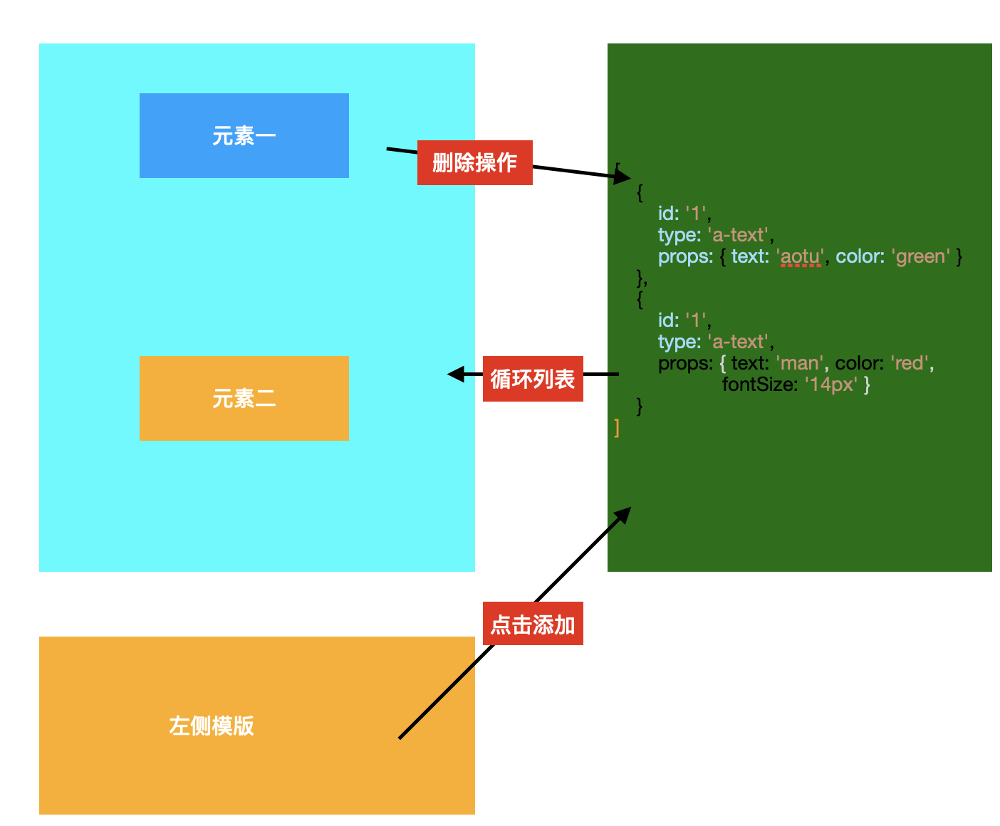

# 需求初步分析

**首页**

- 导航条
    - 未登录显示未登录按钮
    - 已登录 显示创建设计、我的作品、还有下拉菜单（个人设置和退出)

- 展示列表
    - 图片
    - 标题
    - 作者信息和使用人数
    - Hover 显示创建按钮

- 搜索
    - 搜索以后有清空按钮

**登录**
- 发送验证码
- 登录、表单验证

**模版详情页**

- 展示图片、二维码、作者、标题
- 使用该模版创建
- 下载图片

**我的作品**

- 作品或者模版列表
    - 编辑
    - 统计
    - 删除
    - 转赠
    - 下载图片

- 搜索
- 翻页

**编辑器**

- 左组件面板-可以添加到编辑器中的组件类型
    - 文本
    - 图形
    - 形状
    - 。。。

- 中画布区域-从左侧添加的组件都会呈现到编辑器
    - 点击选中
    - 拖动改变位置、大小
    - 快捷键
    - 右键菜单

- 右属性编辑面板-可以编辑中间组件的属性以及其他功能
    - 元素属性
    - 图层背景、隐藏显示、锁定解锁、拖动排序
    - 背景设置

- 顶部保存、发布、预览、设置
    - 点击保存
    - 点击预览、弹框
        - 左侧显示预览
        - 右侧设置标题、描述和头图
    - 发布-弹框
        - 左侧显示截图
        - 右侧显示默认渠道、并且可以进行编辑

- 其他-不属于界面上的一些功能（定时保存、退出提示等等）

# 项目难点分析

- 核心问题：**编辑器和h5页面整体就是一系列元素组成的**，自然而然就应该抽象成组件，但是组件的 `属性` 应该如何设计、`Scheml` 如何维护
- 组件的可扩展性
- 编辑器的核心功能其实就是对组件增删改查的操作，如何设计编辑器整体的状态
- 组件有多种，它的属性也有多种。怎么将这些属性渲染成不同的表单组件、在表单组件中、属性作出修改后、怎样实时的将值反射到组件中
- 编辑器有很多交互：拖动移动位置、大小、快捷键、右键菜单、缩放、重做/回滚、等等功能。他们都是核心之外的交互，那么很自然，如何把这些功能进行结偶。
 
 # 业务组件库

 对于上面的需求、我们有必要搭建自己的组件库、然后定义一系列特有的组件属性。

 ## 组件属性设计

 组件属性大体可以分为两类：`公共属性` 和 `特有属性`，可以参考 [属性](https://www.yuque.com/docs/share/37224f92-3071-4ff7-adf1-0d0635677c34)

 ## 组件扩展性问题
 组件在业务组件库中是没有任何问题的，这里说的扩展性是指如何在编辑器中对它进行适配，包括展示和编辑的适配。这个我们可以在编辑器中再去思考

# 编辑器难点解决方案

首先编辑器的设计大体如下：
- 左侧：组件模版库
- 画布
- 右侧属性设置

## 整体状态设计

编辑器其实就是围绕中间画布的元素进行一系列的操作、那么自然就是一系列的元素组件组成、我们可以把它抽象成一系列特定的数据结构



```ts
export interface EditorStore {
  // 供中间编辑器渲染的数组
  components: ComponentData[];
  // 一系列和其他状态相关的信息，应该有很多
  // 当前编辑的是哪个元素，uuid
  currentElement: string;
}
interface ComponentData {
  // 每个元素 props 所有属性
  // 我们上节课已经分析过了，是 css 属性和其他属性的混合体
  // 并且我们会把这些属性完全平铺开来，其实在编辑器分析过后，你就能更感受到平铺的一个好处
  props: { [key: string]: any };
  // id，uuid v4 生成
  id: string;
  // 业务组件库名称 l-text，l-image 等等 
  name: string;
}
```

## 场景设计

将元素渲染到画布

使用 `store` 中 `components` 数据进行循环渲染

```js
compoents.map(component => <component.name {...props} />）
```

### 渲染左侧预设组件模版

我们可以维护一个服务信息、每次拉取最新的组件。这些组件都有一个点击事件，我们可以添加 一层 `wrapper` 来解决，这样可以做到和内部组件隔离，互不影响

```js
compoents.map(component => <Wrapper><component.name {...props} /></Wrapper>）
```

### 添加删除组件

其实就是操作 `store` 中的数据即可

```js
// 添加
components.push({type: '', props: {} })
// 删除
components = components.filter((component) => component.id !== id)
```

### 将属性映射到全部表单

用一张图来表示流程


现在我们以及完成了数据到画布的第一步、接下来就是点击画布中的某个属性需要把该组件的属性映射到右侧的表单中。

一个很容易想到的把直接表单组件写死到页面中

```js
const currentComponentProps = {
  text: '123',
  color: '#fff'
}

<input value={text}/>
<color-picker value={color}/>
...
```

缺点：
- 代码冗长
- 对不同类型组件都需要判断
- 可扩展性很差

看到界面展示、我们可以想到，界面UI就是数据的抽象，所以我们可以使用特定的数据结构将它渲染成页面

```js
const textComponentProps = {
  text: 'hello',
  fontFamily: 'HeiTi',
  color: '#fff'
}

const propsMap = {
  text: {
    component: 'input'
  },
  fontFamily: {
    component: 'dropdown',
  },
  color: {
    component: 'color-picker'
  }
}

// 这里我们还是循环所有属性，在每个属性中渲染对应处理这个属性的组件
map(textComponentProps, (key, value) => {
  <propsMap[key] value={value}>
})
```

- 当没有遇到类型 Form 组件时候,我们可以进行二次开发，只要这个组件有对应 `value` 属性
- 在一定程度上满足了可扩展性，组件的属性可以扩展，对于 `color` 属性，我们可以二次开发一个 `拾色器` 组件,只需要传入 `value` 属性即可

我们的数据自始保持从上到下，也就是说在 `Form` 操作变更了数据最终还是要回到 `store` 中的。很明显，我们右侧表单在修改时，每个都对应有自己的 `onChange` 事件，我们就可以知道是那个组件、那个属性变化了，我们就去更新对应的属性值即可，这样 `store` 发生变更、数据流就完成了。

```js
map(textComponentProps, (key, value) => {
  const handleChange = (propKey, newValue, id) => {
    const updatedComponent = store.components.find(component.id === id)
    updatedComponent.props[propKey] = newValue
  }
  <propsMap[key] value={value} @change={handleChange}>
}

```

除了上面表单的更新，中间的画布交互更新，也是一样原理。比如说我们发生拖动位置，对应就是发生 `onChange` 事件去更改 `store` 里面的值。这里需要注意的是我们在外层添加一层 `Wrapper` 组件，各种事件都是放在这个上面，比如拖动、改变位置后发生 `onChange` 事件

对于复杂组件也是如此，不管你内部逻辑有多么的复杂，添加上传图片、删除、编辑、最终发出去事件的值就是对 `picture` 值的变化

### 画布操作插件化

比如快捷键操作，它只写成普通的可重用的函数即可，在回调中，我们就可以对全局 `store` 进行一系列的改写，而快捷键这个功能和编辑器是没有任何关系的。

# 总体架构


- 技术栈：Vue3+TS
- 打包工具：vie-cli + rollup
- 组件库：自定义组件库 + ant-design-vue
- 持续集成：Travis


