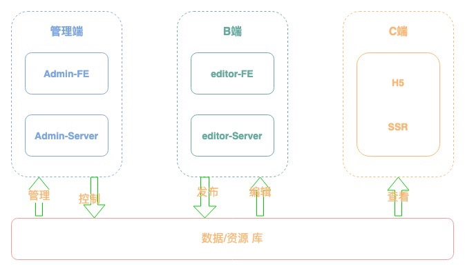
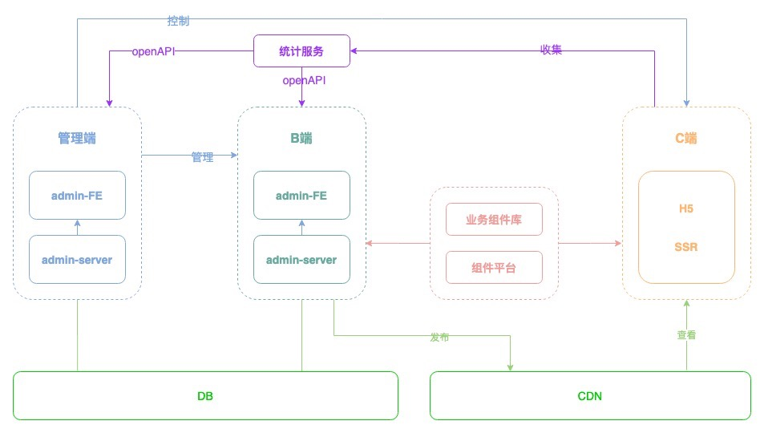

# 《慕课乐高》  整体架构设计  V1.0

## 项目需求
参见：[需求文档](https://www.yuque.com/books/share/af79538c-09eb-4ddd-bfb7-599816c233bf)

## 核心功能清单
|  使用者   | 功能  |
|  ----  | ----  |
| B端  | 模板库 |
|   | 作品管理 |
|   | 编辑器|
|   | 数据统计 |
| C端  | 查看作品|
|   | 分享作品|
| 管理端 | 用户管理 |
| | 模板管理 |
| | 作品管理 |
| | 数据统计 |

## 目标
- 制定 作品制作>发布>展示 整体架构
- 为下一步详细方案设计提供依据

## 范围
- 根据需求进行整体架构设计，不涉及具体实现。
- 业务逻辑需自我循环，有始有终，有进有出。

## 数据流转关系图

## 模块设计

- 组件库，独立第三方，同时用于编辑器和H5
- 因需自定义事件统计，需自研统计服务

## 作品的数据结构

## 扩展性保证

- 扩展组件
- 扩展编辑器的功能，例如：组件隐藏、锁定
- 扩展页面的配置

## 开发提效
- 脚手架
- 组件平台

## 运维保障
- 线上服务和运维服务
- 备份与安全
- 监控和报警
- 服务扩展性：流量大