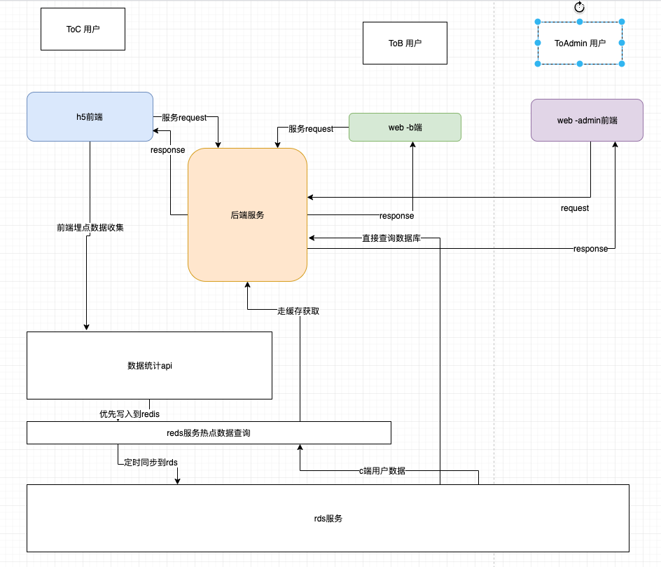

####     文档资料：https://www.imooc.com/wiki/weban
####     技术永远都是要为业务服务
####     技术是实现业务增长。

####    架构师：
不要过多的关注细节，要看整体，看范围。
不要确定内容需要调研设计
设计需要考虑复杂度，越简单越好。

####     以架构师的思考-分析业务需求
- 项目-浅层需求   
- 项目-深层需求
没有业务场景无需求架构设计，需要有具体解决方案才需要有架构设计。

前端研发流程：

####    以架构师的思维来分析需求

- 核心点：需要分析潜在需求，需要全局的把握思维，需要为用户增长负责。
- 全面、完整、闭环-三个关键点。
- 参考业务理解能力：设计测试一个h5抽奖界面，你作为主要测试负责人，你会具体思考哪些需求点（常规、隐形），以
- 测试过程中可能会涉及到前端实现的技术方案。
- -需要通过流程图的完善业务--初级架构师。

####    浅层需求分析
需求指导设计、设计指导开发

####    深层需求分析
不容易一眼看出来，但却很重要的。
架构师-需要深度理解业务，技术要为业务增长负责。
功能存在必要性，服务业务增长。
业务闭环，其中统计与统计分销很重要，c端方面渠道分销需要着重统计。

####    架构设计-全局的结构设计
不同角色，基于角色功能列表，每个功能单个闭环。

- pm的关系：统一战线，对业务负责。

####    技术方案设计
ssr的使用场景需要考虑-b端、c端？需要考虑场景toc 可以考虑ssr使用。
前后端代码库设计。

####    业务组件库？
画布什么内容映射到c端h5就是什么样子，render 渲染的逻辑需要一致的。（业务组件-独立第三方内容
，各个模块都是组件进行应用）

####    统计服务
日常pv/uv,每个页面的访问、uv每个用户的访问
具体事件-需要一定自定义事件。

####    项目分析与项目之间依赖关系
- 前端项目    h5ssr项目
- 后端项目 
- 统计服务-提供openapi内容（面对用户，面对admin）

####    脚手架
>脚手架-创建项目 
>脚手架-组件

####    数据结构的设计
数据的存取与抽象内容。
数据存取结构
画布与同步修改
图层？div?
--------------------------------------------------------------------------------
####    技术方案
阐述自己的思路，流程，处理方案，流程图，数据流，判断逻辑，库表设计。
也是工作内容的产出。
--------------------------------------------------------------------------------
####    技术方案整体策略
###### 产品需求
范围：整体设计，架构设计，没有细节
###### 模块设计
模块拆分与关系图，结果
模块的关键功能，职责（组件功能）
###### 特殊的模块重点说明
组件库，独立第三方，用于编辑器
自主研发的统计服务
做的数据结构
Vuex的 结构届时
###### 数据结构关系图

###### 扩展性保证
扩展组件，数据结构层面
扩张选编辑器的功能
扩展页面的配置
（可以进行具体讨论操作，集思广益）

###### 开发提效
- 脚手架
- 组件平台

###### 运维平台
线上服务检测
安全
监控和报警
服务扩展性；流量大
大厂自己研发，小厂的第三方运维。

--------------------------------------------------------------------------------
#### 作业打卡
- https://imooc-lego.github.io

输入/输出。
#### 学习的思考：浅层学习看输入，深层学习涮出。

##### 技术方案的理解
技术方案是必要的，在日常项目管理也是督促完成方案设计，同时有具体方案可以与产品，测试进行沟通学习。
技术方案是沉淀自己思想的途径。

#### 技术实现（业务）
h5抽奖为例
从一个架构师思考：
功能完整性：安全设计需要补充。

#### 网站技术方案流程图
