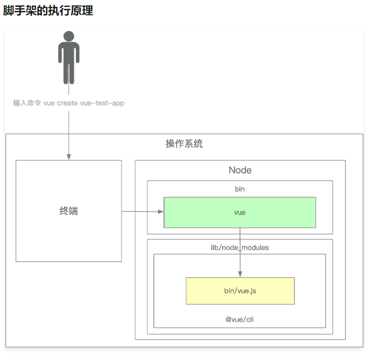

# 脚手架架构设计和框架搭建

## 脚手架的作用

开发脚手架的核心目标是：提升前端研发效能

## 脚手架的核心价值

1. 自动化：项目重复代码拷贝/git 操作/发布上线操作
2. 标准化：项目创建/git flow/发布流程/回滚流程
3. 数据化：研发过程系统化、数据化，使得研发过程可量化

## 和自动化构建工具的区别

1. 不满足需求：jenkins、travis 通常在 git hooks 中触发，需要在服务端执行，无法覆盖研发人员本地的功能，如：创建项目自动挡化、本地 git 操作自动化等
2. 定制负责：jenkins、travis 定制过程需要开发插件，其过程较为复杂，需要使用 java 语音，对前端开发不够友好

## 入门

脚手架本质上来说，是一个操作系统的客户端。  
它通过命令行执行：
```
vue create vue-test-app
```

### 脚手架的实现原理

通过 npm 全局安装一个 脚手架例如 `@vue/cli` 后，会解析 `package.json` 文件中的 bin 配置去在 node 的安装目录下的 bin 目录下，创建一个软连接，连接到软件包中，软连接的名称就是 bin 配置的 key，连接的文件就是 bin 配置的 value，value 指向的文件中需要设置 `#! /usr/bin/env node` 来标识文件执行的方法

### 基于 lerna 搭建自己的脚手架并且发布到 npm
安装方法

```
    npm install -g @weilai-cli/core
```
执行命令
```
    weilai-cli -h
```

## 进阶

### 理解 yargs 常用 API 和 开发流程

```
const cli = yargs(); // 创建一个基础脚手架

    cli
        // 配置 使用提示
        .usage('Usage: weilai-test-cli [command] <options>')
        // 配置 脚手架最少要接收一个命令
        .demandCommand(1, "最少需要输入一个命令。 通过 --help 查看所有可用的命令和选项。")
        // 配置 命令输入错误的时候可以根据输入 推荐合适的命令
        .recommendCommands()
        // 配置 严格的无法识别的命令也将报告为错误
        .strict()
        // 配置 发生故障时执行的方法
        .fail((err, msg) => {
            console.log(err)
        })
        // 配置 help 和 version 的别名
        .alias('h', 'help')
        .alias('v', 'version')
        // 配置 容器宽度
        .wrap(cli.terminalWidth())
        // 配置 收尾的文字
        .epilogue(
            dedent`
                哎哟，不错哟！
                小伙汁
            `
        )
        // 配置 gameStart 配置 类型为布尔值，描述是五黑走起，别名是 g
        .options({
            gameStart: {
                type: 'boolean',
                describe: '五黑走起',
                alias: 'g'
            }
        })
        .option('gameEnd', {
            type: 'string',
            // hidden: true,
            describe: '冲冲冲',
            alias: 'r'
        })
        // 配置 分组 把 gameStart 分配到 召唤师峡谷 这个组里面
        .group(['gameStart'], '召唤师峡谷:')
        .group(['gameEnd'], '慕课网:')
        // 配置 命令 当执行 init [name] 命令的时候一系列的行为
        .command(
            'init [name]', 'Do init a project', 
            (yargs) => {
                // 子命令
                yargs
                    .option('name', {
                        type: 'string',
                        describe: 'Name of aproject',
                        alias: 'n'
                    })
            }, 
            (argv) => {
                // 行为
                console.log(argv)
            }
        )
        // 配置 命令的第二种方法
        .command({
            command: 'list',
            aliases: ['ls', 'la', 'll'],
            describe: 'List local packages',
            builder: (yargs) => {

            },
            handler: (argv) => {
                console.log(argv)
            }
        })
        // 解析参数
        .parse(argv, context)
```

### 理解 lerna 实现原理

已经忘掉了😃  
准备二刷三刷

### import-local 实现原理，理解 require.resolve 实现原理

已经忘掉了😃  
准备二刷三刷

