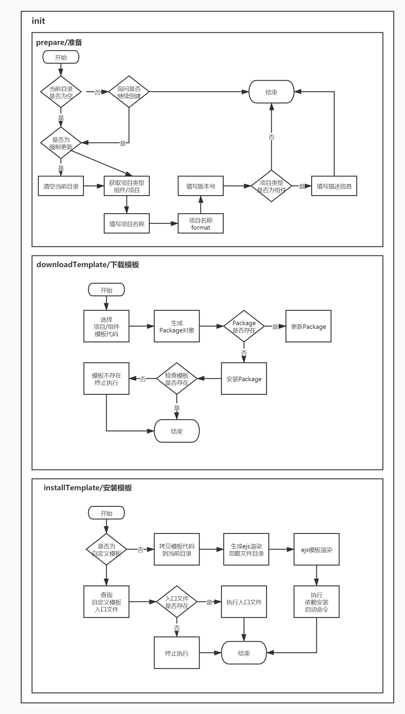

# 脚手架创建项目流程设计和开发
完成 `weilai-cli` 脚手架创建项目流程开发

本期主要是 `prepare/准备、downloadTemplate/下载模板` 部分的内容

## 创建功能架构设计
1. 首先安装模板之前，我们需要做一些准备操作，例如：`判断目录是否为空、创建的项目类型、以及收集一些必要信息`；
2. 其次需要根据选择的项目类型选择下载相应的项目模板；
3. 最后我们需要对下载的模板进行安装操作以及做一些特殊处理。



## prepare/准备
首先我们需要获取模板信息，来确认是否有模板可供下载，否则填了半天信息，结果没有模板可以下载岂不尴尬;

然后我们需要判断目标目录是否为空，如果不为空要提示用户是否继续创建，如果继续创建，则要提示用户是否清空目标目录下的所有文件;

然后要求用户输入一些必要的信息，例如：`名称、版本号、类型、模板` 等

示例代码如下：
```
// 准备阶段
async prepare() {
    const localPath = process.cwd()

    // 0. 判断项目模板是否存在
    const spinner = spinnerStart('正在获取模板信息...')
    const template = this.template = await getProjectTemplate()
    spinner.stop(true)
    log.verbose('template', template)
    if(!Array.isArray(template) || template.length === 0) {
        throw new Error('项目模板不存在')
    }

    // 1. 判断当前目录是否为空
    if(!this.isCwdEmpty(localPath)) {
        // 2. 询问是否启动强制更新
        let ifContinue
        if(!this.force) {
            ifContinue = (await inquirer.prompt({
                type: 'confirm',
                name: 'ifContinue',
                default: false,
                message: '当前文件夹不为空，是否继续创建项目？'
            })).ifContinue
            
            // 终止流程
            if(!ifContinue) return false
        }

        if( ifContinue || this.force ) {
            // 二次确认
            const { confirmDelete } = await inquirer.prompt({
                type: 'confirm',
                name: 'confirmDelete',
                default: false,
                message: '是否确认清空当前目录下的文件？'
            })

            if(confirmDelete) {
                // 清空当前目录
                const spinner = spinnerStart('正在清空当前目录...')
                fsExtra.emptyDirSync(localPath)
                spinner.stop(true)
            }
        }
    }
    
    // 项目的基本信息
    return this.getProjectInfo()
}

// 获取项目信息
async getProjectInfo() {
    function isValidName(v) {
        return /^[a-zA-Z]+([-][a-zA-Z][a-zA-Z0-9]*|[_][a-zA-Z][a-zA-Z0-9]*|[a-zA-Z0-9])*$/.test(v)
    }

    let projectInfo = {}

    // 1. 选择创建项目或者组件
    const { type } = await inquirer.prompt({
        type: 'list',
        name: 'type',
        message: '请选择初始化类型',
        default: TYPE_PROJECT,
        choices: [
            { name: '项目', value: TYPE_PROJECT },
            { name: '组件', value: TYPE_COMPONENT}
        ]
    })

    log.verbose('project class', type)
    const title = type === TYPE_PROJECT ? '项目' : '组件'
    this.template = this.template.filter(template => template.tag.includes(type))

    const projectPrompt = [
        {
            type: 'input',
            name: 'projectName',
            message: `请输入${title}名称`,
            default: this.projectName ? this.projectName : '',
            validate: function(v) {
                const done = this.async()
                setTimeout(() => {
                    // 1. 首字符必须为英文
                    // 2. 尾字符必须为英文和数字
                    // 3. 字符仅允许'-_'
                    if(!isValidName(v)) {
                        return done(`请输入合法的${title}名称`)
                    }
                    done(null, true)
                })
            },
            filter: (v) => {
                return v
            }
        },
        {
            type: 'input',
            name: 'projectVersion',
            message: `请输入${title}版本号`,
            default: '1.0.0',
            validate: function(v) {
                const done = this.async()
                setTimeout(() => {
                    if(!sermver.valid(v)) {
                        return done(`请输入合法的版本号`)
                    }
                    done(null, true)
                })
            },
            filter: (v) => {
                if(!!sermver.valid(v)) {
                    return sermver.valid(v)
                }

                return v
            }
        }, {
            type: 'list',
            name: 'projectTemplate',
            message: `请选择${title}模板`,
            choices: this.createTemplateChoice()
        }
    ]

    // 2. 获取项目的基本信息
    if(type === TYPE_PROJECT) {

        const project = await inquirer.prompt(projectPrompt)

        projectInfo = { type, ...projectInfo, ...project }
    } else if(type === TYPE_COMPONENT) {
        const descriptionPrompt = {
            type: 'input',
            name: 'componentDescription',
            message: '请输入组件描述信息',
            default: '',
            validate: function(v) {
                const done = this.async()
                setTimeout(() => {
                    if(!(v)) {
                        return done('请输入组件描述信息')
                    }
                    done(null, true)
                })
            }
        }

        projectPrompt.push(descriptionPrompt)

        const project = await inquirer.prompt(projectPrompt)

        projectInfo = { type, ...projectInfo, ...project }
    }

    
    if(projectInfo.projectName) {
        projectInfo.name = require('kebab-case')(projectInfo.projectName).replace(/^-/, '')
    }
    
    if(projectInfo.projectVersion) {
        projectInfo.version = projectInfo.projectVersion
    }

    if(projectInfo.componentDescription) {
        projectInfo.description = projectInfo.componentDescription
    }

    return projectInfo
}
```

## downloadTemplate/下载模板
首先需要获取到之前收集的各种信息数据，例如：`名称、版本、类型、模板`;

然后在通过这些数据筛选出 `模板的信息` ，并生成 `目标、缓存` 目录，以及其他配置项信息;

其次创建一个 `Package` 对象，并且判断 `package` 是否存在(就是在缓存中是否已经下载了该模板)，如果存在则对 `Package` 对象进行更新模板的操作，如果不存在则对 `Package` 对象进行下载操作。

示例代码如下：
```
// 下载模板
async downloadTemplate() {
    const { projectTemplate } = this.projectInfo
    this.templateInfo = this.template.find(item => item.npmName === projectTemplate)
    const targetPath = path.resolve(userHome, '.weilai-cli', 'template')
    const storePath = path.resolve(userHome, '.weilai-cli', 'template', 'node_modules')
    const { npmName: packageName, version: packageVersion } = this.templateInfo
    const templateNpm = this.templateNpm = new Package({
        targetPath,
        storePath,
        packageName,
        packageVersion
    })

    // 判断 package 是否存在
    let flag = await templateNpm.exists()
    const spinner = spinnerStart('正在下载模板...')
    await sleep()
    try {
        if(!flag) {
            // 不存在 安装
            await templateNpm.install()
        } else {
            // 存在 更新
            await templateNpm.update()
        }
    } catch (e) {
        throw e
    } finally {
        spinner.stop(true)
        flag ? log.success('更新模板成功') : log.success('下载模板成功')
    }
}
```
## readline 核心元源码分析
待更新...

## 命令行可交互列表组件开发
命令行可交互列表组件的核心原理是依赖 `readline` 去开发的;

通过使用 `rxjs` 监听 `keypress` 来对命令行中显示的内容进行重绘

示例代码如下：
```
const EventEmitter = require('events')
const readline = require('readline')
const MuteStream = require('mute-stream')
const ansiEscapes = require('ansi-escapes')
const { fromEvent } = require('rxjs')

const option = {
    type: 'list',
    name: 'name',
    message: 'select your name:',
    choices: [
        { name: 'sam', value: 'sam' },
        { name: 'shuangyue', value: 'sy' },
        { name: 'zhangxuan', value: 'zx'}
    ]
}

function Prompt(option) {
    return new Promise((resolve, reject) => {
        try {
            const list = new List(option)
            list.render()
            list.on('exit', (answers) => {
                resolve(answers)
            })
        } catch (e) {
            reject(e)
        }
    })
}

class List extends EventEmitter {
    constructor(option) {
        super()
        this.name = option.name
        this.message = option.message
        this.choices = option.choices
        this.input = process.stdin
        const ms = new MuteStream()
        ms.pipe(process.stdout)
        this.output = ms
        this.rl = readline.createInterface({
            input: this.input,
            output: this.output
        })
        this.selected = 0
        this.height = 0
        this.keypress = fromEvent(this.rl.input, 'keypress')
            .forEach(this.onKeypress)
        this.haveSelected = false // 是否已经选择完毕

    }

    onKeypress = (keymap) => {
        const key = keymap[1]
        if(key.name === 'down') {
            this.selected++
            if(this.selected >= this.choices.length) {
                this.selected = 0
            }
            this.render()
        } else if(key.name === 'up') {
            this.selected--
            if(this.selected < 0) {
                this.selected = this.choices.length - 1
            }
            this.render()
        } else if(key.name === 'return') {
            this.haveSelected = true
            this.render()
            this.close()
            this.emit('exit', this.choices[this.selected])
        }

        
    }

    clean() {
        const emptyLines = ansiEscapes.eraseLines(this.height)
        this.output.write(emptyLines)
    }

    close() {
        this.output.unmute()
        this.rl.output.end()
        this.rl.pause()
        this.rl.close()
    }

    getContent = () => {
        if (!this.haveSelected) {
            let title = '\x1B[32m?\x1B[39m \x1B[1m' + this.message + '\x1B[22m\x1B[0m \x1B[0m\x1B[2m(Use arrow keys)\x1B[22m\n';
            this.choices.forEach((choice, index) => {
                if (index === this.selected) {
                    if (index === this.choices.length - 1) {
                        title += '\x1B[36m❯ ' + choice.name + '\x1B[39m ';
                    } else {
                        title += '\x1B[36m❯ ' + choice.name + '\x1B[39m \n';
                    }
                } else {
                    if (index === this.choices.length - 1) {
                        title += `  ${choice.name} `;
                    } else {
                        title += `  ${choice.name} \n`;
                    }
                }
            });
            this.height = this.choices.length + 1;
            return title;
        } else {
            const name = this.choices[this.selected].name;
            let title = '\x1B[32m?\x1B[39m \x1B[1m' + this.message + '\x1B[22m\x1B[0m \x1B[36m' + name + '\x1B[39m\x1B[0m \n';
            return title;
        }
    };
      

    render() {
        this.output.unmute()
        this.clean()
        this.output.write(this.getContent())
        this.output.mute()
    }
}

Prompt(option)
    .then(answers => {
        console.log(answers)
    })

```