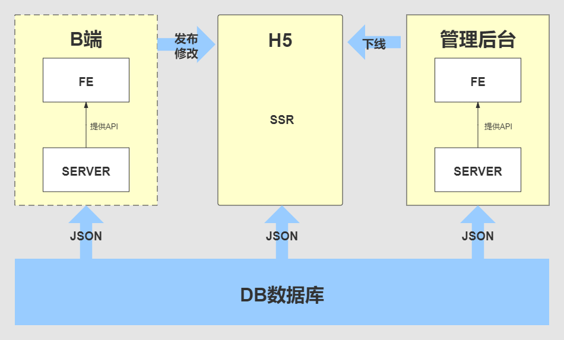

# 慕课乐高架构方案设计文档

## 需求背景

[需求文档](https://www.yuque.com/books/share/af79538c-09eb-4ddd-bfb7-599816c233bf?#%20%E3%80%8A%E9%9C%80%E6%B1%82%E3%80%8B)

## 范围

整体设计、架构设计

## 模块设计

### 模块拆分和关系图
该项目对应三种用户 


### 各个模块的功能解释

B 端和编辑器，前后端分离
biz-editor-fe
biz-editor-server

H5 SSR
h5-server

管理后台 做前端分析
admine-fe
admine-server

### 特殊模块说明：组件库、统计服务

独立业务组件库
复用，减少冗余

自研统计服务
支持自定义事件统计
支持 Open API
第三方无法支持

## 核心数据结构设计

### 数据结构思路

- 每个组件尽量符合 vnode 规范，方便学习和扩展，减少沟通成本
- 用数组来组织数据，有序
- 尽量使用引用关系，不要冗余

### 数据结构示例

```javascript
{
        work: {
            title: '作品标题',
            setting: {}, // 一些可能的配置项 扩展性保证
            props: {}, // 页面的一些设置 扩展性保证
            components: [
            {
                id: '1',
                name: '文本1',
                tag: 'text',
                attrs: {
                    fontSize: '20px'
                },
                children: ['文本1']
            },
            {
                id: '2',
                name: '图片1',
                tag: 'image',
                attrs: {
                    src: 'xxx.png',
                    width: '120px'
                },
                children: null
            }
        ]
    }
}
```

### 数据流转

- 创建作品：初始化一个 JSON 数据
- 保存作品：修改 JSON
- 发布作品：修改数据中发布状态字段
- 屏蔽作品：修改数据中某个字段达到紧急下线管理
- c 端浏览作品：获取 JSON SSR 渲染



## 扩展性保证

### 扩展组件

### 扩展编辑器功能，如锁定，隐藏

### 扩展页面信息，如增加多语言

### 扩展其他功能，如大数据分析和计算等

## 研发提效

### 脚手架：创建、发布

### 组件平台：积累业务组件，提高代码复用，降低维护成本

## 运维保障

### 线上服务和运维服务

### 安全

### 服务扩展性: 基于云服务，可以随时扩展机器和配置
