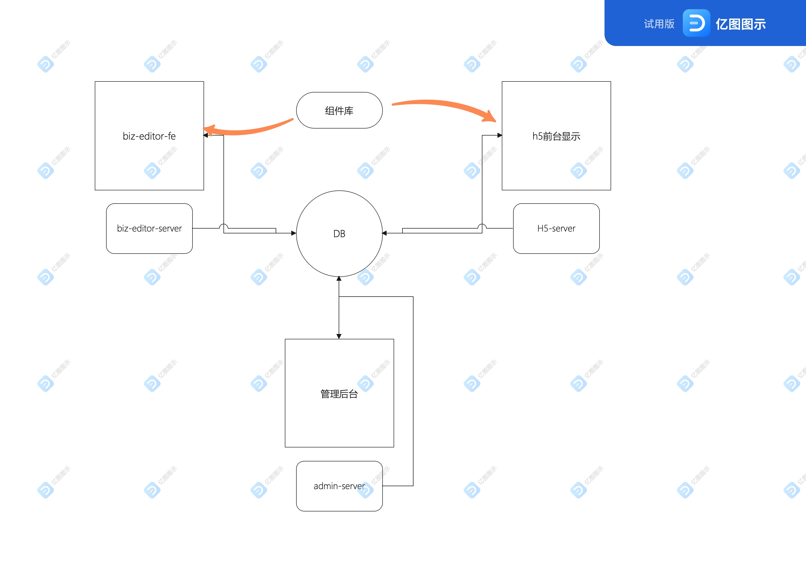

# 慕课乐高架构设计文档
## 需求
 1. [需求文档](https://www.yuque.com/books/share/af79538c-09eb-4ddd-bfb7-599816c233bf) 
## 范围（整体，架构）
 1. 根据需求分为，B端和编辑器，H5 ，管理后台
 2. B端和编辑器：实现后h5的生成，编辑和修改，
 3. h5客户端：实现用户参与，分享，和获取用户数据等功能
 4. 管理后台：管理h5进行查看，发布，下限控制，pv/uv的统计所有项目的监控和对b端的权限和编辑器的控制
 
## 模块设计（模块关系，结果，功能，职责）
 1. B 端和编辑器，做前后端分离
   biz-editor-fe
   biz-editor-server
 2. H5 适合做 SSR ，因为要考虑性能
   H5-server
 3. 管理后台，做前端分析
   admin-fe
   admin-server
 

## 作品的数据结构（vuex store）
 1. 数据存储为json
 2. 组件数据为vnode格式
 3. 使用vuex存储数据，达到数据同步

## 扩展性保证
 1. 创建组件库（可扩展组件）
 2. 扩展编辑器功能，如锁定、隐藏
 3. 扩展页面信息，如增加多语言
 4. 扩展其他功能，如大数据分析和计算等  
## 开发提效
 1. 脚手架：创建发布
 2. 组件平台
## 运维保障
 1. 线上服务和运维服务
 2. 安全
 3. 监控和报警
 4. 服务扩展性：基于云服务，可以随时扩展机器和配置