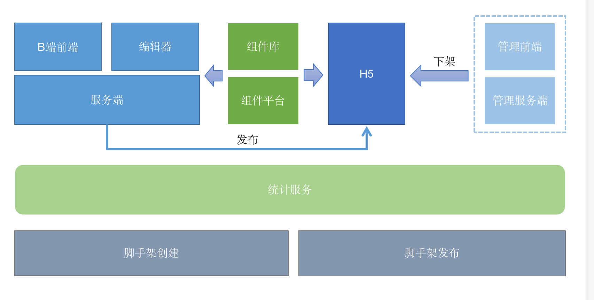

## 技术方案设计文档
### 需求分析

- #### 浅层需求

  登录（注册、登录、用户信息保存...）

  作品（创建、编辑、发布、作品信息保存、删除作品、获取作品列表...）

  访问（生成链接分享）

- #### 深层需求

  作品（删除与恢复、转赠、复制...）

  访问（多渠道分享，分渠道统计）

  管理（作品管理，防止违规内容；用户管理，防止违规用户；模板管理，私有公用）

### 架构设计

- #### 项目分析

  - B端和编辑器
    - `biz-editor-fe`
    - `biz-editor-server`
  - H5
    - `H5-server`
  - 管理后台
    - `admin-fe`
    - `admin-server`

- #### 独立业务组件

  编辑器画布使用的组件和渲染逻辑与H5一致，因此抽离出来

- #### 自研统计服务

  需求：分渠道统计H5

  功能：支持自定义事件统计、支持Open API

  自研功能设计：日志收集、日志分析、Open API

- #### 项目关系
  项目关系如图所示：
  
	
- #### 数据结构设计

  ##### 设计思路：

  - 尽量符合VNode规范
  - 有序
  - 当前选中组件
  - 图层依赖于其他值，不是单独的数据

  ```js
  {
    work: {
      title: '作品标题',
      setting:{/*options...*/},
      props: {/*页面设置*/},
      components: [
        {
          id: 'xxx', //组件id
          name: '文本1',
          tag: 'text',
          attrs: {fontSize: '20px'},
        	children: [
  					{
							name: '文本1'
            }
          ]
        },
				{
          id: 'xxx', //组件id
          name: '文本2',
          tag: 'text',
          attrs: {fontSize: '20px'},
        	children: [
  					{
							name: '文本1'
            }
          ]
        }
      ]
    },
		activeComponentId: 'xxx'
  }
  ```


#### 扩展性

- 扩展组件
- 扩展编辑器功能，如添加动画效果...
- 扩展页面信息，如增加音频播放
- 扩展其他功能...

#### 研发提效

- 脚手架创建发布
- 组件平台

#### 运维保障

- 线上服务和运维服务
- 安全
- 监控和预警
- 服务扩展性：基于云服务，可以随时扩展机器和配置。