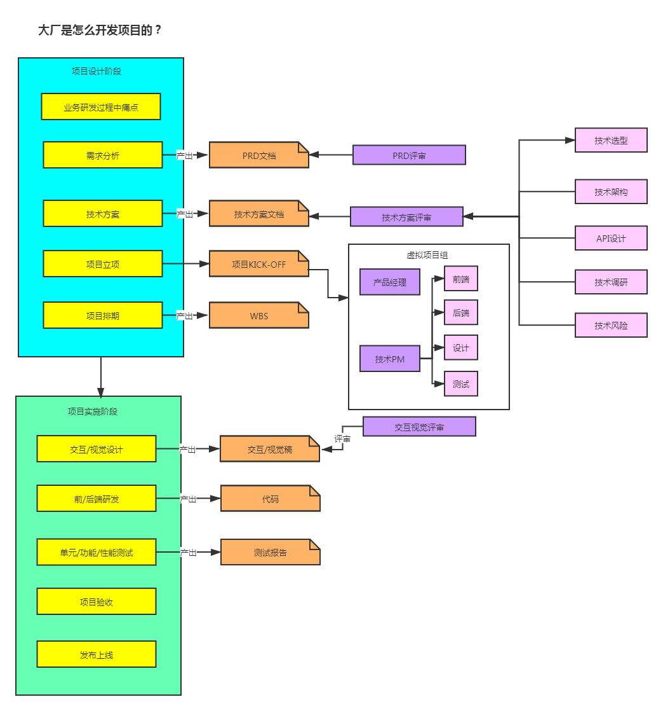
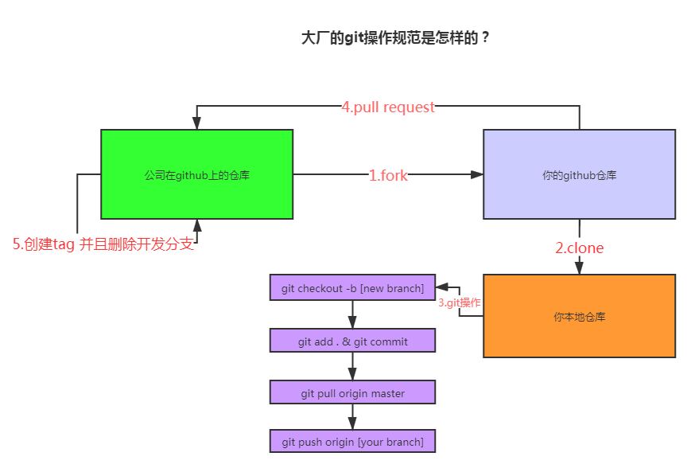
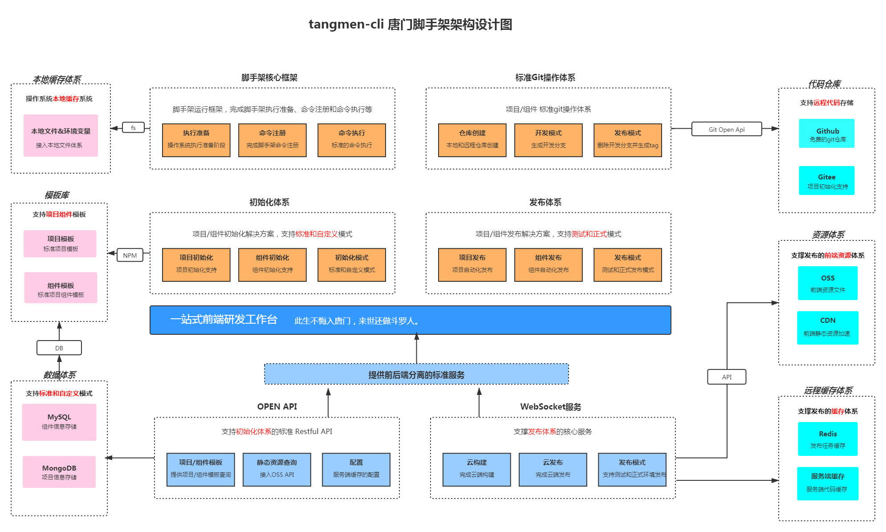

# 脚手架核心流程开发

## 脚手架整体架构设计
### 前端开发过程中的痛点和需求分析
**痛点**
- 存在大量重复代码的拷贝
- 协同开发时，分支混乱， 操作不规范，导致耗时
- 发布上线耗时，会出现各种各样的错误

**需求分析** 

1.通用的组件/模板创建能力
- 模板支持定制，定制后能发布生效
- 模板支持快速接入，极低的接入成本  

2.通用的项目/组件发布能力
- 发布过程中自动完成标准的git操作
- 发布完成后自动删除开发分支并创建tag
- 发布后自动完成云构建、cdn、域名绑定
- 发布过程支持测试/正式两种模式

**大厂是如何做项目的** 

自己动手画了一下示意图 

**git操作规范** 

自己动手画了一下示意图 

**架构设计图**
