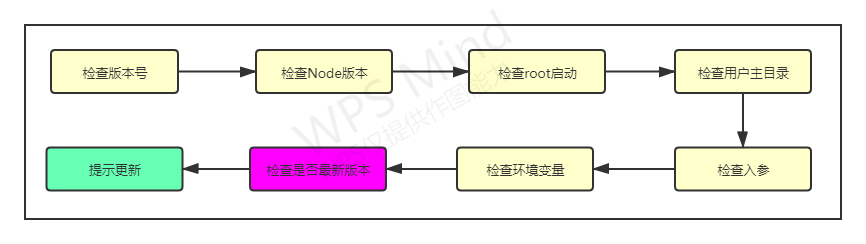

# 脚手架核心流程开发

## 脚手架整体架构设计

---

### 前端开发过程中的痛点和需求分析

**痛点**

-   存在大量重复代码的拷贝
-   协同开发时，分支混乱， 操作不规范，导致耗时
-   发布上线耗时，会出现各种各样的错误

**需求分析**

1.通用的组件/模板创建能力

-   模板支持定制，定制后能发布生效
-   模板支持快速接入，极低的接入成本

    2.通用的项目/组件发布能力

-   发布过程中自动完成标准的 git 操作
-   发布完成后自动删除开发分支并创建 tag
-   发布后自动完成云构建、cdn、域名绑定
-   发布过程支持测试/正式两种模式

**大厂是如何做项目的**

自己动手画了一下示意图


**git 操作规范**

自己动手画了一下示意图


**架构设计图**


## 脚手架模块拆分策略

### 拆包原则

根据模块的功能来拆分：

-   core: 核心模块
-   utils: 工具模块
-   commands: 命令模块
-   models: 模型模块

### 拆包结果

1. 核心流程：core
2. 命令模块：commands
    - 初始化
    - 发布
    - 清除缓存
3. 模型： models
    - Command 命令
    - Project 项目
    - Component 组件
    - Npm 模块
    - Git 仓库
4. 支撑层： utils
    - Git 操作
    - 云构建
    - 工具方法
    - API 请求
    - Git API

## core 模块技术方案

core 模块的技术方案主要分为三个阶段，分别是**准备阶段、命令注册、命令执行**。第三周的课程内容主要是讲准备阶段。

---

### 涉及到的技术点

#### 核心库

-   import-local
-   commander

#### 工具库

-   fs-extra (用于文件操作，基于 fs 封装的库)
-   dotenv (可以获取到环境变量)
-   semver (比较 package 的版本)
-   root-check (进行 root 降级)
-   user-home (拿到用户主目录)
-   colors (可以在终端当中打印不同颜色的文本)
-   npmlog (打印日志用，可以进行定制)

---

### 实现脚手架准备过程

#### 检查版本号

思路：直接引用 package.json 文件，获取其中的 version 字段，打印到终端。注意：这里打印的时候可以使用 console.log，也可以使用 npmlog 这个依赖库。

```javascript
const pkg = require('../package.json')
function checkVersion() {
	console.log(pkg.version)
	// or
	log.info(pkg.version)
}
```

#### 检查 Node 版本

思路： 获取当前的 node 版本，和我们事先预设好的版本进行比对，如果当前版本较低，那么给用户一个提示。

```javascript
const semver = require('semver')
const colors = require('colors/safe')
function checkNodeVersion() {
	// 获取当前的 node 版本
	const currentVersion = process.version
	// 和我们事先预设好的版本进行比对
	const lowestVersion = constant.LOWET_NODE_VERSION
	// 如果当前版本较低，那么给用户一个提示
	if (!semver.gte(currentVersion, lowestVersion)) {
		throw new Error(colors.red(`tangmen-cli 需要安装${lowestVersion}版本及以上的Node.js`))
	}
}
```

#### 检查 root 是否启动

思路：这个功能比较简单，事情都让 root-check 这个库帮我们做了，我们只需要引用并且调用一下就可以实现 root 降级，规避掉因为 root 用户带来的一系列权限问题。

```javascript
function checkRoot() {
	const rootCheck = require('root-check')
	rootCheck()
}
```

#### 检查用户主目录

```javascript
const userHome = require('user-home')
const pathExists = require('path-exists').sync
function checkUserHome() {
	if (!userHome || !pathExists(userHome)) {
		throw new Error(colors.red('当前用户主目录不存在，请检查!'))
	}
}
```

#### 检查入参

```javascript
let args
function checkInputArgs() {
	args = require('minimist')(process.argv.slice(2))
	checkArgs()
}

function checkArgs() {
	if (args.debug) {
		process.env.LOG_LEVEL = 'verbose'
	} else {
		process.env.LOG_LEVEL = 'info'
	}
	log.level = process.env.LOG_LEVEL
}
```

#### 检查环境变量的两种实现方式

```javascript
function checkEnv() {
	const dotenv = require('dotenv')
	const dotenvPath = path.resolve(userHome, '.env')
	if (pathExists(dotenvPath)) {
		dotenv.config({
			path: dotenvPath
		})
	}
	createDefaultConfig()
	log.verbose('环境变量', process.env.CLI_HOME_PATH)
}
// 创建默认的环境变量配置
function createDefaultConfig() {
	const cliConfig = {
		home: userHome
	}
	if (process.env.CLI_HOME) {
		cliConfig['cliHome'] = path.join(userHome, process.env.CLI_HOME)
	} else {
		cliConfig['cliHome'] = path.join(userHome, constant.DEFAULT_CLI_HOME)
	}
	process.env.CLI_HOME_PATH = cliConfig.cliHome
}
```

```javascript
function checkEnv() {
	const dotenv = require('dotenv')
	const dotenvPath = path.resolve(userHome, '.env')
	if (pathExists(dotenvPath)) {
		config = dotenv.config({
			path: dotenvPath
		})
	}
	config = createDefaultConfig()
	log.verbose('环境变量', config, process.env.CLI_HOME)
}
// 创建默认的环境变量配置
function createDefaultConfig() {
	const cliConfig = {
		home: userHome
	}
	if (process.env.CLI_HOME) {
		cliConfig['cliHome'] = path.join(userHome, process.env.CLI_HOME)
	} else {
		cliConfig['cliHome'] = path.join(userHome, constant.DEFAULT_CLI_HOME)
	}
	return cliConfig
}
```

#### 检查是否为最新版本

```javascript
async function checkGlobalUpdate() {
    // 获取当前用户安装的版本是多少
	const currentVersion = pkg.version
	const npmName = pkg.name
    // 通过接口请求拿到最新的版本号
	const { getNpmSemverVersion } = require('@tangmen-cli-dev/get-npm-info')
	const latestVersion = await getNpmSemverVersion(currentVersion, npmName)
    // 拿npm上最新的版本号和本地安装的版本号进行对比，如果前者大于后者，则给用户一个明显的提示
	if (latestVersion && semver.gt(latestVersion, currentVersion)) {
		log.warn(
			colors.yellow(`请手动更新${npmName}, 当前版本:${currentVersion}, 最新版本: ${latestVersion}
                  更新命令: npm install -g ${npmName}
        `)
		)
	}
}
```

## 本周作业完成情况

1. 绘制脚手架架构设计图（已完成）
2. 实现脚手架准备过程代码（已完成）
3. 通过 commander 实现一个脚手架，包含自定义 option 和 command 功能：npm i -g imooc-test-erdan（已完成）
4. 通过 webpack 和原生两种方式实现 Node 对 ES Module 的支持（进行中）
