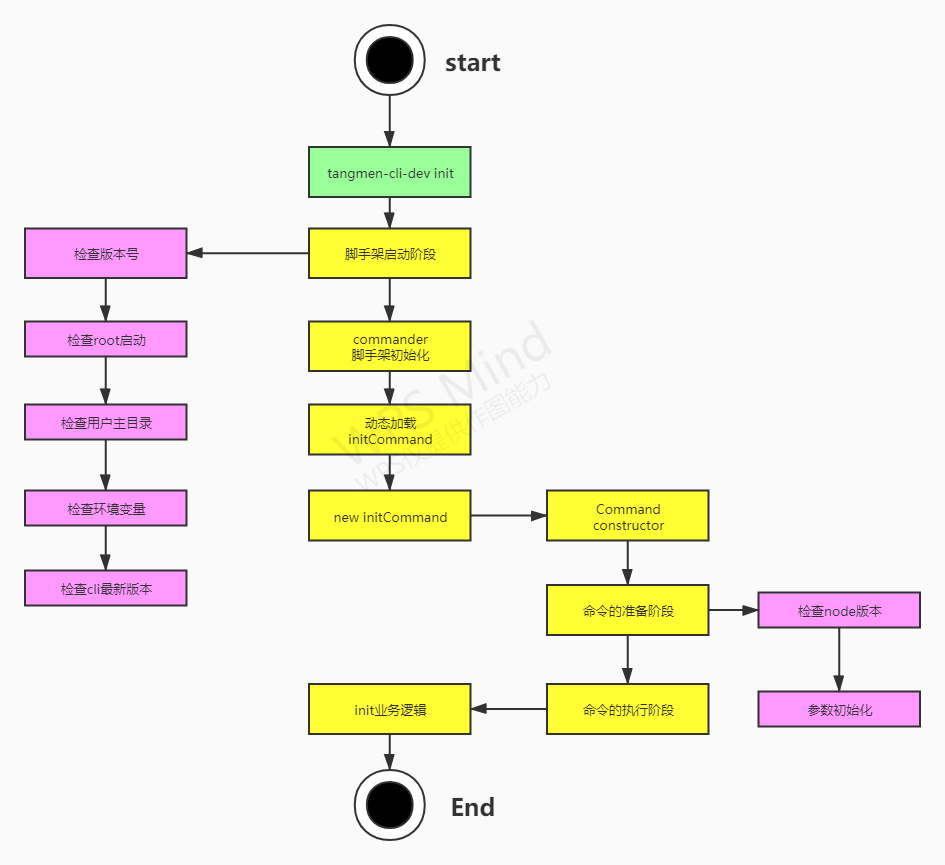
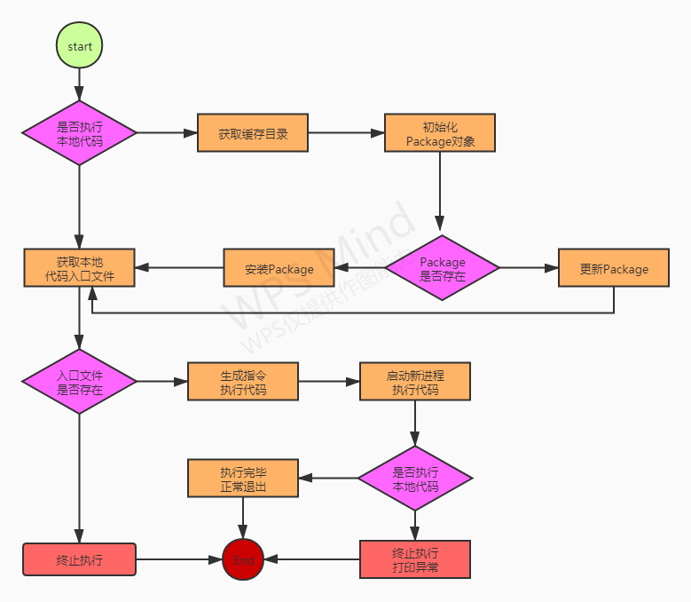

### 脚手架架构优化示意图



### 脚手架命令动态加载功能架构设计图



## 本周作业

### 1.完成tangmen-cli-dev脚手架动态命令执行代码编写

```javascript
// core/exec/lib/index.js
'use strict';

const cp = require('child_process')
const path = require('path')
const Package = require('@tangmen-cli-dev/package')
const log = require('@tangmen-cli-dev/log')

const SETTINGS = {
    init: '@tangmen-cli-dev/init'
}

// 缓存目录
const CACHE_DIR = 'dependencies'

async function exec() {
    // 目标目录
    let targetPath = process.env.CLI_TARGET_PATH
    // 用户主目录
    const homePath = process.env.CLI_HOME_PATH

    let storeDir = ''
    let pkg

    const cmdObj = arguments[arguments.length - 1]
    const cmdName = cmdObj.name()
    const packageName = SETTINGS[cmdName]
    const packageVersion = 'latest'

    // 是否执行本地代码 -> 否的话 就执行下面这段逻辑
    if (!targetPath) {
        targetPath = path.resolve(homePath, CACHE_DIR) // 生成缓存路径
        // 存储目录
        storeDir = path.resolve(targetPath, 'node_modules')
        log.verbose('targetPath', targetPath)
        log.verbose('storeDir', storeDir)
        // 初始化一个Package
        pkg = new Package({
            targetPath,
            packageName,
            packageVersion
        })
        // 如果Package存在
        if (await pkg.exists()) {
            // 更新package
            await pkg.update();
        } else {
            // 安装package
            await pkg.install();
        }
    } else {
        pkg = new Package({
            targetPath,
            packageName,
            packageVersion
        })
    }
    // 是否执行本地代码 -> 选择是的话 执行下面这段逻辑
    // 获取本地代码入口文件
    const rootFile = pkg.getRootFilePath();
    // 本地代码存在的情况下执行以下逻辑，否则终止执行
    if (rootFile) {
        try {
            const args = Array.from(arguments);
            const cmd = args[args.length - 1];
            const o = Object.create(null);
            Object.keys(cmd).forEach(key => {
                if (cmd.hasOwnProperty(key) &&
                    !key.startsWith('_') &&
                    key !== 'parent') {
                    o[key] = cmd[key];
                }
            });
            args[args.length - 1] = o;
            // 生成指令执行代码
            const code = `require('${rootFile}').call(null, ${JSON.stringify(args)})`;
            // 启动新进程执行代码
            const child = spawn('node', ['-e', code], {
                cwd: process.cwd(),
                stdio: 'inherit',
            });
            // 执行产生异常时 打印异常 并终止执行
            child.on('error', e => {
                log.error(e.message);
                process.exit(1);
            });
            // 执行完毕 正常退出
            child.on('exit', e => {
                log.verbose('命令执行成功:' + e);
                process.exit(e);
            });
        } catch (e) {
            log.error(e.message)
        }
    }
}

// windows操作系统spawn执行命令兼容
function spawn(command, args, options) {
    const win32 = process.platform === 'win32'
    const cmd = win32 ? 'cmd' : command
    const cmdArgs = win32 ? ['/c'].concat(command, args) : args

    return cp.spawn(cmd, cmdArgs, options || {})
}

module.exports = exec;
```

```javascript
// models/package/lib/index.js
'use strict';

const path = require('path')
const fse = require('fs-extra')
const pkgDir = require('pkg-dir').sync
const pathExists = require('path-exists').sync
const npminstall = require('npminstall')
const {isObject} = require('@tangmen-cli-dev/utils')
const formatPath = require('@tangmen-cli-dev/format-path')
const {getDefaultRegistry, getNpmLastVersion} = require('@tangmen-cli-dev/get-npm-info')

class Package {
    constructor(options) {
        // 判断边界情况 如果没有传参 直接提示用户options不得为空
        if (!options) {
            throw  new Error('Package类的options参数不能为空')
        }
        // 如果参数不是对象的话提示用户options必须是对象
        if (!isObject(options)) {
            throw  new Error('Package类的options参数必须是对象')
        }
        // package的目标路径
        this.targetPath = options.targetPath
        // 缓存Package的路径
        this.storeDir = options.storeDir
        // package的名字
        this.packageName = options.packageName
        // package的version
        this.packageVersion = options.packageVersion
        // package的缓存目录前缀
        this.cacheFilePathPrefix = this.packageName.replace('/', '_')
    }

    // 准备(预检)阶段
    // 如果缓存package的路径目录不存在的话，我们用fs模块创建一个目录
    // 如果使用者传进来的版本参数是latest，那么我们就要调取API获取最新版本的信息
    async prepare() {
        if (this.storeDir && !pathExists(this.storeDir)) {
            fse.mkdirpSync(this.storeDir)
        }
        if (this.packageVersion === 'latest') {
            this.packageVersion = await getNpmLastVersion(this.packageName)
        }
    }

    // 读取缓存路径
    get cacheFilePath() {
        return path.resolve(this.storeDir, `_${this.cacheFilePathPrefix}@${this.packageVersion}@${this.packageName}`);
    }

    // 获取指定的缓存路径
    getSpecificCacheFilePath(packageVersion) {
        return path.resolve(this.storeDir, `_${this.cacheFilePathPrefix}@${packageVersion}@${this.packageName}`);
    }

    // 判断当前的package是否存在
    async exists() {
        if (this.storeDir) {
            await this.prepare()
            return pathExists(this.cacheFilePath)
        } else {
            return pathExists(this.targetPath)
        }
    }

    // 安装package
    async install() {
        await this.prepare()
        return npminstall({
            root: this.targetPath,
            storeDir: this.storeDir,
            registry: getDefaultRegistry(),
            pkgs: [{
                name: this.packageName,
                version: this.packageVersion
            }]
        })
    }

    // 更新package
    async update() {
        await this.prepare()
        const latestPackageVersion = await getNpmLastVersion(this.packageName)
        const latestFilePath = this.getSpecificCacheFilePath(latestPackageVersion)
        if (!pathExists(latestFilePath)) {
            await npminstall({
                root: this.targetPath,
                storeDir: this.storeDir,
                registry: getDefaultRegistry(),
                pkgs: [{
                    name: this.packageName,
                    version: latestPackageVersion
                }]
            })
            this.packageVersion = latestPackageVersion
        }
    }

    // 获取入口文件的路径
    async getRootFilePath() {
        function _getRootFile(targetPath) {
            // 1.获取package.json所在目录
            const dir = pkgDir(targetPath)
            if (dir) {
                // 2.读取package.json
                const pkgFile = require(path.resolve(dir, 'package.json'))
                // 3.寻找main/lib
                if (pkgFile && pkgFile.main) {
                    // 路径的兼容
                    return formatPath(path.resolve(dir, pkgFile.main))
                }
            }
            return null
        }

        if (this.storeDir) {
            return _getRootFile(this.cacheFilePath)
        } else {
            return _getRootFile(this.targetPath)
        }
    }

}

module.exports = Package
```

```javascript
'use strict';

const semver = require('semver')
const colors = require('colors/safe')
const log = require('@tangmen-cli-dev/log')

const LOWEST_NODE_VERSION = '12.0.0'

class Command {
    constructor(argv) {
        if (!argv) {
            throw new Error('参数不能为空')
        }
        if (!Array.isArray(argv)) {
            throw new Error('参数必须为数组')
        }
        if (argv.length < 1) {
            throw new Error('参数列表为空')
        }
        this._argv = argv
        let runner = new Promise((resolve, reject) => {
            let chain = Promise.resolve()
            // 检查node版本
            chain = chain.then(() => this.checkNodeVersion());
            // 初始化参数
            chain = chain.then(() => this.initArgs());
            // init业务逻辑
            chain = chain.then(() => this.init());
            // 执行
            chain = chain.then(() => this.exec());
            chain.catch(err => {
                log.error(err.message)
            })
        })
    }

    // 初始化参数
    initArgs() {
        this._cmd = this._argv[this._argv.length - 1]
        this._argv = this._argv.slice(0, this._argv.length - 1)
    }

    // 检查node版本
    checkNodeVersion() {
        const currentVersion = process.version
        const lowestVersion = LOWEST_NODE_VERSION
        if (!semver.gte(currentVersion, lowestVersion)) {
            throw new Error(colors.red(`tangmen-cli 需要安装${lowestVersion}版本及以上的Node.js`))
        }
    }

    // 交给子类去实现
    init() {
        throw new Error('init必须实现！');
    }

    // 交给子类去实现
    exec() {
        throw new Error('exec必须实现！');
    }

}

module.exports = Command
```

### 作业2

待更新...(计划1.15之前上交)

## 补充：在自己电脑上如何配置多个公钥

因为疫情的原因，国际庄现在不让出门，我平时是用公司的电脑进行练习的，这次用自己的电脑来配置公钥，但是遇到一个问题：我们这个仓库是在github的，但是我另一个仓库是在gitee上面存放的，于是我使用现有的账号可以正常拉取、推送到github，但是推送到gitee的时候它告诉我说权限不足。

通过百度得知是有办法解决的，那就是在一台电脑上配置多个ssh-key，经过参考网上的教程，终于调通了，将这次经历记下来，如果你和我有一样的问题，希望能帮到你。
这里偷个懒，将教程的链接直接贴在这里了：[https://www.cnblogs.com/popfisher/p/5731232.html](https://www.cnblogs.com/popfisher/p/5731232.html)

**石家庄加油！河北加油！**
