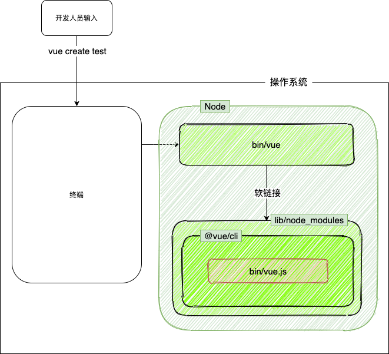

# 脚手架架构设计和框架搭建

## 学习目标
- 脚手架实现原理
- lerna常见用法
- 架构设计技巧和架构图绘制

## 学习方法
- 架构三部曲：掌握原理-> 独立思考 -> 总结反思
- 深度剖析知名开源项目
- 出全局思考问题

## 脚手架核心价值
- 自动化：项目重复代码拷贝/git操作/发布上线等
- 标准化：项目的创建/代码的管理等
- 数据化：研发过程系统化数据化

## 深度理解脚手架
- 脚手架的本质是操作系统的一个客户端
- 命令  
  <br/>
``` javascript
vue create test --force -r https:xxxxx
```
这里  
- vue 是主命令
- test 是command
- --force是 options
- -r 是简称

## 脚手架执行原理
- 终端输入命令，通过系统环境变量查找命令 which vue
- 终端接收vue命令，找到vue命令所在，这里会有个vue的软链接，链接至lib/node_modules/@vue/cli/lib/bin/vue.js，然后通过node.js运行


## 从应用角度出发怎么开发脚手架
- 需要有个npm项目
- 项目中应该有个bin/vue.js
- 把这个项目发布到npm
- 将npm项目安装到lib/node_modules下
- 在node的bin下创建软链接至lib/node_module/@vue/cli/lib/bin/vue.js