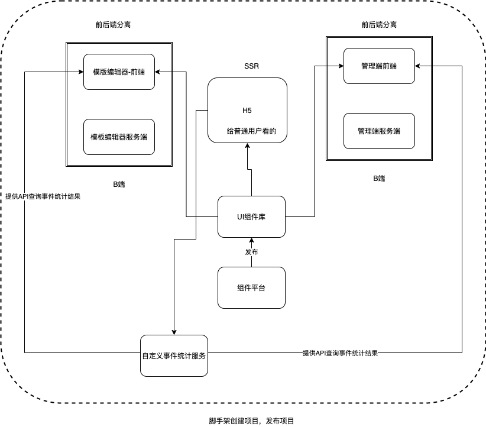
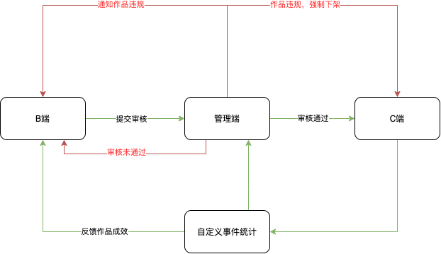

# 需求分析和架构设计

## 1 项目构成
分成B端（内容制作端）、C端（消费端，玩家端）、管理端（管理B端和C端），以上每个都有对应的服务端，整个项目由脚手架创建并管理，发布等，如下图所示



## 2 子项目关系
- 这里子项目是指B端、C端这些项目  

B端是任务发起者，或者说内容制作者使用的客户端，B端完成内容创建后供C端使用，C端是消费端，B端和C端同样是客户端，需要用同样的前端组件库以保证两端的页面渲染是一样的，C端产生效益，需要另外的服务用于统计产品被访问次数以及分享次数，此服务还需向B端和管理端提供查询接口，方便运营统计以及作为未来业务发展的导向  

- 特殊模块说明：自定义事件统一，在三个模块之外，组件库要独立出

## 3 核心数据结构
### 数据结构要求
- 每个组件尽量符合 vnode 规范
- 尽量使用引用关系，不要冗余
```javascript
{
    work: {
        title: '作品标题',
        setting: {}, // 一些可能的配置项 扩展性保证
        props: {}, // 页面的一些设置 扩展性保证
        components: [
        {
            id: '1',
            name: '文本1',
            tag: 'text',
            attrs: {
                fontSize: '20px'
            },
            children: ['文本1']
        },
        {
            id: '2',
            name: '图片1',
            tag: 'image',
            attrs: {
                src: 'xxx.png',
                width: '120px'
            },
            children: null
        }
      ]
    }
}
```
### 数据流转


## 扩展性保障
- 组件库扩展
- 编辑器扩展
- 数据结构扩展

## 开发提效
- 使用脚手架工具

## 运维保障
- 线上服务和运维服务
- 安全
- 服务扩展：流量大时怎么办