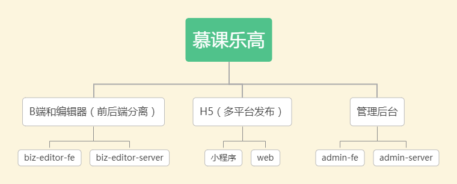

### 需求分析
##### 熟悉产品需求
- 以架构师的思维分析需求，不能只停留在表面实现需求，要考虑怎么实现能给业务带来增长
- 全局思维、整体思维、闭环思维，不能只考虑自己，要全局考虑整个团队，要做到有输出、有输入、有结果

##### 浅层需求
- 分析表面需要实现的功能，如登录、创建作品、编辑、发布、访问作品等

##### 深度需求
> 通过浅层需求分析，进一步分析需求

- 作品的管理
- 作品统计
- 作品发布
- h5
- 后台管理

以上需求还有很多细节点，就不一一阐述

##### 需求分析总览图


### 架构设计
##### 需要的项目


**独立业务组件库**

编辑器画布使用的组件和渲染逻辑和h5完全一致，为了两边一致，应该抽离出来提供给它们使用，从而保证制作的时候和渲染出来的h5保持一致

##### 自研统计服务
考虑自研服务前，先列出我们统计所需的功能

我们需要实现分渠道统计这个需求，要实现这个需求，我们就需要自定义事件统计

- 支持自定义事件统计
- 支持Open API

经过调研后，我们发现，市面上第三方服务要么不支持，要么收费很贵，综合对比，只能选择自研一个

包括：

- 日志收集
- 日志分析
- Open API

##### 各个项目之间关系


##### 作品数据结构设计

思路：
- 每个组件尽量符合vnode规范
- 用数组来组织数据，有序
- 尽量使用引用关系，不要冗余

**vuex store**
```javascript
{
  work: {
    title: '作品标题',
    setting: {/* 一些可能的配置项，用不到就先预留 */},
    props: {/* 页面body的一些设置，如背景色 */},
    components: [
      // components要用数组，有序结构
      // 单个node要符合常见的vnode格式
      {
        id: 'xxx', // 每个组件都有id，不重复
        name: '文本1',
        tag: 'text',
        attrs: { fontSize: '20px' },
        children: [
          '文本1' // 文本内容，有时候放在children，有时候放在attrs或者props，没有标准，看实际情况来确定
        ]
      },
      {
        id: 'yyy',
        name: '图片1',
        tag: 'image',
        attrs: { src: 'xxx.png', width: '100px' },
        children: null
      }
    ]
  }
}
```

**vuex getter**
```javascript
// 图层
{
  layers: (state) => {
    state.work.components.map(c => {
      return {
        id: c.id,
        name: c.name
      }
    })
  }
}
```

##### 扩展性保证
- 扩展组件
- 扩展编辑器功能、如锁定、隐藏
- 扩展页面信息，如增加多语言
- 扩展其他功能，如大数据分析和计算等

##### 研发效率
- 脚手架：创建发布
- 组件平台

##### 运维保障
- 线上服务和运维服务
- 安全
- 监控和报警
- 服务扩展性： 基于云服务，可以随时扩展机器和配置