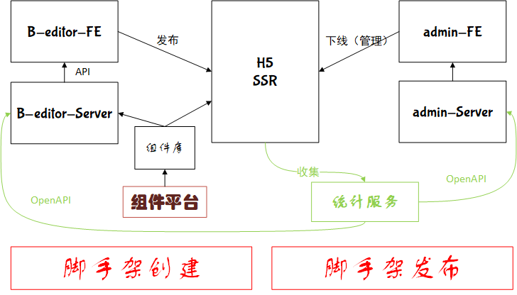

# 技术方案设计文档


## 问题

+ 项目是用来做什么的？
+ 项目是什么样的架构？

## 需求背景
[https://www.yuque.com/imooc-lego/zlz87z](https://www.yuque.com/imooc-lego/zlz87z)

## 项目描述

+ 功能主要分为三个部分：运营管理服务、移动端用户服务、系统管理服务；

1. 运营管理服务

+ 给用户提供作品创建、发布、删除作品、恢复作品、统计等服务；

2. 移动端用户服务

+ 用来给用户展示发布的作品，收集用户的访问信息到统计服务；

3. 系统管理服务

+ 管理用户作品的发布，对用户的各种行为进行统计

### 总结

想要成为一名架构师对于项目应该有`完整`、`闭环`、`全面`这个三个方面的思考。完整和全面是要对项目要有全面的思考，要站在业务全局的角度上面思考问题，闭环是项目要有输入输出，最终形成一个闭环。`作品管理、用户查看、采集数据、作品管理查看数据`形成一个业务完闭环，`系统管理、对作品的管理、数据收集、系统管理检测数据也形成一个闭环`。



## 模块设计
系统应该分为三个主要的业务模块、一个服务收集模块、前端组件模块、脚手架模块；
1. 业务模块应该分别完成：作品创建及作品相关的管理（作品添加、删除、修改、查看、统计）、实现作品价值的模块（使用移动端界面、可以收集用户的数据）、对平台上所有的作品进行管理的模块（屏蔽一些作品、查看作品的一些统计）。
2. 数据采集模块按照业务需要对数据库种的数据进行统计、汇总。
3. 前端组件模块可以被业务模块的前端调用；
4. 脚手架模块简化项目编码、测试、发布、运维的流程

## 核心数据结构设计
+ 画布的数据模块应该使用JSON来进行保存，可以使用redux、vuex之类的状态管理工具来动态实时的更新、响应数据。

```json
{
    'name': '画布名称'， // 画布的名称、创建时间、修改者等画布的属性数据
    // ....
    'content': [ // 画布中的内容
    	{
    		// 标签名称、文案、唯一的key、样式
		}, // 各种画布中的组件
		// ...
	],
	'selected': 'key', // 被选中的key，用来决定浮层谁被选中
}
```

## 拓展性保证
1. 前端组件的可拓展性
2. 后端接口的可拓展性

## 研发提效
1. 组件化开发
2. 脚手架开发

## 运维保障
拥有具备运维技能的专业工程师