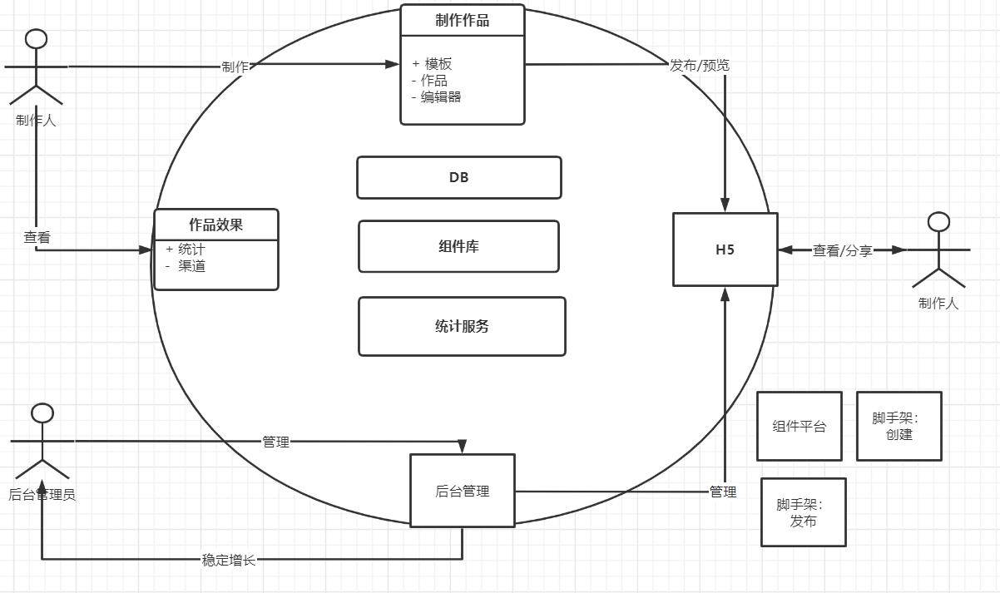

# 整体架构设计方案 v1.0

## 需求

[需求地址](https://www.yuque.com/imooc-lego/zlz87z)


## 范围
> 整体设计，架构设计，没有细节  

编辑b端(前后分离)、项目服务端(中台)、管理端(前后分离)、作品展示c端(服务端渲染)

## 模块设计

模块的拆分和关系图，结果  
模块的关键功能，职责等  
特殊的模块重点说明  


- 组件库，独立第三方，同时用于编辑器和 H5
- 自研统计服务，为何自研



## 作品的数据结构

vuex store 的结构，解释  
数据流转关系图  

```js
{
    // 作品
    work: {
        title: '作品标题',
        setting: { /* 一些可能的配置项，用不到就先预留 */ },
        props: { /* 页面 body 的一些设置，如背景色 */ },
        components: [
            // components 要用数组，有序结构
            // 单个 node 要符合常见的 vnode 格式
            {
                id: 'xxx', // 每个组件都有 id ，不重复
                name: '文本1',
                tag: 'text',
                attrs: { fontSize: '20px' },
                children: [
                    '文本1' // 文本内容，有时候放在 children ，有时候放在 attrs 或者 props ，没有标准，看实际情况来确定
                ]
            },
            {
                id: 'yyy',
                name: '图片1',
                tag: 'image',
                attrs: { src: 'xxx.png', width: '100px' },
                children: null
            },
        ]
    },

    // 画布当前选中的组件
    activeComponentId: 'xxx'
}

```

vuex getter 选择当前选中的图层
```js
{
    layers() => {
        store.work.components.map(c => {
            return {
                id: c.id,
                name: c.name
            }
        })
    }
}

```

## 扩展性保证

扩展组件，数据结构层面  
扩展编辑器的功能，例如：组件隐藏、锁定  
扩展页面的配置  
（讨论，集思广益）

## 开发提效

脚手架 创建：可以开发快速创建项目原型的脚手架，来省去配置项目初始化的时间。
脚手架 发布：。。。
组件平台


## 运维保障

线上服务和运维服务  
安全  
监控和报警  
服务扩展性：流量大