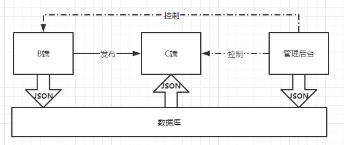

# 整体架构设计 V1.0

## 范围
整体设计，架构设计，没有细节

## 模块设计
模块关系图


- B端是前后端分离开发，受众不是大众所以不采用SSR模式开发，如果H5的编辑器比较复杂，可以拆分成单独项目进行开发。
- C端采用的是SSR模式开发，一个原因是性能的考虑，另一个方面受众人数较多。
- 组件库独立出来作为一个第三方项目，B端的编辑器和C端共用一个组件库进行H5页面的渲染。所见即所得，B端编辑好页面后，C端也可以复用组件库进行渲染，达到视觉统一，降低开发成本。
- 管理后台采用前后端分离开发，内部人员使用，主要用来进行B端和C端的数据管理，数据统计，可以让运营人员把控产品的全局。
- 自研统计服务，统计一些自定义事件，供B端和使用后台管理系统的人员知道产品的走向。
  - 自研统计服务主要是因为市面上支持自定义事件的统计服务大而全，而且价格昂贵，我们只需要有选择的开发一些满足自生需求的统计就行。

## 核心数据结构
单个组件应该使用vnode规范，使用业界统一规范有助于我们少踩一些坑，并能得到扩展性较强的组件结构。vuex store 的大概结构如下：
```json
{
    // 作品
    work: {
        title: '作品标题',
        setting: { /* 一些可能的配置项，用不到就先预留 */ },
        props: { /* 页面 body 的一些设置，如背景色 */ },
        components: [
            // components 要用数组，有序结构

            // 单个 node 要符合常见的 vnode 格式
            {
                id: 'xxx', // 每个组件都有 id ，不重复
                name: '文本1',
                tag: 'text',
                attrs: { fontSize: '20px' },
                children: [
                    '文本1' // 文本内容，有时候放在 children ，有时候放在 attrs 或者 props ，没有标准，看实际情况来确定
                ]
            },
            {
                id: 'yyy',
                name: '图片1',
                tag: 'image',
                attrs: { src: 'xxx.png', width: '100px' },
                children: null
            },
        ]
    },

    // 画布当前选中的组件
    activeComponentId: 'xxx'
}
```
数据流转关系图





使用统一的数据库管理数据，B端产生组件的配置数据存入数据库并发布项目，C端读取组件配置数据渲染出H5页面供用户访问，管理后台通过管理数据库的数据达到控制B端和C端的目的。

## 扩展性保证
- 数据结构层面
  - 一些可能的整体项目级别配置项。主要是是否可编辑，是否锁定等等。
  - 一些页面级别的配置参数，大小，背景色之类的。
- 编辑器层面
  - 保证组件的可扩展性，组件的锁定，可选，图层等等后续必要的扩展功能。

## 开发提效
- 脚手架固化一些重复操作，规范流程，提高开发效率。
  - 创建项目的流程
  - 提交代码的流程
  - 测试项目的流程
  - 打包项目的流程
  - 发布项目的流程
- 组件平台主要固化组件的开发和发布流程，提升组件开发效率。

## 运维保障（待补充）
- 线上服务和运维服务
- 安全
- 监控和报警
- 服务扩展性：流量大