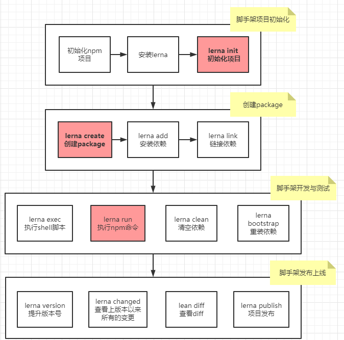

# lerna的使用

## 简介
- `lerna`是一个优化基于`git+npm`的多`package`**项目管理工具**
- Lerna是架构优化的产物，他揭示了一个架构真理：项目复杂度提升后，就需要对项目进行架构优化。架构优化的主要目标往往以效能为核心。

## 优势
- 大幅度减少重复操作
- 提升操作的标准化

## 主要解决的脚手架开发痛点
- 重复操作太多
  - 多package的本地link
  - 多package的依赖安装
  - 多package的单元测试
  - 多package的代码提交
  - 多package的代码发布
- 版本一致性管理
  - 发布时的版本一致性
  - 发布后相互依赖版本升级

## 基于lerna的脚手架开发基本流程


## 脚手架项目初始化基本流程
- 确定组织名称，去`npm`注册组织`yourOrg`
- 去`github`上建立空仓库，添加相应的`LICENSE`和`README.md`文件
- 下载仓库使用npm init建立package.json文件
- 使用`npm i lerna -D`安装`lerna`
- 使用`lerna init`初始化脚手架环境
- 进入lerna.json修改合适的版本号
- 使用`lerna create yourPackName`建立包，包名设置`@yourOrg/yourPackName`保证之后推送到对应注册的组织。
- 进入各个包中的package.json中添加配置，因为组织下的包默认都是私有的，这里显示指定为`public`
  ```json
  "publishConfig": {
    "access": "public"
  }
  ```
- 使用npm login登陆npm
- 使用lerna publish修改版本号并向npm推送包