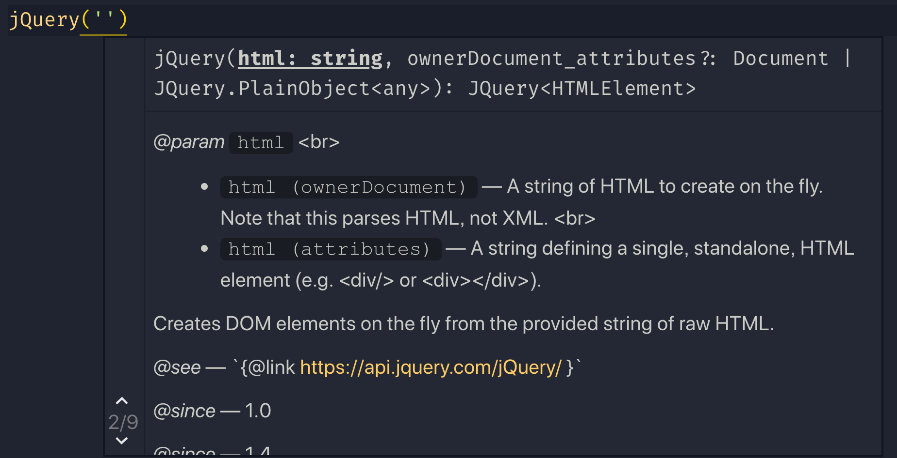
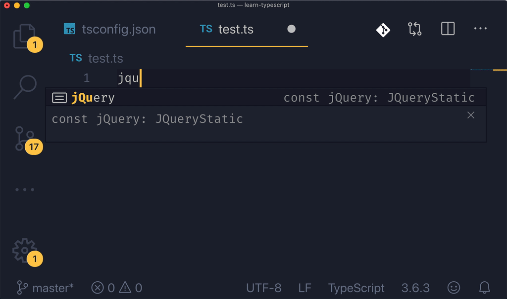
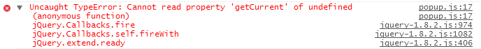

# Typescript 是不是前端开发必备的技能？一个 ts 黑到 ts 粉的心路历程

2020年 Typescript 各种火，就像我之前说的在 jsconf 2019上，typescript 也变成了一个主要议题，占到了很大比重，来自微软的讲师韩骏还拿出了这么一张图，来表达自己的观点，

我觉得这个不是夸大其词，而实实在在的是一个趋势，来自 2018 年 stateofjs 权威调查显示，80% 的程序员都希望在新的项目中学习和使用 typescript。大家可以明显看到从 2016 年到 2018年 这个趋势的绝大变化，这就说明 typescript 越来越流行了。

在我的编程生涯到现在，我一直在使用动态类型语言（Dynamically Typed Language），聊起这个概念，那就要说说 动态类型语言 和他的对立面 - 静态类型语言（Statically Typed Language）。我刚写 typescript 的时候，对类型声明嗤之以鼻，添加一大堆类型浪费我宝贵的时间，还时不时遇到根本看不懂的类型错误，感觉很抓狂，我当时想对 ts 编译器说：“老子能管好自己写的类型，不用你报错”，实在搞不定的类型错误发生的时候，我就会使用 any 大法，完全是一副应付差事的用法。

我当时维护的项目是一个十几万行的大型项目，当时还在推另外一个小型项目，我极力反对 typescript，据理力争，“你是想让我赶快完成任务？还是浪费时间在写 any 上面？这玩意儿根本就不能给你避免 Bug，都是扯犊子。” 后来我花更多的时间在老项目上面，我每天写 any 发 PR 被老外一阵喷。这时候可不能给自己丢脸啊，我开始认真对待起 type 来。

我发现当我在代码中打入了越来越多类型的时候，效率居然变得很高（自动补全），遇到各种傻瓜错误（比如说 typo，我的单词记不住，经常打错 ）的几率也越来越少，在后来两年的工作生涯中，我在很多比较大型的项目中都使用了它，并且越来越感受到它的优势。虽然精通 ts 真的有一定的难度，但是其实你也不必那么精通，能差不多看懂，帮你提高效率就好了，我总结几点编码过程中，实实在在帮助到我的点。

1 程序更容易理解

当我们进行编码的时时候，我们非常关心这几个问题，一个函数或者方法接受什么样什么类型的参数，它的返回值和类型是什么？有什么其他外部数据需要被引进？为了解决这几个问题，我们一般都要详细的查阅文档，搞清楚所有的来龙去脉，因为动态语言的约束我们很难完成这几项任务，我们需要在代码真正运行的时候来调试才能知道答案，比如说加断点或者 console.log 去查看输出，甚至还需要社交过程，我有好几次都是直接跑去问同事或者blame原来写这段代码的人，发个邮件问这些代码究竟是干嘛的，扯皮扯个好几天。有了 typescript，这几个问题都迎刃而解，代码就是全部的注释，通过代码你不再需要去进行猜测，而是直接就可以知道这些问题的答案。看下面上古神器 jQuery 的提示，这参数，返回值的说明，还有文档地址和代码示例，这水平比你百度出来不知几百年前的csdn博客文章不知道高到哪里去了。

2 效率更高

有了 IDE 和 compiler 的帮助，你可以非常方便的在不同的代码块和定义之间进行跳转，同时进行代码补全，还有丰富的接口提示，可以是事半功倍。我就享受这个感觉，能让 IDE 炫酷的提示是每个程序员的梦想。可以疯狂的体验下“老夫就是 jQuery 一把梭”的快感。

3 更少的错误

在编译期间能够发现大部分的错误，这远远要比运行时候再出现这些错误要好的多。在 typescript 之前，我不知道有多少次出现变量名称打错这种错误，传入错误类型的参数，还有就是还有就是排在前端错误第一名：最经典的“Cannot read property 'xxx' on undefined：无法在 undefined 上读取 xxx 属性，通常出现在 a.b.c 的情况。”

4 非常好的包容性

typescript 是 javascript 超集，即使我们把 js 文件直接命名为 ts 文件，也不会有任何的问题，兼容第三方库，即使这些库没有用 ts 编写，也可以给他们编写单独的类型文件进行读取。大部分非常流行的库都用 typescript 实现或者提供写好的类型文件供开发者使用，比如 React，vue，angular，和 ant design 等等，使用起来可谓是无缝衔接。

5 提高自身水平

ts 内部有非常多的内置对象，这些对象我们平时在使用的时候都没有过多的在意，比如 NodeList 和 HTMLCollection 的异同，Event 对象，衍生出来的 MouseEvent，TouchEvent 都有啥区别和属性 等等。。。 把这些接口都一一搞清楚以后，对BOM 和 DOM 的机制了解可以达到另外一个境界，潜移默化的就变成了 API 使用高手。当别人看到没用过的属性的时候，你可以骄傲的化身 API 达人。

## 结论：

假如你工作在一个大中型项目上面，typescript 对你应该是利大于弊。可以学！还能从另外一个方便了解静态类型语言是怎么玩的，看到别人的 Java 代码居然能有看得懂的部分了。 当然要学会根据自己的需求和项目的规模合理选用工具，如果你的应用就是一个简单的展示页面，加几个 UI 状态改变，就没有必要使用。